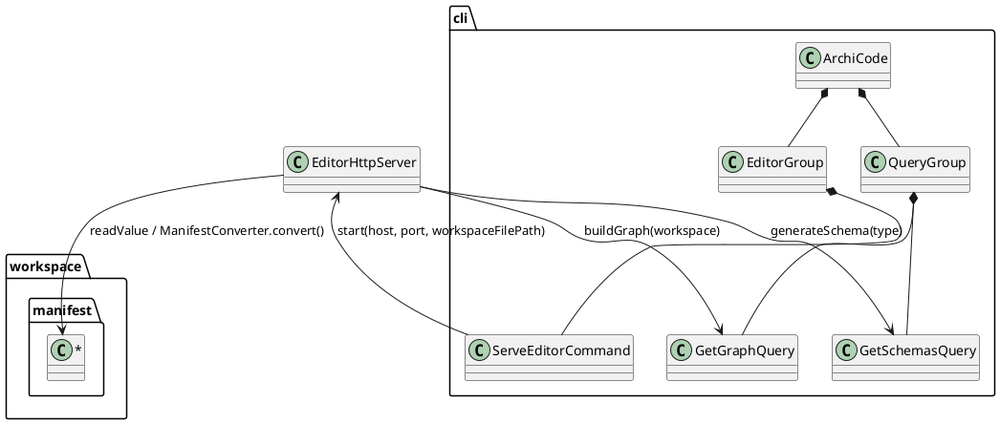
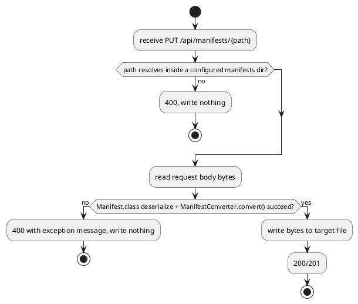

# Manifest Editor Server

# Summary

Add a new `editor serve` command (`EditorGroup` -> `ServeEditorCommand`,
flat in `src/main/java/io/morin/archicode/cli/`, registered as a top-level
`ArchiCode` subcommand group alongside `ViewsGroup`/`QueryGroup`) that starts
a local, unauthenticated HTTP server exposing a small REST API: the resolved
graph (reusing `GetGraphQuery`'s own graph-building logic in-process), a
`query schemas` passthrough (reusing `GetSchemasQuery`'s schema-generation
logic in-process), raw manifest-file read, and manifest-file write with
structural validation before persisting. The server is implemented with the
JDK's built-in `com.sun.net.httpserver.HttpServer` — no new runtime
dependency, no Quarkus HTTP extension. There is no PRD for this run
(infra-facing `TDD+pln` profile, matching run-0004/W-1's precedent — see
"PRD Traceability"); scope comes from wave 002's manifest entry `W-2` and its
Phase P2 table row.

# Scope

In scope:

- One new command group, `editor`, with one subcommand, `serve`
  (`EditorGroup.java`, `ServeEditorCommand.java`), registered as a top-level
  `ArchiCode` subcommand alongside `ViewsGroup`/`QueryGroup` — see `DEC-1`.
- An embedded HTTP server (JDK `com.sun.net.httpserver.HttpServer`,
  `EditorHttpServer.java`) exposing:
  - `GET /api/graph` — the resolved element/relationship graph, same content
    `query graph` prints, reusing `GetGraphQuery`'s graph-building logic
    in-process.
  - `GET /api/schemas/{type}` (`type` = `workspace`|`manifest`) — the same
    JSON Schema `query schemas <type>` prints, reusing `GetSchemasQuery`'s
    schema-generation logic in-process.
  - `GET /api/manifests/{path}` — the raw YAML (or TOML/JSON, per the
    manifest's own file extension) bytes of the manifest file at `{path}`
    (a path relative to the workspace file's directory, e.g.
    `manifests/app.collaborator.yaml`).
  - `PUT /api/manifests/{path}` — body is the raw manifest file content
    (same shape `GET` returns); validated per `DEC-4` before persisting;
    `2xx` and the file on disk is overwritten (or created) with exactly the
    submitted bytes; `4xx` and nothing is written.
  - A placeholder root (`GET /`) — see `DEC-6`; no webapp (that's W-3).
- Request-time (not server-startup-time) resolution of
  `settings.manifests.paths` for the manifest read/write endpoints, and
  request-time rebuilding of the full `Workspace`/graph for `GET
  /api/graph` — so writes are visible on the next read without a server
  restart (`DEC-3`).
- Path-traversal and scope guarding for `{path}`: the resolved file's parent
  directory must equal (not merely be nested under) one of the workspace's
  configured `settings.manifests.paths`, mirroring `ManifestParser`'s own
  flat (non-recursive) directory listing — see `DEC-5`.
- `-p`/`--port` (default `8080`, a conventional HTTP default — no existing
  README example maps a port today, per "Current State") and `--host`
  (default `0.0.0.0`) options on `editor serve`; `-w`/`--workspace` is
  inherited from `ArchiCode` like every other command.
- `README.md`: a new "Serve the manifest editor" example mirroring the
  existing `docker run ... archicode <command>` examples, with the host-side
  port mapped to `127.0.0.1` by default (`-p 127.0.0.1:8080:8080`) — see
  `DEC-7` and the wave's own Non-Goals/Risks.
- Unit tests exercising the HTTP surface directly (JDK `java.net.http.HttpClient`
  against the server bound to an ephemeral port in-process) — no new test
  dependency, no Failsafe `*IT` test (this repository has none yet and
  Failsafe is skipped by default; see "Observability and Verification").
- Minimal, additive refactors to `GetGraphQuery.java` and
  `GetSchemasQuery.java` to extract their existing logic into a
  package-visible method the HTTP server can call directly — same
  behavior, same output, one caller becomes two (`IMP-1`, `IMP-2`).
- Manual verification against `.custom/` (gitignored, copied into this
  worktree per the same convention run-0004 used).

Out of scope (per wave non-goals and this phase's own table row):

- Any webapp, static bundle, or UI (`W-3`). If static files are ever served,
  this run only wires an empty/placeholder mount point — see `DEC-6`.
- Authentication, authorization, TLS, or any session/user concept — the
  wave's own Non-Goals rule this out explicitly; the only guard is the
  operator's host-side port mapping (`DEC-7`).
- The Claude-editing bridge (`W-4`) — no AI-invocation endpoint of any kind.
- A manifest-listing/tree endpoint. The wave's P2 exit evidence asks only
  for graph/schema/raw-read/write; discovering which paths exist is
  implicitly available already (the graph's `elements` carry element
  references, and a directory listing of the configured
  `manifests/` folder is trivial), but building a dedicated endpoint for it
  is `W-3`'s concern, not asked for here. Revisit if `W-3` finds the graph
  response insufficient for tree navigation.
- Format-preserving writes (YAML comments/ordering). Out of scope per the
  wave's own Non-Goals; this run writes exactly the bytes the client
  submitted (after validation), so nothing is reformatted by this run's own
  code, but no round-trip guarantee is made for a client that re-serializes
  before submitting.
- Full-graph re-resolution on manifest write. A write that introduces a
  dangling relationship elsewhere in the graph is accepted (schema/content
  validation is per-manifest, not whole-graph); it will surface the next
  time `GET /api/graph` (or `query graph`/`views generate`) runs — this
  mirrors the wave's own framing of this server as reading/writing manifest
  YAML "outside the render path."
- Any change to `GetGraphQuery`'s or `GetSchemasQuery`'s CLI behavior,
  output, or exit codes — the refactor in `IMP-1`/`IMP-2` is a pure
  extract-method with no behavioral change, verified by their existing
  tests continuing to pass unmodified.
- Quarkus HTTP/RESTEasy extensions (`quarkus-vertx-http`, `quarkus-rest`,
  etc.) — see `DEC-2` for why.
- The `native`/GraalVM profile (not touched, same precedent as run-0004).

# PRD Traceability

No PRD exists for this run (infra-facing `TDD+pln` profile). Requirements
are sourced directly from wave 002's manifest (`W-2`) and Phase P2 table row
in `docs/wav/wav-002-manifest-web-editor/wav-002-manifest-web-editor.md`:
focus ("the one local process... that reads and writes manifest YAML
outside the render path, proxying W-1 and `query schemas` for everything
else"), scope (new `editor serve` command, static bundle + REST API: graph,
schemas passthrough, raw manifest read, manifest write with schema
validation before persisting), and exit evidence (GET graph + GET manifest
both work; schema-valid write persists; schema-invalid write is rejected
with nothing written; README's example maps the port to `127.0.0.1` by
default). All are addressed below under "Technical Goals",
"Observability and Verification", and "Repository Impact". The dispatch
brief that scoped this run additionally fixed the no-UI boundary ("there is
no static webapp to serve yet... a bare API is the correct scope") and the
port/exposure wording, both folded into scope above.

# Technical Goals

- `TG-1` — An `editor serve` command exists, invoked the same way as
  `views generate`/`query schemas` (`docker run ... archicode editor
  serve`), registered as `ArchiCode -> EditorGroup -> ServeEditorCommand`.
- `TG-2` — `GET /api/graph` returns the same JSON content `query graph`
  would print for the same workspace, by calling the same graph-building
  code (not a reimplementation).
- `TG-3` — `GET /api/schemas/{workspace|manifest}` returns the same JSON
  Schema `query schemas <type>` would print, by calling the same
  schema-generation code.
- `TG-4` — `GET /api/manifests/{path}` returns the exact byte content of
  the manifest file at `{path}` (relative to the workspace file's
  directory), for any `{path}` whose parent directory is one of the
  workspace's configured `settings.manifests.paths`.
- `TG-5` — `PUT /api/manifests/{path}` with a payload that deserializes into
  a valid `Manifest` (correct `header.kind`/`header.version` shape) **and**
  converts into its kind-specific `Element` subtype without error persists
  the submitted bytes verbatim to that file and returns `2xx`.
- `TG-6` — `PUT /api/manifests/{path}` with a payload that fails either
  check in `TG-5` returns a `4xx` response with an error message and writes
  nothing to disk.
- `TG-7` — `editor serve` binds to `0.0.0.0` by default (configurable via
  `--host`) so a Docker `-p` mapping can forward traffic to it at all; the
  documented `README.md` invocation maps the host side of that port to
  `127.0.0.1` by default.
- `TG-8` — No behavioral change to any existing command; `GetGraphQuery`'s
  and `GetSchemasQuery`'s own CLI tests pass unmodified after the
  extract-method refactor.

# Non-Goals

- Authentication, TLS, multi-user concerns (wave Non-Goals).
- A webapp or any static UI (`W-3`).
- The Claude-editing bridge (`W-4`).
- A manifest-listing/tree endpoint (see "Scope").
- Format-preserving YAML writes (wave Non-Goals).
- Whole-graph re-validation on a single manifest write (see "Scope").

# Assumptions

- `ASM-1` — "Reads and writes manifest YAML outside the render path" (the
  wave's own `W-2` focus line) means manifest read/write must not require a
  successful full graph resolution (`WorkspaceFactory.create` +
  `ElementIndexFactory`, which forces every relationship to resolve).
  Validated by inspection of `ManifestParser.parse` (manifest discovery only
  needs `settings.manifests.paths`, resolved from the raw
  `io.morin.archicode.resource.workspace.Workspace`, before any
  `ElementIndex` is built) and by the practical concern that a dangling
  reference in one manifest should not block reading or fixing an unrelated
  manifest through this server. `GET`/`PUT /api/manifests/{path}` therefore
  only parse the raw workspace resource (`DEC-3`), not the full indexed
  `Workspace`; only `GET /api/graph` builds the full index, matching
  `query graph`'s own behavior exactly.
- `ASM-2` — A manifest's identity, for this API, is its file path relative
  to the workspace file's directory (e.g. `manifests/app.collaborator.yaml`)
  — not a content-level `id` field. Validated by inspection of `Manifest`/
  `ManifestParser`: there is no manifest-level identifier distinct from the
  file itself; `ManifestParser.Candidate.reference` is derived from
  `header.parent` + the content's `id`, which is not guaranteed unique
  across files in the way a file path is. The dispatch brief's "by id/path"
  wording is read as "by path" for this reason; see `DEC-4`.
- `ASM-3` — `.custom/`, the example workspace, is gitignored and absent from
  a fresh checkout (`.gitignore` line 14 is `.custom`) — same confirmed fact
  run-0004 relied on. Copied in for manual verification only; not committed.
- `ASM-4` — No existing test fixture in `src/test/workspaces/` uses external
  manifest files via `settings.manifests.paths` (`case_a`/`case_b`/`case_c`/
  `case_graph_ok`/`case_graph_dangling` all embed elements directly in the
  workspace YAML). This run adds the first fixture with a real
  `manifests/` directory, modeled on `.custom/`'s own layout (see
  `IMP-6`).
- `ASM-5` — `GetGraphQuery`, `GetSchemasQuery`, and every other Picocli
  command class in `src/main/java/io/morin/archicode/cli/` are already CDI
  beans with no explicit scope annotation (confirmed: `@Inject` fields on
  `GetGraphQuery`/`GetSchemasQuery` are populated today, and both classes
  are directly `@Inject`-ed in their own `@QuarkusTest`s). `EditorHttpServer`
  can therefore `@Inject` them directly as collaborators rather than
  constructing new instances.

# Constraints

- `CON-1` — Must reuse `GetGraphQuery`'s and `GetSchemasQuery`'s existing
  logic for the graph and schema endpoints — no second graph-resolution or
  schema-generation implementation (wave `W-2` focus: "proxying W-1 and
  `query schemas` for everything else").
- `CON-2` — No new runtime Maven dependency for the HTTP server itself
  (`DEC-2`).
- `CON-3` — The server must bind to `0.0.0.0` inside a container by default
  (Docker's `-p` requires it); the documented invocation's host-side port
  mapping must default to `127.0.0.1` (wave Risks: "no authentication, so
  host-side port exposure is the only guard").
- `CON-4` — No write path may escape the workspace's configured
  `settings.manifests.paths` directories (path-traversal guard, `DEC-5`).

# Current State

- `ArchiCode.java` (`src/main/java/io/morin/archicode/cli/ArchiCode.java`)
  is the `@TopCommand`, with `subcommands = { ViewsGroup.class,
  QueryGroup.class }` and an inherited `-w`/`--workspace` option
  (`ScopeType.INHERIT`). `ViewsGroup`/`QueryGroup` are both thin group
  classes (`@CommandLine.ParentCommand ArchiCode archiCode;`) living flat in
  `cli/`, each listing their leaf subcommands. There is no `cli/query/` or
  `cli/views/` subpackage despite the wave manifest's `likely_paths` guess
  for `W-1` (`cli/query/**`) and `W-2` (`cli/editor/**`) — see `DEC-1`,
  which follows the same convention run-0004's `DEC-1` already established.
- `GetGraphQuery.java` (added by run-0004/`W-1`) builds `Graph{elements,
  relationships}` by walking `Workspace.appIndex`/`techIndex` and forcing
  `ElementIndex.getElementByReference` on every relationship destination;
  its `run()` method inlines graph-building and JSON serialization/output
  in one method body.
- `GetSchemasQuery.java` inlines schema generation (via
  `JsonSchemaGenerator`/`jackson-module-jsonSchema-jakarta`) and output in
  one `run()` method, for `SchemaType.WORKSPACE`/`MANIFEST`
  (`Workspace.class`/`Manifest.class`). The generated schema is Jackson's
  own (pre-draft-07, "legacy") `JsonSchema` model — confirmed by running
  `query schemas manifest`: `header` fields use `"required": true` per
  property (not a top-level `required` array) and `content` is emitted as
  `{"type": "any"}` because `Manifest.content` is a raw `ObjectNode` the
  generator cannot introspect further. This is a real limitation of
  `jackson-module-jsonSchema-jakarta`, not a bug to fix here — see `DEC-4`.
- `ManifestParser.parse(wksDir, manifestsDirs)`
  (`src/main/java/io/morin/archicode/manifest/ManifestParser.java`) resolves
  each configured `manifestsDirs` entry against `wksDir`, lists files in
  that directory **non-recursively** (`directory.listFiles((dir, name) ->
  MapperFormat.resolve(name).isPresent())`), and for each file:
  `mapper.readValue(file, Manifest.class)` then
  `ManifestConverter.builder().manifest(resource).mapper(mapper).build().convert()`
  — the latter copies `manifest.getContent()`, injects
  `"kind": manifest.getKind().getSubTypeName()`, and deserializes into the
  kind's `Class<?>` (`ManifestKind.type`, e.g. `Person.class`), `@SneakyThrows`.
  A missing required field (e.g. `AbstractElement.id`, `@NonNull
  @JsonProperty(required = true)`) throws unchecked. This two-step
  parse-then-convert *is* the system's real validation of "a valid
  manifest" — stronger than the generated JSON Schema can express for
  `content` — and this run reuses it rather than writing a second validator
  (`DEC-4`).
- `WorkspaceFactory.create(Path)` first reads the raw
  `io.morin.archicode.resource.workspace.Workspace` via
  `mapperFactory.create(path).readValue(path.toFile(),
  resource.workspace.Workspace.class)`, *then* calls
  `manifestParser.parse(wksDir, rawWorkspace.getSettings().getManifests().getPaths())`,
  *then* builds both `ElementIndex`es. Manifest discovery's own
  configuration (`settings.manifests.paths`) is available after only the
  first step — this is what `ASM-1`/`DEC-3` rely on.
- `MapperFactory.create(Path)` (`src/main/java/io/morin/archicode/MapperFactory.java`)
  resolves a reusable, pre-configured `ObjectMapper` (YAML/TOML/JSON) by
  file extension via `MapperFormat.resolve(Path)`. `MapperFactory.create(path)`
  and `.create(MapperFormat)` are both reused by this run unchanged.
- No HTTP server, servlet container, or Quarkus HTTP extension exists in
  `pom.xml` today (confirmed: no `quarkus-vertx-http`, `quarkus-rest`, or
  `quarkus-resteasy*` dependency) and `src/main/resources/application.properties`
  has no `quarkus.http.*` entries.
- No test in `src/test/` uses `RestAssured` or any HTTP client (confirmed:
  no `rest-assured` dependency anywhere); every existing CLI test invokes
  the command's `run()` method directly and inspects captured stdout or
  thrown exceptions (`GetGraphQueryTest`, `GetSchemasQueryTest`).
- `README.md`'s "Run" section lists four `docker run -u ... -v
  "$(pwd):/workdir" -w "/workdir" --rm ghcr.io/tmorin/archicode <command>`
  examples (`--help`, `views generate`, `query schemas workspace`, `query
  schemas manifest`); none maps a host port today (none of today's commands
  need one).
- No `docs/CLAUDE.md` register declaration and no `arc`/`dom` directories
  exist (same finding run-0004 and wave 001/run-0002 already made) — Canonical
  Impact is "not applicable."

# Proposed Design

Two component relationships change (a new `EditorGroup`/`ServeEditorCommand`
pair, and a new `EditorHttpServer` that calls into the existing
`GetGraphQuery`/`GetSchemasQuery` beans), so a component diagram is included
per the diagram trigger rules.



A reviewer should confirm: `EditorHttpServer` never re-derives graph
resolution or schema generation itself — both calls above delegate to the
existing `GetGraphQuery`/`GetSchemasQuery` beans (`CON-1`); manifest
read/write goes through the raw workspace resource and
`ManifestParser`/`ManifestConverter`'s own classes, not a new parser.

`DEC-1 — EditorGroup/ServeEditorCommand placed flat in cli/, not under cli/editor/`

- Decision: Add `EditorGroup.java` and `ServeEditorCommand.java` at
  `src/main/java/io/morin/archicode/cli/`, registered as
  `ArchiCode(subcommands = {ViewsGroup.class, QueryGroup.class,
  EditorGroup.class})`, mirroring `ViewsGroup`/`QueryGroup`'s own flat
  placement and thin-group pattern.
- Rationale: the wave manifest's `likely_paths` for `W-2` lists
  `src/main/java/io/morin/archicode/cli/editor/**`, but the actual, current
  convention (`ViewsGroup`, `QueryGroup`, and run-0004's own `DEC-1` for
  `GetGraphQuery`) keeps every command group flat in `cli/`. Creating a
  subpackage for only the new group would be the one inconsistent
  placement in that package, for no behavioral reason, and would leave
  `ViewsGroup`/`QueryGroup` as the odd ones out relative to a convention
  this run didn't otherwise need to touch.
- Alternatives considered: `cli/editor/EditorGroup.java` +
  `cli/editor/ServeEditorCommand.java` as the manifest's `likely_paths`
  implies — rejected for the reason above; moving `ViewsGroup`/`QueryGroup`
  into matching subpackages too, for consistency — rejected as out of scope
  (touches files with no behavioral reason to change, for a phase whose
  focus is "one local process").
- Tradeoffs: this run's actual `likely_paths` footprint differs from the
  wave manifest's declared one, exactly the same, already-accepted tradeoff
  run-0004 named for `W-1`. Named here and in the final report; zero
  collision risk since wave 002 is fully serial (its own Risks section
  confirms the same-batch path-overlap check has nothing to check).
- Linked requirement: wave 002 manifest `W-2` `likely_paths` (deviation);
  existing `ViewsGroup`/`QueryGroup` convention; run-0004 `DEC-1` precedent.

`DEC-2 — Embedded HTTP server via com.sun.net.httpserver.HttpServer, not a Quarkus HTTP extension`

- Decision: Implement `EditorHttpServer` on top of the JDK's built-in
  `com.sun.net.httpserver.HttpServer` (shipped in the JDK's own
  `jdk.httpserver` module, present in every standard JDK distribution
  including JDK 25; no Maven dependency needed), with manual
  `HttpHandler`/`createContext` routing.
- Rationale: this application's only existing server-shaped extension is
  `quarkus-picocli` (CLI/command mode) — there is no `quarkus-vertx-http`/
  `quarkus-rest` dependency today. Adding one would make Quarkus start an
  HTTP listener as part of *every* command's application bootstrap (not
  just `editor serve`), since Quarkus's HTTP extension binds its port at
  application startup, before any Picocli command-specific logic runs;
  avoiding that would require additional conditional-activation
  configuration this change has no other reason to introduce. The JDK's
  `HttpServer` is created and bound explicitly, only inside
  `ServeEditorCommand.run()`, so every other command's startup is
  completely unaffected — zero risk of regressing `views generate`/`query
  *`'s behavior or startup time (`CON-2`, `TG-8`).
- Alternatives considered: `quarkus-vertx-http`/`quarkus-rest` — rejected
  for the reason above (changes every command's bootstrap, not just this
  one) and because it would need `quarkus.http.*` configuration research
  this run has no other reason to take on; a third-party embedded server
  (e.g. `Javalin`, `undertow` standalone) — rejected, since the JDK's own
  `HttpServer` is sufficient for the small, fixed set of routes this run
  needs and adds no new dependency at all (`CON-2`).
- Tradeoffs: `com.sun.net.httpserver.HttpServer` has no built-in
  path-parameter routing or content-negotiation helpers — routing is done
  manually by inspecting `exchange.getRequestURI().getPath()` and
  `exchange.getRequestMethod()` inside each handler. Acceptable for four
  fixed routes; would not scale to a larger API, but none is planned here.
  `HttpServer`'s native-image support is unconfirmed; out of scope per
  "native profile not touched" (same as run-0004) — flagged as `RISK-2`.
- Linked requirement: wave `W-2` scope ("embedded HTTP server
  library/mechanism... is yours to decide and justify in the TDD"); `CON-2`.

`DEC-3 — Manifest read/write resolve settings via the raw workspace resource; only GET /api/graph builds the full indexed Workspace`

- Decision: `GET`/`PUT /api/manifests/{path}` call
  `mapperFactory.create(workspaceFilePath).readValue(workspaceFilePath.toFile(),
  io.morin.archicode.resource.workspace.Workspace.class)` to obtain
  `settings.manifests.paths` only — the same first step
  `WorkspaceFactory.create(Path)` performs internally, stopped before
  manifest parsing or index building. `GET /api/graph` alone calls the full
  `workspaceFactory.create(workspaceFilePath)` (via `GetGraphQuery`'s own
  logic, `DEC-4`'s sibling decision below) and therefore the full
  `ElementIndex` resolution, same as `query graph`.
- Rationale: the wave's own `W-2` focus line frames this server as reading/
  writing manifest YAML "outside the render path" (`ASM-1`). If manifest
  read/write required a fully-resolved graph, a single dangling relationship
  anywhere in the workspace would block reading or fixing an unrelated
  manifest through this server — exactly the opposite of what an editor
  server needs during active editing, when the workspace is often
  momentarily inconsistent.
- Alternatives considered: always building the full `Workspace` via
  `workspaceFactory.create(...)` for every endpoint, for implementation
  uniformity — rejected, it would make `GET`/`PUT /api/manifests/{path}`
  spuriously fail whenever any *other* manifest has a dangling reference,
  which has no bearing on reading or writing the requested manifest.
- Tradeoffs: two different "build a workspace view" paths exist in this one
  class (raw-resource-only vs. fully-indexed) — acceptable and already
  mirrored by `WorkspaceFactory.create(Path)` itself, which performs exactly
  these two stages internally; this decision just stops at the first stage
  for the two endpoints that only need it.
- Linked requirement: wave `W-2` focus ("outside the render path"); `ASM-1`.

`DEC-4 — Manifest write validation: Manifest.class deserialization + ManifestConverter.convert(), not a standalone JSON-Schema-validator library run against query schemas manifest's output`

- Decision: On `PUT /api/manifests/{path}`, parse the submitted bytes with
  `mapperFactory.create(path).readValue(bytes, Manifest.class)`, then
  `ManifestConverter.builder().manifest(resource).mapper(mapper).build().convert()`.
  Either step throwing (missing/malformed `header`, unknown `kind`, or
  content that doesn't match the kind's `Element` subtype — e.g. a missing
  `id`) is caught and mapped to a `400` response with the exception message;
  both succeeding means the payload is valid and the bytes are written
  as-is.
- Rationale: `query schemas manifest`'s generated schema (via
  `jackson-module-jsonSchema-jakarta`) is a real, usable artifact for
  *discovery* (`GET /api/schemas/manifest`, `CON-1`/`TG-3`) but is
  structurally too shallow to validate *content* against: `content` is
  emitted as `{"type": "any"}` because `Manifest.content` is a raw
  `ObjectNode` the generator cannot introspect per-`kind` (confirmed by
  running `query schemas manifest` — see "Current State"). Running a
  standard JSON-Schema-draft validator (e.g. `networknt/json-schema-validator`)
  against that schema would therefore only ever check `header` shape and
  no-op on `content` — strictly weaker than, and a near-duplicate of, the
  `Manifest.class` deserialization step below. Reusing
  `Manifest.class`/`ManifestConverter` instead performs the *actual*
  per-`kind` content validation the rest of the system already relies on
  (`ManifestParser.parse` does exactly this for every file it discovers),
  satisfying "validate the payload against the manifest JSON Schema" in
  substance — this *is* the enforced shape a valid manifest must have —
  without introducing a second, weaker validator or a new dependency.
- Alternatives considered: adding `networknt:json-schema-validator` (or
  similar) and validating against `GetSchemasQuery`'s generated schema
  directly — rejected per the shallowness argument above, and because that
  schema is not standards-draft-compliant either (`"required": true` per
  property, draft-03-style, rather than a top-level `required` array),
  which most maintained validator libraries don't parse correctly without
  extra adaptation; building a hand-rolled schema-shape checker — rejected,
  duplicates `Manifest.class`'s own Jackson-level required-field
  enforcement for no benefit.
- Tradeoffs: the HTTP response's `400` body is a raw Java exception message
  (e.g. `Missing required creator property 'id'...`), not a structured,
  schema-path-annotated validation report a dedicated validator library
  would produce. Acceptable for this run's scope (a bare API, no UI to
  render rich errors into); `W-3` can wrap/reformat this message when it
  builds the actual edit form.
- Linked requirement: wave `W-2` scope ("manifest write: validate the
  payload against the manifest JSON Schema before persisting"); `CON-1`
  (reuse, don't reimplement); `TG-5`, `TG-6`.

`DEC-5 — Manifest path identity and traversal guard: relative path must resolve to a direct child of a configured manifests dir`

- Decision: `{path}` in `/api/manifests/{path}` is interpreted as a path
  relative to the workspace file's directory. For both `GET` and `PUT`,
  resolve `target = workspaceDir.resolve(path).normalize()`, then require
  `target.getParent().toRealPath()` to equal, exactly, the real path of one
  of `settings.manifests.paths` (each resolved against `workspaceDir` and
  `toRealPath()`'d once per request). A `{path}` whose parent doesn't match
  any configured manifests dir, or whose extension doesn't resolve via
  `MapperFormat.resolve(...)`, is rejected (`404` for `GET`, `400` for
  `PUT`) before any file I/O.
- Rationale: `ManifestParser.parse` lists each configured dir
  **non-recursively** (`directory.listFiles(...)`, no subdirectory walk) —
  a manifest file, today, is always a direct child of a configured
  manifests dir. Requiring exact parent-dir equality (via `toRealPath()`,
  which resolves symlinks and rejects a non-existent path outright) matches
  that existing semantics precisely and closes path traversal: a `{path}`
  containing `..` normalizes to some other real location, which will not
  equal any configured manifests dir's real path, and is rejected (`ASM-2`,
  `CON-4`).
- Alternatives considered: allowing any path under the workspace directory
  (broader, simpler check) — rejected, widens the write surface far beyond
  what `ManifestParser` itself ever reads, and weakens the traversal guard;
  allowing nested subdirectories under a manifests dir — rejected as
  speculative, since no existing manifest file is ever nested one, and
  `ManifestParser` wouldn't discover it anyway (it would silently never be
  picked up by `query graph`/`views generate`, which would be a confusing
  trap for an editor user).
- Tradeoffs: none identified; this is the narrower, not the riskier, choice,
  and matches existing manifest-discovery behavior exactly.
- Linked requirement: `CON-4`; `TG-4`; `ASM-2`.

`DEC-6 — No static file serving; GET / returns a plain-text placeholder`

- Decision: `EditorHttpServer` mounts `/` with a handler that returns a
  fixed `200 text/plain` body (e.g. "ArchiCode Manifest Editor API — no
  webapp yet, see W-3."); every other route is under `/api/`. No
  `createContext` for serving files from a classpath or filesystem
  directory is added.
- Rationale: the dispatch brief is explicit that there is no static webapp
  to serve yet and that inventing frontend work is out of scope; a bare
  API is the correct scope for this run. A placeholder root avoids a
  confusing `404`/connection-refused for anyone who points a browser at the
  bare host:port, at zero implementation cost.
- Alternatives considered: wiring a static-file `HttpHandler` pointed at an
  empty directory now, for `W-3` to fill in later — rejected as premature;
  `W-3`'s own TDD can choose where its bundle lives and how it's served
  (classpath resource vs. filesystem) with full context this run doesn't
  have yet, without this run's empty-directory wiring becoming an
  unnecessary constraint.
- Tradeoffs: `W-3` will need to add its own static-serving wiring to this
  same class/file rather than finding a mount point pre-built — accepted,
  that's a few lines of additive work for a run that will already be
  modifying `EditorHttpServer` to add the webapp's own needs.
- Linked requirement: dispatch brief ("no static webapp to serve yet... a
  bare API is the correct scope... don't invent frontend work").

`DEC-7 — editor serve binds 0.0.0.0 by default; README's documented invocation maps the host port to 127.0.0.1`

- Decision: `ServeEditorCommand`'s `--host` option defaults to `"0.0.0.0"`
  (the server binds all interfaces inside its own process/container by
  default). `README.md`'s new example uses
  `-p 127.0.0.1:8080:8080` (not bare `-p 8080:8080`) as the documented,
  copy-pasted invocation.
- Rationale: Docker's `-p` port publishing requires the containerized
  process to listen on `0.0.0.0` (or at least not only `127.0.0.1`) to be
  reachable via the published mapping at all — binding the server itself to
  loopback would silently break the documented Docker invocation. Given
  that, and that this server has no authentication by design (wave
  Non-Goals/Risks), the *only* real guard against LAN-wide exposure is the
  host-side mapping the operator chooses — so the documented example must
  default to the loopback-restricted mapping (`-p 127.0.0.1:8080:8080`)
  rather than leaving it to whoever copies the example to think to add it
  (wave Risks: "`README.md`'s example for this command must default to the
  loopback-restricted form").
- Alternatives considered: defaulting `--host` to `127.0.0.1` and requiring
  an explicit `--host 0.0.0.0` to run in a container — rejected, this would
  make the *documented* Docker example fail out of the box (silently: the
  container would start, but `-p` would never forward anything, with no
  obvious error), which is worse than a clearly-stated host-side mapping
  default; adding a loud runtime warning when `--host 0.0.0.0` is used —
  considered as a future improvement (`DEF-1`), not required by the wave's
  exit evidence.
- Tradeoffs: a user who runs `editor serve` directly on their host (no
  Docker) and doesn't pass `--host 127.0.0.1` gets a LAN-reachable,
  unauthenticated server by default — documented explicitly in `README.md`
  and this TDD; mitigated by `--host` being available for that case.
- Linked requirement: wave Non-Goals/Risks ("no authentication, so
  host-side port exposure is the only guard"); `CON-3`; `TG-7`.

# Repository Impact

`IMP-1 — GetGraphQuery.java: extract buildGraph(Workspace) for reuse`
- Path(s): `src/main/java/io/morin/archicode/cli/GetGraphQuery.java`
- Change type: modify (extract-method, additive signature; no behavior
  change)
- Why impacted: `CON-1`, `TG-2`, `TG-8`.
- Linked PRD IDs: n/a (no PRD; wave manifest `W-2`).
- Risks / notes: `run()` keeps its existing `try`-free body, now calling the
  new public `buildGraph(workspace)`; `GetGraphQueryTest` is unchanged and
  must keep passing, proving the refactor is behavior-preserving.

`IMP-2 — GetSchemasQuery.java: extract generateSchema(SchemaType) for reuse`
- Path(s): `src/main/java/io/morin/archicode/cli/GetSchemasQuery.java`
- Change type: modify (extract-method, additive signature; no behavior
  change)
- Why impacted: `CON-1`, `TG-3`, `TG-8`.
- Linked PRD IDs: n/a.
- Risks / notes: `GetSchemasQueryTest` unchanged and must keep passing.
  `SchemaType`/`SchemaTypeConverter` stay package-visible nested types,
  reused as-is by `EditorHttpServer` (same package).

`IMP-3 — New command group: EditorGroup.java`
- Path(s): `src/main/java/io/morin/archicode/cli/EditorGroup.java`
- Change type: add
- Why impacted: `TG-1`, `DEC-1`.
- Linked PRD IDs: n/a.
- Risks / notes: thin group class mirroring `ViewsGroup`/`QueryGroup`
  exactly; registers itself in `ArchiCode.java`'s `subcommands` (`IMP-7`).

`IMP-4 — New command: ServeEditorCommand.java`
- Path(s): `src/main/java/io/morin/archicode/cli/ServeEditorCommand.java`
- Change type: add
- Why impacted: `TG-1`, `TG-7`, `DEC-1`, `DEC-7`.
- Linked PRD IDs: n/a.
- Risks / notes: owns `-p`/`--port` (default `8080`) and `--host` (default
  `0.0.0.0`); builds the raw workspace path from the inherited
  `-w`/`--workspace` option (same pattern as `GenerateViewsCommand`); starts
  `EditorHttpServer` then blocks (`Thread.currentThread().join()`-style)
  until the process is terminated — no graceful-shutdown machinery beyond
  what the OS/JVM already provides on `SIGTERM`/Ctrl+C, matching this run's
  single-operator, locally-invoked scope.

`IMP-5 — New class: EditorHttpServer.java`
- Path(s): `src/main/java/io/morin/archicode/cli/EditorHttpServer.java`
- Change type: add
- Why impacted: `TG-2` through `TG-6`, `DEC-2` through `DEC-6`.
- Linked PRD IDs: n/a.
- Risks / notes: CDI bean (`@ApplicationScoped`), `@Inject`s `GetGraphQuery`,
  `GetSchemasQuery`, `WorkspaceFactory`, `MapperFactory`; exposes
  `start(String host, int port, Path workspaceFilePath)` returning the bound
  `com.sun.net.httpserver.HttpServer` (so tests can bind to an ephemeral
  port and inspect the real ephemeral port via `getAddress().getPort()`)
  and a `stop(HttpServer)` helper. All route handlers are private methods
  on this class.

`IMP-6 — New test fixture: a workspace with a real manifests/ directory`
- Path(s): `src/test/workspaces/editor_manifests/workspace.yaml`,
  `src/test/workspaces/editor_manifests/manifests/per_a.yaml`,
  `src/test/workspaces/editor_manifests/manifests/sol_a.yaml`
- Change type: add
- Why impacted: `TG-4`, `TG-5`, `TG-6` — exercising real file-backed
  manifest read/write needs a fixture with
  `settings.manifests.paths`-discoverable files (`ASM-4`), which no
  existing fixture has.
- Linked PRD IDs: n/a.
- Risks / notes: modeled directly on `.custom/manifests/*.yaml`'s own shape
  (`header.kind`/`header.version` + `content.id`/`relationships`); isolated,
  new directory, touches no existing fixture.

`IMP-7 — ArchiCode.java: register EditorGroup`
- Path(s): `src/main/java/io/morin/archicode/cli/ArchiCode.java`
- Change type: modify
- Why impacted: `TG-1`.
- Linked PRD IDs: n/a.
- Risks / notes: one-line addition to the `subcommands` array; no other
  change.

`IMP-8 — New test: EditorHttpServerTest.java`
- Path(s): `src/test/java/io/morin/archicode/cli/EditorHttpServerTest.java`
- Change type: add
- Why impacted: `TG-2` through `TG-6` (the wave's P2 gate criteria).
- Linked PRD IDs: n/a.
- Risks / notes: `@QuarkusTest`, starts the server on port `0` (ephemeral)
  against a temp-directory copy of `editor_manifests/` (so write assertions never
  touch the committed fixture), uses `java.net.http.HttpClient` for real
  HTTP requests, stops the server in an `@AfterEach`.

`IMP-9 — README.md: new "Serve the manifest editor" example`
- Path(s): `README.md`
- Change type: modify (additive section)
- Why impacted: `TG-7`, `DEC-7`, wave exit evidence ("README's documented
  example maps the port to `127.0.0.1` by default").
- Linked PRD IDs: n/a.
- Risks / notes: follows the existing four examples' exact
  `docker run \ -u ... -v ... -w ... --rm ghcr.io/tmorin/archicode
  <command>` shape, with `-p 127.0.0.1:8080:8080` added and a one-line note
  on why (loopback-only by default; `-p 8080:8080` would expose it to the
  whole LAN, since the server has no authentication).

# Canonical Impact

Not applicable — no canonical registers declared. Same finding run-0004 and
wave 001/run-0002 already made, re-confirmed directly for this run (no
`docs/CLAUDE.md` register declaration, no `arc`/`dom` directories).

# Data Model and Contracts

`CTR-1 — GET /api/graph response`
- Current contract: none (new endpoint).
- Proposed contract: identical JSON shape to `query graph`'s stdout —
  `{"elements": [{"reference", "layer", "element"}], "relationships":
  [{"source", "layer", "relationship"}]}` (see run-0004's TDD `DEC-4` for
  the full shape; unchanged here). `Content-Type: application/json`.
  `200` on success; `500` with the exception message if any relationship is
  dangling (an `ArchiCodeException`, same failure `query graph` throws,
  mapped to an HTTP failure rather than a process exit code since there is
  no process exit code in an HTTP response).
- Affected files: `EditorHttpServer.java` (new handler), no change to
  `GetGraphQuery.java`'s own output shape.
- Migration or compatibility notes: none; purely additive endpoint.
- Linked PRD IDs: n/a.

`CTR-2 — GET /api/schemas/{type} response`
- Current contract: none (new endpoint).
- Proposed contract: identical JSON Schema document `query schemas <type>`
  prints (the Jackson "legacy" schema model described in "Current State").
  `type` path segment is case-insensitive, mapped the same way
  `GetSchemasQuery.SchemaTypeConverter` does; `200` with the schema on a
  recognized type, `400` with an error body on an unrecognized one.
  `Content-Type: application/json`.
- Affected files: `EditorHttpServer.java` (new handler), no change to
  `GetSchemasQuery.java`'s own output shape.
- Migration or compatibility notes: none.
- Linked PRD IDs: n/a.

`CTR-3 — GET /api/manifests/{path} response`
- Current contract: none (new endpoint).
- Proposed contract: the exact byte content of the manifest file at
  `{path}` (`DEC-5`'s resolution/guard rules), with `Content-Type` set from
  the file's own extension (`application/yaml` for `.yaml`/`.yml`,
  `application/json` for `.json`, `application/toml` for `.toml`). `200` on
  a resolvable, in-bounds path to an existing file; `404` if the file
  doesn't exist or `{path}`'s parent isn't a configured manifests dir.
- Affected files: `EditorHttpServer.java` (new handler).
- Migration or compatibility notes: none.
- Linked PRD IDs: n/a.

`CTR-4 — PUT /api/manifests/{path} request/response`
- Current contract: none (new endpoint).
- Proposed contract: request body is raw manifest file content (same shape
  `CTR-3` returns, in the format implied by `{path}`'s own extension).
  `DEC-4`'s two-step validation runs before any write. On success: the
  file is overwritten (or created, if it didn't exist, inside an existing,
  configured manifests dir) with exactly the submitted bytes; `200`
  (or `201` if newly created) with an empty or minimal confirmation body.
  On validation failure: `400` with the exception message as the body;
  nothing written. On an out-of-bounds/unrecognized `{path}` (`DEC-5`):
  `400` before any parsing is attempted; nothing written.
- Affected files: `EditorHttpServer.java` (new handler); no change to
  `Manifest.java`/`ManifestConverter.java`/`ManifestKind.java` — reused
  as-is.
- Migration or compatibility notes: none; this is the first writer of
  manifest files this repository has ever had (every existing command only
  reads them).
- Linked PRD IDs: n/a.

# Interfaces and Behavior

`ArchiCode -> EditorGroup -> ServeEditorCommand` (new leaf), parallel to the
existing `ArchiCode -> {ViewsGroup, QueryGroup}`. `ServeEditorCommand`
delegates to `EditorHttpServer`, a new, independent collaborator that in
turn delegates to the existing `GetGraphQuery`/`GetSchemasQuery` beans and
to `ManifestParser`/`ManifestConverter`'s supporting classes
(`Manifest`/`ManifestKind`) for manifest validation. No change to
`ArchiCode`, `ViewsGroup`, `QueryGroup`, or either existing `Query*` class's
own CLI behavior.

User-facing behavior: an operator runs `editor serve` (directly or via the
documented Docker invocation), the process prints a "listening on
`<host>:<port>`"-style log line and blocks; a client (curl, or eventually
`W-3`'s webapp) issues HTTP requests against the four routes above until the
operator stops the process.

# Flows and Processing Logic

`FLOW-1 — GET /api/graph`
- Trigger: `GET /api/graph` request.
- Steps: `EditorHttpServer` calls `workspaceFactory.create(workspaceFilePath)`
  (full resolution) -> `getGraphQuery.buildGraph(workspace)` -> JSON-serialize
  -> write response.
- Branches / failure paths: `ArchiCodeException` (dangling destination) ->
  caught -> `500` with the message. Any other exception -> `500` with the
  message (never surfaces a Java stack trace as the whole body; logged
  server-side via `@Slf4j`).
- Final output / rendered result: `200 application/json` graph, or `500`
  with an error message.
- Linked PRD IDs: n/a; wave `W-2` scope.

`FLOW-2 — PUT /api/manifests/{path}`
- Trigger: `PUT /api/manifests/{path}` request with a body.
- Steps: resolve+guard `{path}` (`DEC-5`) -> read request body bytes ->
  `mapperFactory.create(target).readValue(bytes, Manifest.class)` ->
  `ManifestConverter...convert()` -> on success, check `Files.exists(target)`
  (before writing, to choose the `200`/`201` response below) ->
  `Files.write(target, bytes)` -> respond.
- Branches / failure paths: guard failure -> `400`, nothing read/written;
  deserialization/conversion failure -> `400` with the exception message,
  nothing written; I/O failure writing the file (e.g. permissions) -> `500`.
- Final output / rendered result: `2xx` and the file updated on disk, or a
  `4xx`/`5xx` with nothing written.
- Linked PRD IDs: n/a; wave `W-2` scope (exit evidence #2/#3).



A reviewer should confirm the two failure branches above both terminate
before any `Files.write` call — the validate-then-persist ordering is the
wave's P2 gate criterion #3 ("a schema-invalid manifest payload is rejected
... and nothing is written").

# Reliability, Performance, and Scalability

Single local operator, no concurrency design beyond what
`com.sun.net.httpserver.HttpServer`'s default executor already provides
(sequential-by-default unless `setExecutor` is called; this run does not
call `setExecutor`, so requests are handled one at a time — acceptable for
one operator, matching the wave's own "no multiple concurrent users... as a
design goal" Non-Goal). `GET /api/graph` rebuilds the full workspace/graph
on every call (`DEC-3`) — the same cost `query graph` already has per
invocation; `.custom/`'s ~25 manifests make this a non-concern in practice,
same conclusion run-0004 reached for the CLI command itself. No caching, no
background refresh, no new external dependency, no persistence beyond the
manifest files already on disk.

# Security and Privacy

No authentication, authorization, or TLS — by design, per the wave's own
Non-Goals (this run does not attempt to add any of these). The only
mitigations in scope are: (1) `DEC-5`'s path-traversal guard, keeping
read/write confined to configured manifests directories; (2) `DEC-7`'s
documented, loopback-default host-port mapping, which is the operator-level
control the wave names as the actual exposure boundary. This server can
read and overwrite arbitrary files inside the workspace's manifests
directories for anyone who can reach its port — this is the accepted,
documented risk profile for a single-local-operator tool, not a gap this
run is expected to close.

# Observability and Verification

Primary gate:

```bash
./mvnw verify
```

Must be green — exercises `EditorHttpServerTest` alongside every existing
test, including the unmodified `GetGraphQueryTest`/`GetSchemasQueryTest`
(proving `IMP-1`/`IMP-2`'s refactor is behavior-preserving).

Exit-evidence-specific checks (run manually from the worktree root, JDK 25
active; `.custom/` must be present per `ASM-3`):

```bash
java -jar target/quarkus-app/quarkus-run.jar editor serve -w .custom/workspace.yaml --port 8099 &
sleep 2
curl -s http://127.0.0.1:8099/api/graph | python3 -m json.tool > /dev/null && echo "graph OK"
curl -s http://127.0.0.1:8099/api/manifests/manifests/app.collaborator.yaml | head -5
curl -s -o /dev/null -w "%{http_code}\n" -X PUT --data-binary @<(curl -s http://127.0.0.1:8099/api/manifests/manifests/app.collaborator.yaml) http://127.0.0.1:8099/api/manifests/manifests/app.collaborator.yaml
curl -s -o /dev/null -w "%{http_code}\n" -X PUT --data-binary 'header: {kind: "archicode.morin.io/person", version: "1"}
content: {name: "no id"}' http://127.0.0.1:8099/api/manifests/manifests/app.collaborator.yaml
kill %1
```

- `TG-2`: the `GET /api/graph` output must be valid JSON and must match
  `query graph -w .custom/workspace.yaml`'s own output byte-for-byte (same
  underlying call).
- `TG-4`: the `GET /api/manifests/...` output must be the same bytes as
  `cat .custom/manifests/app.collaborator.yaml`.
- `TG-5`: re-submitting the just-fetched, valid content via `PUT` must
  return `2xx` and leave the file's bytes unchanged.
- `TG-6`: submitting a payload missing the required `content.id` must
  return `4xx`, and `.custom/manifests/app.collaborator.yaml` must be
  byte-identical to before the request (verified via `diff`/`git status`
  showing no change, since `.custom` isn't tracked — a `cp` of the file
  before/after the request, diffed, is the actual check used).
- `TG-7`: `curl` against `127.0.0.1:8099` succeeds; the command's own
  startup log line states the bound host (`0.0.0.0` by default).

Out of scope for this run's verification: the `native`/GraalVM profile (not
touched, same as run-0004).

# Deployment and Rollout

Code-only, additive CLI subcommand plus a new `README.md` section. No
migration, no feature flag, no backward-compatibility concern (new command
and new HTTP surface, nothing depends on it yet; no existing command's
behavior changes per `TG-8`). Rollback is `git revert` of this run's commit
— planning guidance only; this TDD does not grant deployment permission.

# Risks and Tradeoffs

`RISK-1` — `DEC-1`'s file-placement deviation from the wave manifest's
declared `likely_paths` (`cli/editor/**`, `tools/manifest-editor/server/**`)
could look, out of context, like scope drift. Mitigated by stating the
reasoning here and in the final report, exactly as run-0004 did for the
same kind of deviation; zero actual collision risk since wave 002 is fully
serial.

`RISK-2` — `com.sun.net.httpserver.HttpServer`'s behavior under the
`native`/GraalVM profile is unconfirmed (this run does not test or claim
native-image compatibility). Accepted: the native profile is out of scope
for this run's verification, same precedent as run-0004; if a future run
needs `editor serve` to work under `-Dnative`, it will need to verify this
specifically (flagged here so it isn't silently assumed later).

`RISK-3` — `DEC-4`'s validation is `header`-shape plus `content`-vs-`kind`
shape, not a full cross-reference check (e.g. a write that sets
`header.parent` to a non-existent parent, or a `relationships[].destination`
to a non-existent element, is accepted at write time and only surfaces on
the next `GET /api/graph`/`query graph`/`views generate`). Accepted per
scope ("Full-graph re-resolution on manifest write" is explicitly out of
scope) and consistent with the wave's own framing of this server as
operating "outside the render path."

`RISK-4` — `DEC-7`'s `0.0.0.0` default bind means a direct (non-Docker)
invocation of `editor serve` with no `--host` override is LAN-reachable and
unauthenticated. Mitigated by `README.md` documenting the Docker-based,
loopback-mapped invocation as the primary example, and by `--host
127.0.0.1` being available for a direct invocation; not eliminated, by wave
design (no auth is in scope at all).

# Open Questions

None outstanding. The three genuine design forks this run faced (`DEC-2`
HTTP server mechanism, `DEC-4` validation strategy, `DEC-5` manifest path
identity/traversal guard) were resolved by direct inspection of the existing
codebase (`ManifestParser`, `MapperFactory`, the actual output of `query
schemas manifest`) and the wave's own stated constraints, not left open.

# Deferred Work

`DEF-1` — A loud runtime warning (or refusal without an explicit
acknowledgement flag) when `editor serve` is started with `--host 0.0.0.0`
outside a container, to reduce the chance of an operator accidentally
exposing an unauthenticated server to their LAN. Not required by the wave's
exit evidence; worth a future run's own PRD if real usage shows this is a
recurring mistake.

`DEF-2` — A manifest-listing endpoint (directory listing of each configured
`settings.manifests.paths` entry, or exposing each `GetGraphQuery`
`ElementEntry`'s backing file path). Not required by this phase's exit
evidence; likely needed by `W-3` for tree navigation, left for that run to
specify with full knowledge of what its webapp actually needs.

# File Placement and Frontmatter

Saved at
`docs/wav/wav-002-manifest-web-editor/run/run-0005-manifest-editor-server/tdd-0005-manifest-editor-server.md`,
per `manage-runs`' convention for a wave-owned run. Frontmatter carries
`type: tdd`, `run: 0005`, `wave: 002`, and `related:` links to the wave
plan, business case, and run-0004's TDD (the precedent this run's `DEC-1`
and infra-facing, no-PRD profile both follow).
