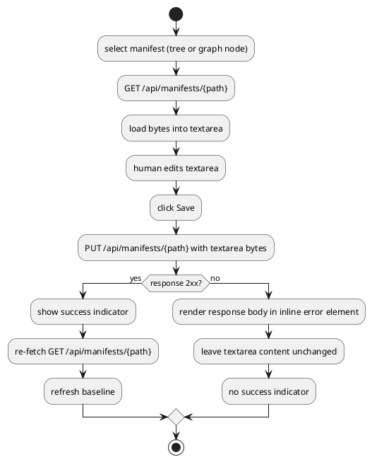

# Manifest Editor Webapp

# Summary

Replace `EditorHttpServer`'s placeholder `GET /` (run-0005/`W-2`'s `DEC-6`)
with a real single-page webapp — one self-contained, classpath-served
`index.html` (inline CSS/JS, no build step, no new `package.json`
dependency) — that lets a human browse the manifest tree, see the resolved
dependency graph as an inline SVG, open a manifest's raw content in a text
editor backed by `GET /api/schemas/manifest`, and save it against
`PUT /api/manifests/{path}` with validation errors surfaced inline. Also
adds the one real server-side gap blocking tree navigation: a new
`GET /api/manifests` directory-listing endpoint, reusing
`EditorHttpServer`'s existing `resolveManifestsDirs` helper, that doubles as
the path↔reference lookup the webapp needs to map a clicked graph node back
to the manifest file that defines it. There is no PRD for this run
(infra-facing `TDD+pln` profile, matching run-0004/`W-1` and
run-0005/`W-2`'s precedent — see "PRD Traceability"); scope comes from wave
002's manifest entry `W-3` and its Phase P3 table row.

# Scope

In scope:

- `EditorHttpServer.java`: a new `GET /api/manifests` endpoint (exact path,
  distinct from the existing `GET/PUT /api/manifests/{path}` context) that
  lists every manifest file discoverable under the workspace's configured
  `settings.manifests.paths`, with each entry's path-relative-to-workspace-dir,
  derived `reference` (same `header.parent` + `.` + `content.id` derivation
  `ManifestParser.Candidate` already uses), and `kind` — see `DEC-3`, `CTR-1`.
- `EditorHttpServer.java`: replace `handleRoot` (the `DEC-6` placeholder) with
  a handler that serves one classpath-bundled `index.html` — see `DEC-1`.
- A new static webapp, `src/main/resources/editor-webapp/index.html`: tree
  navigation (sourced from the new listing endpoint), a dependency-graph view
  (sourced from `GET /api/graph`, rendered as inline SVG with a simple,
  deterministic layout — `DEC-2`), a manifest edit view (raw-text editor
  backed by `GET /api/schemas/manifest` for structural guidance — `DEC-4`),
  and a save action against `PUT /api/manifests/{path}` with inline error
  surfacing — `DEC-5`.
- Resolving the wave's open YAML-comment-preservation non-goal: no
  reformatting-on-save library is introduced; the raw-text editing model
  preserves hand-authored formatting/comments by construction, since the
  file is never parsed and re-serialized — only displayed and submitted as
  the same byte sequence the user edited — see `DEC-6`.
- Manual verification against `.custom/` (gitignored, copied into a scratch
  directory per the same discipline run-0004/run-0005 used — `.custom/`
  itself is never written to).
- Unit tests for the new `GET /api/manifests` endpoint, added to
  `EditorHttpServerTest.java` (real HTTP, JDK `HttpClient`, same pattern as
  the existing tests in that class).

Out of scope (per wave non-goals and this phase's own table row):

- The Claude-editing bridge (`W-4`) — no AI-invocation endpoint, no diff/
  accept-discard UI.
- Authentication, authorization, TLS — wave Non-Goals, unchanged from
  run-0005/`W-2`.
- A structured, schema-generated edit *form* (one input per manifest field).
  `GET /api/schemas/manifest`'s `content` is emitted as `{"type": "any"}`
  (run-0005 TDD "Current State": `Manifest.content` is a raw `ObjectNode`
  Jackson's schema generator cannot introspect per-`kind`), so a form
  generated from that schema could only ever cover `header.kind`/
  `header.version` and would silently drop every `content` field for every
  manifest kind. A raw-text editor avoids presenting a form that looks
  complete but structurally cannot be — see `DEC-4`.
- Whole-graph re-validation on save — unchanged from run-0005's `RISK-3`;
  `PUT /api/manifests/{path}` still validates only the one file being saved.
- Any change to `GET/PUT /api/manifests/{path}`'s existing contract
  (`CTR-3`/`CTR-4` in run-0005's TDD) beyond what `DEC-3` adds alongside it.
- A JS build step, bundler, or new `package.json` dependency — this
  repository's only existing frontend tooling is `prettier`/
  `prettier-plugin-java` (for `.java` sources); nothing here changes that.
- The `native`/GraalVM profile (not touched, same precedent as run-0004/
  run-0005).

# PRD Traceability

No PRD exists for this run (infra-facing `TDD+pln` profile). Requirements
are sourced directly from wave 002's manifest (`W-3`) and Phase P3 table row
in `docs/wav/wav-002-manifest-web-editor/wav-002-manifest-web-editor.md`:
focus ("the screen a human actually looks at: browse the tree, see the
dependency graph, edit a manifest, save it"), scope (single-page app served
by `W-2`: tree navigation, dependency-graph view, manifest detail/edit view
backed by the JSON Schema from `GET /api/schemas/manifest`, save action
against `PUT /api/manifests/{path}` with validation errors surfaced inline),
and exit evidence (manual walkthrough: browse tree, see a cross-manifest
edge, edit a field, save, reload and see it persisted; an invalid edit is
blocked with a visible error before save). All are addressed below under
"Technical Goals", "Proposed Design", and "Observability and Verification".
The dispatch brief additionally fixed the one real server-side gap (no
manifest-listing endpoint — left open by run-0005's own `DEF-2`) and the
decision to resolve, not leave open, the wave's YAML-comment-preservation
non-goal; both folded into scope above (`DEC-3`, `DEC-6`).

# Technical Goals

- `TG-1` — `GET /api/manifests` returns every manifest file discoverable
  under the workspace's configured `settings.manifests.paths` (same
  discovery set `ManifestParser.parse`/`query graph` use), each with its
  path (relative to the workspace file's directory, matching
  `GET/PUT /api/manifests/{path}`'s own path semantics), its derived
  `reference`, and its `kind` — or `null` reference/kind plus a
  `parseError` message for a file that currently fails to parse, so one
  broken manifest never hides the rest of the tree.
- `TG-2` — `GET /` serves a single HTML page (`index.html`) that, loaded in
  a browser pointed at a running `editor serve` instance, lets a human
  browse the manifest tree (from `TG-1`), see the resolved graph (from
  `GET /api/graph`) with at least one cross-manifest relationship rendered
  as a visible edge, open any manifest's raw content, edit it, and save it.
- `TG-3` — A save that violates `PUT /api/manifests/{path}`'s existing
  validation (run-0005 `DEC-4`: `Manifest.class` deserialization +
  `ManifestConverter.convert()`) is rejected by the server exactly as before
  (`4xx`, nothing written) and the webapp shows the rejection's message in a
  dedicated, visible inline element near the Save button — never a raw
  response-body dump via `alert()`/unstyled text — without discarding the
  user's unsaved edit in the textarea.
- `TG-4` — A save that passes validation persists, and reloading the page
  (or re-selecting the same tree entry) shows the saved content, proving the
  round trip through the real `PUT`/`GET` endpoints (not a client-side-only
  state update).
- `TG-5` — No behavioral change to any existing endpoint
  (`GET /api/graph`, `GET /api/schemas/{type}`, the existing
  `GET/PUT /api/manifests/{path}` contract); `EditorHttpServerTest`'s
  existing cases pass unmodified.
- `TG-6` — The webapp introduces no new Maven or `package.json` dependency,
  no CDN-hosted script/stylesheet, and no build step — `index.html` is
  served exactly as checked in.

# Non-Goals

- A schema-generated edit form (see "Scope").
- The Claude-editing bridge (`W-4`).
- Authentication, TLS, multi-user concerns (wave Non-Goals).
- Format-preserving *re-serialization* of a parsed-then-rebuilt YAML
  document — moot by construction per `DEC-6`, not attempted.
- A general-purpose graph-layout library (force-directed, hierarchical,
  etc.) — `DEC-2` uses a fixed, simple layout; not a goal to generalize it.

# Assumptions

- `ASM-1` — A human verifying this run's webapp has a standards-compliant
  browser capable of `fetch`, inline SVG, and ES2020+ JS, with no
  requirement to support older browsers — reasonable for a local,
  loopback-only developer tool with no public user base (wave Non-Goals:
  single local operator). Not validated against a specific browser version
  matrix; accepted as the same informal bar every other local dev tool in
  this ecosystem sets.
- `ASM-2` — `.custom/`'s `settings.manifests.paths` is unset in
  `.custom/workspace.yaml`, so it resolves to `Settings.Manifests`'s default,
  `{"manifests"}` (confirmed by reading
  `src/main/java/io/morin/archicode/resource/workspace/Settings.java`) — the
  manifest tree for manual verification is therefore one flat directory,
  `.custom/manifests/*.yaml` (25 files). Validated by inspection; the
  listing/tree UI must not assume exactly one configured directory, since a
  workspace can configure more (`DEC-3`'s response is a flat list of
  entries, not hardcoded to one directory, precisely to generalize past this
  particular fixture).
- `ASM-3` — `AbstractElement.name`/`.id` (both plain Jackson-serialized
  getters, confirmed in
  `src/main/java/io/morin/archicode/resource/element/AbstractElement.java`)
  are present on every graph node's `element` object, so the graph view can
  label nodes with a human name, falling back to `id`/`reference` when
  `name` is absent (it is not `@NonNull`).
- `ASM-4` — `com.sun.net.httpserver.HttpServer.createContext` matches the
  *longest* registered prefix, so registering a new, separate context for
  the exact path `/api/manifests` (no trailing slash) alongside the existing
  `/api/manifests/` (trailing slash, per-file reads/writes) context routes
  correctly without touching the existing context's registration. Validated
  by reading the JDK's own `HttpServer`/`ContextList` Javadoc semantics
  (prefix matching keyed by path, longest match wins); not unit-tested
  directly against the JDK itself, but exercised indirectly by `TG-1`'s new
  test (`IMP-3`) alongside the existing per-file tests, which must keep
  passing unmodified (`TG-5`).
- `ASM-5` — Reusing `resolveManifestsDirs` (currently `private` on
  `EditorHttpServer`) for the new listing handler requires no access-level
  change beyond what a same-class private method call already allows — the
  new handler lives on `EditorHttpServer` itself, not a new class, so this
  is a straightforward in-class call, not a visibility change (`DEC-3`).

# Constraints

- `CON-1` — Must reuse `EditorHttpServer`'s existing `resolveManifestsDirs`
  helper and its path-safety reasoning for the new listing endpoint — no
  second directory-resolution implementation (dispatch brief: "reuse...
  rather than re-deriving manifest-directory resolution from scratch").
- `CON-2` — No new runtime Maven dependency, no new `package.json`
  dependency, no build step (dispatch brief; `TG-6`).
- `CON-3` — No CDN-hosted script or stylesheet at runtime — this is a local,
  loopback-only tool (dispatch brief).
- `CON-4` — No change to `GET /api/graph`'s, `GET /api/schemas/{type}`'s, or
  the existing `GET/PUT /api/manifests/{path}`'s response contracts
  (`TG-5`).
- `CON-5` — The webapp must work against a real, running `editor serve`
  instance and the real API contracts above — no mock server, no fixture
  data baked into the page.

# Current State

- `EditorHttpServer.java`
  (`src/main/java/io/morin/archicode/cli/EditorHttpServer.java`, added by
  run-0005/`W-2`) registers four contexts: `/` (`handleRoot`, a fixed
  `200 text/plain` placeholder — `DEC-6` in run-0005's TDD), `/api/graph`,
  `/api/schemas/` (prefix), and `/api/manifests/` (prefix, both `GET` and
  `PUT`/`POST`). `resolveManifestsDirs(Path workspaceFilePath, Path
  workspaceDir)` is a `private` method that parses only the raw
  `io.morin.archicode.resource.workspace.Workspace` resource (not the
  fully-indexed graph) to read `settings.manifests.paths`, resolving each
  configured entry against `workspaceDir`; `isWithinConfiguredManifestsDir`
  uses it for the existing path-traversal guard. There is currently no route
  that lists what files exist under those directories — run-0005's own
  `DEF-2` named this gap explicitly and left it for this run.
- `GetGraphQuery.Graph`/`ElementEntry`/`RelationshipEntry`
  (`src/main/java/io/morin/archicode/cli/GetGraphQuery.java`) are the
  `GET /api/graph` response's Java types: `ElementEntry{reference, layer,
  element}`, `RelationshipEntry{source, layer, relationship}`. `element` is
  the full `Element` (e.g. `Person`, `Solution` — see
  `src/main/java/io/morin/archicode/resource/element/**`), which carries
  `id`, `name`, `description`, `qualifiers`, `tags`, `relationships`
  (`AbstractElement`). `relationship.destination` is a reference string
  (e.g. `platform.portal.frontend`), matching the `reference` field other
  `ElementEntry`s are keyed by.
- `ManifestParser.Candidate`
  (`src/main/java/io/morin/archicode/manifest/ManifestParser.java`) derives
  `reference` as `header.parent + "." + content.id` when `header.parent` is
  present, else just `content.id` — the exact mapping the new listing
  endpoint must reproduce so a graph node's `reference` can be looked up
  against a listing entry's `reference` to find its file path.
- `Manifest`/`Manifest.Header`
  (`src/main/java/io/morin/archicode/manifest/Manifest.java`): `header.kind`
  (`ManifestKind`, `@NonNull`), `header.version` (`String`, `@NonNull`),
  `header.parent` (`String`, optional); `content` (`ObjectNode`, `@NonNull`,
  no further Jackson-visible structure). A manifest's `content.id` is read
  directly off the raw `ObjectNode` (`content.get("id")`), not via
  `ManifestConverter`, since the listing only needs the id for the reference
  derivation above, not a fully kind-converted `Element`.
- `GetSchemasQuery.generateSchema(SchemaType.MANIFEST)`
  (`src/main/java/io/morin/archicode/cli/GetSchemasQuery.java`) returns
  Jackson's legacy `JsonSchema` model for `Manifest.class`: `header`'s
  `kind`/`version`/`parent` properties are expressed with per-property
  `"required": true`/`false` flags (not a top-level `required` array);
  `content` is `{"type": "any"}` (confirmed by running `query schemas
  manifest` — same finding run-0005's TDD already recorded, re-confirmed
  here since this run is the first to actually consume that schema in a UI).
- `src/main/resources/` currently contains `application.properties` and
  `META-INF/services/` (no existing static-*web*-asset convention for this
  app to follow or deviate from — confirmed by listing the directory;
  `application.properties` is Quarkus configuration, not a static HTML/CSS/
  JS asset). `pom.xml` has no
  `maven-resources-plugin` customization; default Maven/Quarkus behavior
  copies everything under `src/main/resources/` onto the runtime classpath
  and into the packaged jar (`target/quarkus-app/quarkus-run.jar` and its
  `lib/`/`app/` layout, or the fast-jar's `quarkus-app/app/` directory —
  either way, classpath resources are bundled; no extra configuration
  needed).
- `EditorHttpServerTest.java`
  (`src/test/java/io/morin/archicode/cli/EditorHttpServerTest.java`) starts
  the real server on an ephemeral port against a temp-directory copy of
  `src/test/workspaces/editor_manifests/` (two manifests, `per_a.yaml` →
  `sol_a.yaml`, one relationship) and issues real HTTP requests via
  `java.net.http.HttpClient` — the pattern this run's new test(s) follow.
- `README.md`'s "Serve the manifest editor" section (added by run-0005)
  documents `docker run ... -p 127.0.0.1:8080:8080 ... archicode editor
  serve`; this run adds no new CLI flag or Docker-invocation change, so no
  edit to that section is needed beyond, optionally, a one-line mention that
  `GET /` now serves a webapp (kept minimal — see `IMP-6`).

# Proposed Design

Two things change shape: `EditorHttpServer` gains one new route and a
different root handler (no new class), and a new static asset
(`index.html`) is added under `src/main/resources/`. One component diagram
captures the new/changed relationships; no sequence diagram is needed
beyond the existing `FLOW-1`/`FLOW-2` shape from run-0005's TDD; this run's
flows (`FLOW-1`/`FLOW-2` below) use activity diagrams for their branching.

```plantuml
@startuml
package "cli" {
  class EditorHttpServer
  class GetGraphQuery
  class GetSchemasQuery
}
package "manifest" {
  class ManifestParser
  class Manifest
}
artifact "editor-webapp/index.html" as webapp

EditorHttpServer --> GetGraphQuery : buildGraph(workspace)
EditorHttpServer --> GetSchemasQuery : generateSchema(type)
EditorHttpServer --> Manifest : readValue(bytes) [listing + write validation]
EditorHttpServer --> webapp : serve bytes (classpath resource)
webapp ..> EditorHttpServer : fetch /api/manifests\nfetch /api/manifests/{path}\nfetch /api/graph\nfetch /api/schemas/manifest\nPUT /api/manifests/{path}
@enduml
```

A reviewer should confirm: `EditorHttpServer` still delegates graph/schema
generation to the existing beans (unchanged from run-0005, `CON-4`); the new
listing handler reuses `resolveManifestsDirs` rather than re-deriving
directory resolution (`CON-1`); `index.html` is a static artifact served
byte-for-byte from the classpath, with no server-side templating.

`DEC-1 — Webapp bundle: one classpath resource, src/main/resources/editor-webapp/index.html, served by EditorHttpServer directly (not tools/manifest-editor/webapp/**, not a Quarkus static-resources extension)`

- Decision: Add a single file, `src/main/resources/editor-webapp/index.html`
  (inline `<style>`/`<script>`, no separate `.js`/`.css` files, no templating
  placeholders). `EditorHttpServer.handleRoot` is rewritten to read this
  resource via `getClass().getResourceAsStream("/editor-webapp/index.html")`
  on every request (negligible cost for one small file; no caching layer
  needed) and write its bytes with `Content-Type: text/html; charset=utf-8`.
- Rationale: the wave manifest's `likely_paths` for `W-3` lists
  `tools/manifest-editor/webapp/**`, but nothing in this repository's build
  copies files from `tools/` onto the runtime classpath or into the packaged
  jar — serving from there would need new `maven-resources-plugin`/
  `maven-assembly` configuration this run has no other reason to add.
  `src/main/resources/` is already Maven/Quarkus's own convention for
  classpath-bundled static content, needs zero new build configuration, and
  is already empty of any other static-asset convention to deviate from
  (see "Current State"). A single inline-everything file (rather than
  `index.html` + `app.js` + `styles.css`) means `EditorHttpServer` needs
  exactly one new static-asset route, not a small static-file-server with
  its own path-to-content-type mapping — the same reasoning run-0005's
  `DEC-2` used to avoid a general routing abstraction for a small, fixed set
  of endpoints.
- Alternatives considered: `tools/manifest-editor/webapp/**` as the wave
  manifest's `likely_paths` implies, with a filesystem path baked into
  `EditorHttpServer` (read from disk at request time) — rejected: breaks
  once the application is run from a packaged jar/Docker image where
  `tools/` isn't present (the Docker image, built via `quarkus-container-image-jib`,
  packages the jar's classpath, not the Maven project's source tree); a
  multi-file bundle (`index.html`/`app.js`/`styles.css`) under
  `src/main/resources/editor-webapp/` with a small static-file `HttpHandler`
  mapping path suffix → content type — rejected as unnecessary complexity
  for a page this size (under ~500 lines of HTML+CSS+JS combined), though
  noted as the natural next step if the webapp grows (`DEF-1`); a Quarkus
  static-resources extension (`quarkus-vertx-http`'s `META-INF/resources`
  convention) — rejected for the same reason run-0005's `DEC-2` rejected any
  Quarkus HTTP extension: it would start an HTTP listener at every command's
  bootstrap, not just `editor serve`'s.
- Tradeoffs: this run's actual file footprint
  (`src/main/resources/editor-webapp/**`) differs from the wave manifest's
  declared `likely_paths` (`tools/manifest-editor/webapp/**`) — the same,
  already-accepted kind of deviation run-0004's `DEC-1` and run-0005's
  `DEC-1` both named for their own placement choices. Named here and in the
  final report; zero collision risk since wave 002 is fully serial (its own
  Risks section confirms the same-batch path-overlap check has nothing to
  check). A single large inline file is harder to review diff-by-diff than
  split files, but acceptable at this size and avoids the routing
  complexity noted above.
- Linked requirement: wave `W-3` scope ("a single-page app served by the
  existing `editor serve` server... static files or generated inline, your
  call, justify in the TDD"); `CON-2` (no build step).

`DEC-2 — Dependency graph rendered as inline SVG with a fixed two-row (layer) layout computed in vanilla JS; no layout library`

- Decision: The webapp's Graph tab fetches `GET /api/graph` once, then
  builds an SVG document in JS: nodes are positioned in up to two
  horizontal rows (one per `View.Layer` value present — `APPLICATION`,
  `TECHNOLOGY`), evenly spaced along each row by sorted `reference`; each
  relationship is drawn as a straight `<line>` (with an SVG `<marker>`
  arrowhead) from its source node's position to its destination's; nodes
  are `<circle>` + `<text>` (label = `element.name` or `element.id`,
  `ASM-3`) with a `<title>` tooltip showing the full `reference`; clicking a
  node's circle switches to the Editor tab and loads the manifest mapped to
  that `reference` (`DEC-3`'s listing response).
- Rationale: the dispatch brief is explicit that "a simple, legible
  rendering is enough" and "no external JS library is required" for a
  local, loopback-only tool, and this repository has no frontend build
  tooling to vendor one through anyway (`CON-2`, `CON-3`). A fixed two-row
  layout needs no iterative force simulation, is fully deterministic (same
  input always renders the same layout, useful for the manual verification
  walkthrough), and is legible for `.custom/`'s actual graph size
  (~25 elements across two layers, confirmed by running `query graph`
  against it). `.custom`'s current fixture has elements in both layers
  (15 `app.*` manifests, including `app.platform.*`, for `APPLICATION`; 10
  `env.*` manifests for `TECHNOLOGY`), so both rows are exercised by real
  data.
- Alternatives considered: a force-directed layout — rejected, meaningfully
  more JS to write and debug for a tool whose own exit evidence only asks
  for "at least one cross-manifest relationship rendered as a graph edge",
  not a publication-quality layout; a CDN-hosted graph library (e.g.
  Cytoscape.js, D3) — rejected per `CON-3`; vendoring such a library's
  source into the repository — rejected as unnecessary weight for a layout
  this simple, and it would be the first vendored third-party JS in the
  repository with no build/update tooling to manage it.
- Tradeoffs: a graph with many elements in one layer will crowd that row
  (no overlap avoidance beyond even spacing); acceptable for this run's
  exit evidence and revisitable later (`DEF-1`) if a real workspace's graph
  outgrows it. Edge lines can cross when a relationship's source/destination
  are far apart in the sort order — accepted as a legibility/complexity
  tradeoff, not a correctness issue (every edge is still individually
  traceable via its tooltip/click target).
- Linked requirement: wave `W-3` scope ("a dependency-graph view of resolved
  relationships... a simple, legible rendering is enough — no external JS
  library is required and this is a local, loopback-only tool so avoid
  depending on a CDN at runtime"); `TG-2`.

`DEC-3 — New GET /api/manifests endpoint: flat listing with path, derived reference, and kind; reuses resolveManifestsDirs; tolerant of one unparseable file`

- Decision: Register a new, exact-path context `/api/manifests` (distinct
  from the existing prefix context `/api/manifests/`, per `ASM-4`) that, on
  `GET`, calls `resolveManifestsDirs(workspaceFilePath, workspaceDir)`
  (`CON-1`), then — like `ManifestParser.parse`'s own
  `.filter(path -> path.toFile().exists())` step, which `resolveManifestsDirs`
  itself does *not* perform (it only maps configured paths against
  `workspaceDir`, with no existence check) — skips any resolved directory
  that is not currently a directory on disk (reusing the same
  `Files.isDirectory(...)` guard `isWithinConfiguredManifestsDir` already
  applies) rather than letting `listFiles()` return `null` for it. For each
  directory that does exist, lists its files the same way
  `ManifestParser.parse` does (non-recursive, `MapperFormat.resolve(name)`
  filter), and for each file: attempts
  `mapperFactory.create(file).readValue(file, Manifest.class)`; on success,
  derives `reference` as `header.parent + "." + content.get("id").asText()`
  when `header.parent` is present, else `content.get("id").asText()` (same
  derivation as `ManifestParser.Candidate`, `ASM-2`'s sibling reasoning in
  run-0005's TDD), and reports `kind = header.kind.getId()`; on failure
  (e.g. a manifest mid-edit with invalid YAML), reports `reference: null`,
  `kind: null`, `parseError: <message>` for that entry instead of failing
  the whole response. Response shape: `{"manifests": [{"path", "reference",
  "kind", "parseError"}]}` — see `CTR-1`.
- Rationale: this is the one real gap run-0005's own `DEF-2` named and left
  open — tree navigation needs to know which files exist, and the graph
  view needs a `reference → path` mapping to let a human click a node and
  land on the manifest that defines it, without parsing YAML client-side
  (the dispatch brief explicitly rules out client-side YAML parsing: "map a
  graph node's reference back to the manifest file path... without parsing
  YAML client-side"). Making the listing tolerant of a single unparseable
  file matters specifically because this webapp lets a human leave a
  manifest in an invalid state after a rejected save attempt is retried
  later, or simply navigate away mid-edit without saving — the *file on
  disk* is unaffected in either case (`PUT`'s existing validate-then-persist
  ordering, run-0005 `CTR-4`), but a different file on disk could
  independently be invalid for unrelated reasons, and the tree must still
  render.
- Alternatives considered: deriving the path↔reference mapping from
  `GET /api/graph`'s own response instead of a new endpoint — rejected: the
  graph response has no file-path field at all (it is keyed by `reference`,
  built from the fully-indexed `Workspace`, which has no notion of "which
  file did this come from"), and extending `GetGraphQuery.ElementEntry` with
  a path would require threading file-path tracking through
  `ElementIndex`/`WorkspaceFactory`, a change to `W-1`'s own command's
  output contract this run has no mandate to make (`CON-4`); failing the
  whole `GET /api/manifests` response if any one file fails to parse —
  rejected, it would make the tree navigation break entirely while any one
  manifest is mid-edit or otherwise temporarily invalid, which is exactly
  the scenario an editor tool must tolerate.
- Tradeoffs: the reference-derivation logic now exists in two places
  (`ManifestParser.Candidate` and this new handler) — a small, deliberate
  duplication rather than refactoring `ManifestParser` to expose a reusable
  "derive reference for one file" method, which would touch a class with no
  other reason to change in this run and risk the same kind of
  behavior-preservation burden run-0005's `IMP-1`/`IMP-2` extract-methods
  took on deliberately for the *graph*/*schema* endpoints specifically
  because those were already proxied 1:1. This derivation is ~3 lines and
  covered by this run's own new test (`IMP-3`); accepted.
- Linked requirement: dispatch brief ("add [a directory-listing endpoint],
  reusing `EditorHttpServer`'s existing private `resolveManifestsDirs`...
  also needs a path↔reference mapping... without parsing YAML
  client-side"); run-0005 `DEF-2`; `CON-1`; `TG-1`.

`DEC-4 — Manifest edit view: raw-text editor over the full file bytes, with GET /api/schemas/manifest surfaced as a read-only structural reference panel, not a generated form`

- Decision: Selecting a manifest (from the tree or a graph-node click)
  fetches `GET /api/manifests/{path}` and loads its exact bytes into a
  `<textarea>`. A collapsible side panel, populated once from
  `GET /api/schemas/manifest` (fetched once per page load, cached in memory),
  lists `header.kind`/`header.version` as required and `header.parent` as
  optional (reading the schema's own per-property `required` flags,
  "Current State"), and states plainly that `content`'s shape depends on
  `header.kind` and is schema's `{"type": "any"}` (i.e., free-form from the
  schema's own perspective) — a static, informational reference, not a
  form bound to the textarea's content. Saving sends the textarea's current
  text, verbatim, as the `PUT` body.
- Rationale: `GET /api/schemas/manifest`'s generated schema is real and
  useful for *telling a human what header shape is required*, but
  structurally cannot express validation for `content` ("Current State";
  same limitation run-0005's `DEC-4` already found and relied on for
  server-side validation). Generating an actual input-per-field *form* from
  this schema would produce a form that looks complete for `header` and
  silently omits every `content` field for every one of the ten
  `ManifestKind` values (`Person`, `Solution`, `Component`, ... — see
  `ManifestKind.java`) — worse than no form at all, since it would invite a
  human to believe the form is the full editable surface. A raw-text editor
  is honest about what's actually enforced (the same two-step
  `Manifest.class`/`ManifestConverter` check `PUT` already performs
  server-side) and, as a side effect, is what makes `DEC-6`'s
  comment-preservation answer trivial: the bytes a human edits are the
  bytes submitted, unparsed, so nothing this run writes can reformat them.
- Alternatives considered: a schema-generated form for `header` fields
  (`kind` as a `<select>`, `version`/`parent` as text inputs) with `content`
  left as a nested raw-text/JSON sub-editor — considered as a smaller step
  toward "backed by the schema", but rejected for this run: splitting one
  YAML file into a structured-`header` + raw-`content` editor means
  reconstructing the full file from two pieces, which needs the webapp to
  parse the file's *document* structure (even if not full YAML semantics)
  to know where `header` ends and `content` begins client-side —
  reintroducing exactly the "no client-side YAML parsing" problem `DEC-3`
  was written to avoid, for a benefit (slightly friendlier `header` editing)
  this run's exit evidence doesn't ask for; a fully schema-bound form with
  `content` as an opaque JSON blob input — rejected for the reason above
  (misleadingly presents as complete).
- Tradeoffs: editing `header.kind`/`.version` is exactly as manual (plain
  text, no dropdown/autocomplete) as editing `content` — the schema panel
  is read-only guidance, not an editing aid. Accepted: the wave's own exit
  evidence only requires "edit a manifest field, save it... reload", which
  a raw-text edit satisfies exactly, and a richer `header`-specific
  sub-editor can be added later (`DEF-2`) without touching this run's
  text-editing contract.
- Linked requirement: wave `W-3` scope ("a manifest detail/edit view backed
  by the JSON Schema from `GET /api/schemas/manifest`"); `TG-2`; `CON-4`.

`DEC-5 — Save validation errors surfaced inline, not a raw 400 body dump; nothing is treated as saved on failure`

- Decision: The Save button's handler issues `PUT /api/manifests/{path}`
  with the textarea's current bytes. On a `2xx` response: show a transient
  "Saved" success indicator, and re-fetch `GET /api/manifests/{path}` to
  refresh the "on disk" baseline the textarea is compared against (so a
  subsequent edit's diff state is accurate). On a non-`2xx` response: read
  the response body (plain text, per run-0005 `CTR-4`) and render it inside
  a dedicated, visibly-styled error element directly above the Save button
  (not `alert()`, not a browser console message, not a full-page error);
  the textarea's content (the user's attempted edit) is left exactly as-is,
  not reverted, not cleared, and no success indicator is shown — i.e., the
  edit is visibly *not* treated as saved.
- Rationale: this is `W-3`'s own stated scope ("a save action against
  `PUT /api/manifests/{path}` with validation errors surfaced inline rather
  than as a raw 400 body dump") and directly satisfies the wave's P3 exit
  evidence ("an invalid edit is blocked with a visible error before save").
  Re-fetching after a successful save (rather than trusting the client's own
  copy of what it just sent) proves the round trip through the real server,
  matching `TG-4`'s intent and the exit evidence's explicit "reload and see
  the change persisted" step.
- Alternatives considered: client-side pre-validation (e.g., a hand-rolled
  YAML well-formedness check before sending) to "block" earlier than the
  server round trip — rejected: this run has no YAML parser available
  without a new dependency (`CON-2`), and the server's own validation
  (`Manifest.class` + `ManifestConverter.convert()`) is strictly more
  correct than anything this run could approximate client-side; the wave's
  exit evidence phrase "blocked... before save" is read as "rejected, with
  nothing persisted, and the rejection visible before any save is
  considered complete" (consistent with `PUT`'s own validate-then-persist
  ordering), not as a requirement for a separate client-side check — this
  reading is stated explicitly here since the phrase could otherwise be
  ambiguous to a future reader.
- Tradeoffs: a human only discovers an invalid edit when they click Save
  (there's no live, keystroke-level validation) — acceptable; immediate,
  structured, field-level validation would require the schema-bound form
  `DEC-4` deliberately rejected.
- Linked requirement: wave `W-3` scope and exit evidence (quoted above);
  `TG-3`.

`DEC-6 — No reformatting-on-save library introduced; the YAML comment-preservation non-goal is resolved by the editor's raw-text model, not left open`

- Decision: This run introduces no YAML round-trip/comment-preserving
  library (e.g. a comment-aware YAML parser/writer). The wave's own open
  question — "does saving preserve hand-authored YAML comments/
  formatting?" — is answered: **yes, for any edit made through this
  webapp**, because `DEC-4`'s raw-text editor never parses the file into a
  structured model and re-serializes it; the bytes displayed are the bytes
  (minus whatever the human manually changes in the textarea) submitted
  back. Comments and formatting are preserved exactly as well as a human's
  own text edit preserves them — which is to say, completely, for anything
  they don't touch.
- Rationale: run-0005's server-side write path already writes the submitted
  bytes verbatim (its own `DEC-4`/`CTR-4`: "this run writes exactly the
  bytes the client submitted... so nothing is reformatted by this run's own
  code"); this run's webapp, by choosing a raw-text editing model (`DEC-4`,
  itself chosen for an independent reason — honesty about what the schema
  can validate), happens to close the wave's open non-goal as a side effect,
  with no additional library, parsing, or re-serialization step needed.
  This is the cheapest possible resolution and is honest about its scope:
  it is not a general format-preservation *guarantee* for every possible
  future editing surface, only a true statement about the one editing
  surface this run ships.
- Alternatives considered: adopting a comment-preserving YAML library now,
  "for the future," so a later structured/form editor could reuse it —
  rejected as premature: no such editor exists yet (`DEC-4` explicitly
  defers it, `DEF-2`), and picking a specific library (e.g. for Java,
  `eo-yaml`'s comment support, or a JS one for client-side re-serialization)
  without a concrete consumer would be speculative dependency weight
  (`CON-2`) this run has no justification to add; declaring the question
  still open and deferring the decision entirely — rejected per the
  dispatch brief's explicit instruction to decide it in this run's TDD
  rather than carry it forward unresolved again.
- Tradeoffs: if a future run adds a structured, schema-bound form editor
  (`DEF-2`) that parses a manifest into fields and reconstructs the file on
  save, *that* run will need to make this same decision again, for real,
  with an actual re-serialization step in its design — this run's answer
  does not transfer to that hypothetical design. Flagged here explicitly so
  it isn't assumed settled for all time (`RISK-3`).
- Linked requirement: wave Non-Goals ("does not guarantee preservation of
  hand-authored YAML comments or formatting on save — whether that is
  acceptable... is resolved when the editor run (`W-3`) drafts its own
  PRD/TDD, not at the wave level"); dispatch brief ("decide it in your TDD...
  rather than treating it as unresolved").

# Repository Impact

`IMP-1 — EditorHttpServer.java: new GET /api/manifests handler, rewritten handleRoot`
- Path(s): `src/main/java/io/morin/archicode/cli/EditorHttpServer.java`
- Change type: modify (additive new route; `handleRoot`'s body replaced,
  signature unchanged)
- Why impacted: `TG-1`, `TG-2`, `DEC-1`, `DEC-3`.
- Linked PRD IDs: n/a (no PRD; wave manifest `W-3`).
- Risks / notes: `resolveManifestsDirs` is called from the new handler
  exactly as it already is from `isWithinConfiguredManifestsDir` — no
  signature or visibility change to that method. The new context is
  registered at the exact path `/api/manifests` (`ASM-4`), alongside the
  existing `/api/manifests/` prefix context, which is left untouched.

`IMP-2 — New static asset: src/main/resources/editor-webapp/index.html`
- Path(s): `src/main/resources/editor-webapp/index.html`
- Change type: add
- Why impacted: `TG-2`, `TG-6`, `DEC-1`, `DEC-2`, `DEC-4`, `DEC-5`.
- Linked PRD IDs: n/a.
- Risks / notes: self-contained (inline `<style>`/`<script>`), no external
  requests except to this same server's own `/api/*` routes; no secrets, no
  analytics, no third-party script tag (`CON-3`).

`IMP-3 — EditorHttpServerTest.java: tests for GET /api/manifests and the webapp root`
- Path(s): `src/test/java/io/morin/archicode/cli/EditorHttpServerTest.java`
- Change type: modify (additive test methods)
- Why impacted: `TG-1`, `TG-2`, `TG-5` — proves the new endpoint's response
  shape and that `GET /` now returns the HTML page (not the old placeholder
  text) without breaking any existing, unmodified test in the same class.
- Linked PRD IDs: n/a.
- Risks / notes: reuses the class's existing `editor_manifests/` fixture
  (`per_a.yaml`→`sol_a.yaml`, one relationship) — asserts the listing
  contains both files with their correct `reference`s (`per_a`, `sol_a`,
  neither has a `header.parent` in that fixture) and that
  `GET /` now returns `200 text/html` containing a recognizable marker
  (e.g. a `<title>` or a known JS identifier) rather than the old placeholder
  string, so a regression back to the placeholder is caught.

`IMP-4 — ArchiCode.java, GetGraphQuery.java, GetSchemasQuery.java, ServeEditorCommand.java, EditorGroup.java`
- Path(s): (unchanged; listed to state explicitly that none of these files
  are touched by this run)
- Change type: none
- Why impacted: n/a — included to make `CON-4`/`TG-5` auditable: this run's
  diff should show no changes to any of these files.
- Linked PRD IDs: n/a.
- Risks / notes: n/a.

`IMP-5 — README.md (optional, minimal)`
- Path(s): `README.md`
- Change type: modify (one-sentence addition to the existing "Serve the
  manifest editor" section, added by run-0005)
- Why impacted: tells a reader that `GET /` now serves a webapp rather than
  the old placeholder text, without duplicating the existing Docker
  invocation/port-mapping guidance (unchanged, `CON-4` equivalent for docs —
  no new flag, no new invocation shape).
- Linked PRD IDs: n/a.
- Risks / notes: purely additive; no existing sentence in that section needs
  to change.

# Canonical Impact

Not applicable — no canonical registers declared. Same finding run-0004 and
run-0005 already made (and wave 001/run-0002 before them), re-confirmed
directly for this run: no `docs/CLAUDE.md` register declaration, no
`arc`/`dom` directories anywhere in the repository.

# Data Model and Contracts

`CTR-1 — GET /api/manifests response (new)`
- Current contract: none (new endpoint).
- Proposed contract:
  ```json
  {
    "manifests": [
      {
        "path": "manifests/app.collaborator.yaml",
        "reference": "collaborator",
        "kind": "archicode.morin.io/person",
        "parseError": null
      }
    ]
  }
  ```
  `path` is always present (relative to the workspace file's directory,
  same semantics as `GET/PUT /api/manifests/{path}`'s own `{path}`
  segment). `reference`/`kind` are present and `parseError` is `null` when
  the file parses as a valid `Manifest` (header-shape only, *not* full
  `ManifestConverter` content conversion — listing a file doesn't require
  it to be fully kind-convertible, only header-parseable enough to read
  `content.id`); otherwise `reference`/`kind` are `null` and `parseError`
  carries the exception message. `200` always (an individual file's parse
  failure is reported per-entry, not as a response-level failure);
  `Content-Type: application/json`. `GET` only; other methods `405`.
- Affected files: `EditorHttpServer.java` (new handler).
- Migration or compatibility notes: none; purely additive endpoint, at a
  path (`/api/manifests`, no trailing segment) no existing client calls.
- Linked PRD IDs: n/a.

`CTR-2 — GET / response (changed)`
- Current contract: `200 text/plain`, fixed placeholder string ("ArchiCode
  Manifest Editor API — no webapp yet, see wave 002 W-3.", run-0005
  `DEC-6`).
- Proposed contract: `200 text/html; charset=utf-8`, the bytes of
  `src/main/resources/editor-webapp/index.html` read via classpath resource
  lookup, served verbatim (no server-side templating/substitution).
- Affected files: `EditorHttpServer.java` (`handleRoot`); new
  `editor-webapp/index.html`.
- Migration or compatibility notes: this is an intentional, in-scope
  breaking change to the placeholder's content (not its existence or route)
  — nothing in this repository depends on the old placeholder text (it was
  added by run-0005 specifically as a stand-in for this run to replace).
- Linked PRD IDs: n/a.

# Interfaces and Behavior

`EditorHttpServer` gains one new route (`GET /api/manifests`) and a changed
root handler; no other class's public interface changes (`CON-4`).
User-facing behavior: an operator (or any user with network access to the
server — wave Non-Goals: no auth) opens `http://<host>:<port>/` in a
browser. The page shows a manifest tree (left) and two tabs (Graph /
Editor, `DEC-2`/`DEC-4`). Selecting a tree entry or a graph node loads that
manifest's raw content into the Editor tab; editing and clicking Save
issues the real `PUT`; a validation failure is shown inline (`DEC-5`) and
nothing is persisted; a successful save persists and is confirmed by a
reload showing the new content (`TG-4`).

# Flows and Processing Logic

`FLOW-1 — Page load → tree + graph render`
- Trigger: a browser requests `GET /`, then the page's own JS runs.
- Steps: `GET /` returns `index.html` → the page's JS fires three fetches in
  parallel: `GET /api/manifests` (tree + reference↔path map), `GET
  /api/graph` (graph render), `GET /api/schemas/manifest` (schema reference
  panel, cached) → tree is rendered from the listing; graph SVG is built
  from the graph response, positioning nodes per `DEC-2` and using the
  listing's `reference → path` map to make each node clickable.
- Branches / failure paths: any fetch failing (network error, or `GET
  /api/graph`'s existing `500` on a dangling relationship, run-0005
  `CTR-1`) renders a visible error message in that section only — the tree,
  graph, and schema panel load independently, so one failing does not blank
  the others.
- Final output / rendered result: a browsable tree, a rendered graph (or a
  visible error if the graph endpoint itself fails, e.g. a dangling
  relationship elsewhere in the workspace), and a ready-to-use schema
  reference panel.
- Linked PRD IDs: n/a; wave `W-3` scope.

`FLOW-2 — Edit and save`
- Trigger: a human selects a manifest (tree click or graph-node click) and
  edits its textarea, then clicks Save.
- Steps: selection → `GET /api/manifests/{path}` → textarea populated with
  the exact bytes → human edits → Save clicked → `PUT
  /api/manifests/{path}` with the current textarea bytes.
- Branches / failure paths: `2xx` → success indicator shown, `GET
  /api/manifests/{path}` re-fetched to refresh the baseline (`DEC-5`);
  non-`2xx` → response body rendered in the inline error element, textarea
  left unchanged, no success indicator (`DEC-5`, `TG-3`).
- Final output / rendered result: either the file on disk is updated (and
  a reload proves it, `TG-4`) or nothing is written and the human sees why
  (`TG-3`).
- Linked PRD IDs: n/a; wave `W-3` scope and exit evidence.



A reviewer should confirm the failure branch never clears or reverts the
textarea and never shows a success indicator — this is the wave's P3 exit
evidence's "blocked with a visible error before save" criterion, and the
only way a human can trust that a rejected save truly wrote nothing.

# Reliability, Performance, and Scalability

Single local operator, no concurrency design beyond what the server already
provides (unchanged from run-0005). `GET /api/manifests` lists and
`readValue`s every manifest file on every request (no caching) — the same
per-request-rebuild cost run-0005 already accepted for `GET /api/graph`;
`.custom/`'s 25 files make this a non-concern in practice. The webapp itself
does no polling; every fetch is triggered by an explicit user action
(page load, tab switch, selection, Save) or `FLOW-1`'s one-time page-load
fetch — no background refresh, no websocket, no new persistent connection.

# Security and Privacy

No authentication, authorization, or TLS — unchanged from run-0005, by
wave design. The webapp adds no new write surface beyond the existing
`PUT /api/manifests/{path}` (`CON-4`): it is a client of the existing API,
not a new entry point. `GET /api/manifests`'s `parseError` field can leak a
Java exception message (e.g. a file path fragment) to anyone who can reach
the server — acceptable under the same accepted risk profile run-0005's
"Security and Privacy" section already stated for this single-local-operator
tool (anyone who can reach the port can already read/write any manifest
file directly via the existing endpoints; this adds no new disclosure beyond
that).

# Observability and Verification

Primary gate:

```bash
./mvnw verify
```

Must be green — exercises the updated `EditorHttpServerTest` alongside
every existing test (`TG-5`).

Exit-evidence-specific checks (run manually from the worktree root, JDK 25
active; `.custom/` copied to a scratch directory first, per `ASM-2` and the
same discipline run-0004/run-0005 used):

```bash
cp -r .custom /tmp/custom_verify_0006
java -jar target/quarkus-app/quarkus-run.jar editor serve \
  -w /tmp/custom_verify_0006/workspace.yaml --port 8099 --host 127.0.0.1 &
sleep 2
curl -s http://127.0.0.1:8099/ | grep -o '<title>[^<]*' # expect the webapp's title, not the old placeholder
curl -s http://127.0.0.1:8099/api/manifests | python3 -m json.tool | head -20
curl -s http://127.0.0.1:8099/api/graph | python3 -m json.tool > /dev/null && echo "graph OK"
```

- `TG-1`: `GET /api/manifests`'s response lists `manifests/app.collaborator.yaml`
  with `reference: "collaborator"` and `kind: "archicode.morin.io/person"`
  (matching that file's real `header`/`content.id`).
- `TG-2`/exit evidence: with the server running, open
  `http://127.0.0.1:8099/` in a browser (or, since no browser-automation
  tooling exists in this environment, exercise the same requests the page's
  JS would issue — `curl` each `/api/*` route the page calls, and read the
  served `index.html`/its inline `<script>` directly to confirm the fetch
  sequence, DOM updates, and click handlers match `FLOW-1`/`FLOW-2` — and
  say plainly in the final report which method was actually used); browse
  the tree, see a cross-manifest edge (e.g. `collaborator →
  platform.portal.frontend`) rendered in the Graph tab, open a manifest,
  edit a field, save, reload and see the change persisted.
- `TG-3`: submit an edit that removes `content.id` (or any other
  `@NonNull`/`required` field) via Save; the inline error element must show
  a message and the file on disk must be byte-identical to before the
  attempt (`diff`/`cp`-before-after, same technique run-0005's manual
  verification used, since `.custom` isn't tracked by git).
- `TG-5`: `./mvnw -q test` — the pre-existing `EditorHttpServerTest` cases
  (placeholder-root-replacement aside, which is an intentional, in-scope
  change per `CTR-2`) and every other existing test class pass unmodified.

Out of scope for this run's verification: the `native`/GraalVM profile (not
touched, same as run-0004/run-0005); automated browser testing (no tooling
for it exists in this repository, per the wave's own Phase P3 gate note:
"no visual-regression tooling exists in this repository to automate it").

# Deployment and Rollout

Code-only, additive HTTP route plus one new static asset and a rewritten
placeholder handler. No migration, no feature flag, no backward-compatibility
concern beyond `CTR-2`'s intentional placeholder replacement (nothing
depends on the old placeholder text). Rollback is `git revert` of this run's
commit — planning guidance only; this TDD does not grant deployment
permission.

# Risks and Tradeoffs

`RISK-1` — `DEC-1`'s file-placement deviation from the wave manifest's
declared `likely_paths` (`tools/manifest-editor/webapp/**`) could look, out
of context, like scope drift. Mitigated by stating the reasoning here and
in the final report, exactly as run-0004's and run-0005's own `DEC-1`s did
for the same kind of deviation; zero actual collision risk since wave 002
is fully serial.

`RISK-2` — `DEC-2`'s fixed two-row layout has no overlap-avoidance beyond
even spacing; a workspace with many elements concentrated in one layer
could render a visually crowded (though still technically correct and
clickable) graph. Accepted for this run's exit evidence; a future run can
revisit with a real layout algorithm if this proves insufficient in
practice (`DEF-1`).

`RISK-3` — `DEC-6`'s comment-preservation answer is specific to the
raw-text editing model this run ships; it does not transfer to a future
structured/form editor (`DEF-2`), which would need to make the same
decision again with an actual parse-then-reserialize step in its design.
Flagged explicitly so a future reader doesn't assume the question is closed
for all future editing surfaces, only for this one.

`RISK-4` — `GET /api/manifests`'s per-file tolerant-of-parse-failure design
(`DEC-3`) means a human could be looking at a tree listing where some
entries have no `reference` (e.g. a manifest mid-edit elsewhere, or a
genuinely malformed file) — the webapp must render that case visibly
(e.g. a warning icon/style on that tree entry) rather than silently
omitting it or crashing the tree render. Called out here so implementation
doesn't drop it; verified by this run's own test fixture extension if one
is added, or by manual inspection of the rendered tree against a
deliberately-broken file during verification.

# Open Questions

None outstanding. The real design forks this run faced (`DEC-1` bundle
placement/serving mechanism, `DEC-2` graph-rendering approach, `DEC-3`
listing/reference-mapping shape, `DEC-4` schema-backed edit view honesty,
`DEC-6` YAML comment-preservation) were resolved by direct inspection of the
existing codebase (`EditorHttpServer`, `ManifestParser`, `GetSchemasQuery`'s
actual generated schema, `Settings.Manifests`'s default) and the wave's own
stated constraints, not left open.

# Deferred Work

`DEF-1` — A richer, overlap-avoiding graph layout (e.g. force-directed) and
splitting the webapp bundle into separate `index.html`/`app.js`/`styles.css`
files with a small static-file router, if the single-file inline approach
or the fixed two-row layout prove insufficient once this tool sees real,
larger-workspace usage. Not required by this run's exit evidence.

`DEF-2` — A structured, schema-bound sub-editor for `header` fields
(`kind` as a dropdown of known `ManifestKind` values, `version`/`parent` as
labeled inputs), layered on top of (not replacing) the raw-text `content`
editor — deliberately deferred by `DEC-4`; would need to resolve the
same-file-structure-splitting concern `DEC-4`'s "Alternatives considered"
raised, and would need to revisit `DEC-6`'s comment-preservation answer for
whatever reconstruction step it introduces (`RISK-3`).

`DEF-3` — Visible, per-entry warnings in the tree UI for a manifest that
currently fails to parse (`RISK-4`) beyond whatever minimal treatment this
run's own implementation gives it — a dedicated icon/tooltip explaining
*why* a file is unreadable, if real usage shows the minimal treatment
insufficient.

# File Placement and Frontmatter

Saved at
`docs/wav/wav-002-manifest-web-editor/run/run-0006-manifest-editor-webapp/tdd-0006-manifest-editor-webapp.md`,
per `manage-runs`' convention for a wave-owned run. Frontmatter carries
`type: tdd`, `run: 0006`, `wave: 002`, and `related:` links to the wave
plan, business case, and run-0005's TDD (the server this run builds on, and
the precedent this run's `DEC-1`-style deviation reasoning and infra-facing,
no-PRD profile both follow).
