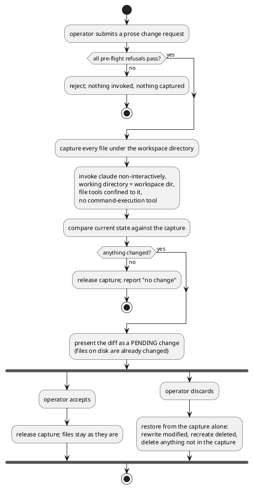

# Claude Editing Bridge

## 1. Context

Wave 002 has shipped three of its four runs. `query graph` (run-0004) exposes
the resolved element/relationship graph as JSON; `editor serve` (run-0005)
runs a local, unauthenticated HTTP server over one workspace, exposing
`GET /api/graph`, `GET /api/schemas/{type}`, `GET /api/manifests` and
`GET|PUT|POST /api/manifests/{path}`; and a single-page webapp (run-0006,
`src/main/resources/editor-webapp/index.html`) lets a human browse the
manifest tree, see the graph, and edit and save one manifest's raw YAML with
server-side validation.

What is still missing is the capability the wave's Purpose names last: from
that same page, a human describes a change in natural language and has Claude
apply it to the real manifest files, with the result shown as a diff that
must be reviewed and accepted before it is treated as final.

This run adds that. Relevant existing areas:
`src/main/java/io/morin/archicode/cli/EditorHttpServer.java` (the server and
its path-containment helpers `resolveManifestsDirs` /
`isWithinConfiguredManifestsDir`), `ServeEditorCommand.java` (the command
that starts it and fixes the one workspace it serves),
`src/main/resources/editor-webapp/index.html` (the surface a human looks at),
and `src/test/java/io/morin/archicode/cli/EditorHttpServerTest.java` (real-HTTP
tests against a temp-directory copy of `src/test/workspaces/editor_manifests/`).

This is the one run in wave 002 with real blast radius: it gives a local web
page the ability to run an autonomous coding agent against a human's actual
files. The wave's own Risks section is explicit that a weak discard guarantee
is a reason to escalate to a human rather than ship quietly.

## 2. Problems

- **Editing a manifest still requires knowing the YAML.** The webapp's editor
  is a raw-text textarea over the file's bytes (run-0006 `DEC-4`, chosen
  deliberately because the generated JSON Schema cannot describe `content`
  per `kind`). A human who knows *what* they want changed — "give the portal
  frontend a description", "point this relationship at the new backend" —
  still has to locate the file, find the field, and get the indentation right.
- **No way to express a change that spans manifests.** A rename that must be
  reflected in every `destination` referencing it is N separate hand edits
  across N files, each one a chance to introduce the dangling reference
  `query graph` was built to detect.
- **An AI-assisted edit, done naively, is untrustworthy and unreviewable.**
  Letting an agent loose on a working tree with no boundary and no undo is
  exactly the failure mode that makes people refuse such tools. Without a
  structural containment boundary and a verified revert, the feature is worse
  than its absence: it would be a button a careful human can never press.
- **There is nowhere to see what an agent actually did.** The server has no
  notion of a pending, not-yet-trusted change, and the webapp has no surface
  that shows "here is what changed, do you want it".

## 3. Scope / Out of Scope

In scope:

- A natural-language change request submitted from the editor webapp to the
  running `editor serve` server, which invokes the `claude` CLI
  non-interactively against the one workspace that server was started with.
- A containment boundary that structurally prevents the invocation from
  writing outside that workspace's directory, independent of what the prompt
  asks for and independent of the agent's own judgment.
- A content capture of that same directory taken before the invocation, and a
  diff computed after it, covering files created, modified and deleted.
  Everything the invocation may write is inside what the capture covers
  (`NFR-1`).
- A review surface in the existing webapp that shows that diff and offers
  exactly two terminal actions: accept or discard.
- A discard that restores every captured file byte-for-byte and removes
  anything the invocation created.
- Documentation of the capability and its one real environmental
  precondition (`claude` must be present where the server runs) in
  `README.md`.
- Automated tests for everything that can be tested without invoking the
  real `claude` binary, plus a live, hand-run verification of the accept,
  discard and containment paths.

Out of scope:

- Choosing a different workspace or directory from the webapp. The bridge
  operates only on the workspace `editor serve` was already started against;
  there is deliberately no "pick a different directory" capability, so there
  is no parameter through which one could be requested.
- Authentication, authorization or TLS — unchanged wave Non-Goal. Anyone who
  can reach the port can already read and write every manifest through
  `PUT /api/manifests/{path}`.
- Multiple concurrent operators, or more than one change under review at a
  time.
- A conversational, multi-turn refinement loop ("no, not like that, try
  again") — one prompt produces one reviewable result.
- Partial accept (accepting some files from a diff and rejecting others).
- Letting the client choose the model, the tool set, the permission mode, or
  any other parameter that would change the invocation's blast radius.
- Packaging `claude` into the published Docker image (see `TC-4`).
- Reverting a change after it has been accepted. Accept is terminal; the
  capture is released.

**Declared deviation from the wave's W-4 exit evidence.** Wave 002's Phase P4
row words its exit evidence as "a prompted change to a manifest in `.custom`".
This run's live verification instead runs against a **disposable copy** of
`.custom` placed outside the repository, and never against `.custom` itself.
`.custom` is the operator's own real (and gitignored — see `Q-2`) workspace;
pointing an autonomous agent at it to prove a safety property would be
spending the very thing the safety property protects. The copy is
byte-identical at the start of each check, so every assertion the wave row
asks for is still made against the same content, same file count and same
graph. Recorded here so a gate reviewer checks this run against the criterion
it actually intends to meet.

## 4. Goals / Non-goals

- `GOAL-1` — A human can describe a manifest change in prose and have it
  applied to the real files, without hand-editing YAML.
- `GOAL-2` — No change produced this way is ever treated as final until the
  human has seen what it did and said yes.
- `GOAL-3` — Saying no restores every file the pre-invocation capture covered
  exactly as it was, with no precondition on the workspace — in particular,
  no requirement that it be a git repository. Everything the invocation could
  have touched is inside what the capture covered (`NFR-1`, `FR-3`), so
  "every file the capture covered" is not a narrower promise than "every file
  the change could have affected".
- `GOAL-4` — The capability cannot be used to touch anything outside the one
  workspace directory the server was started against, whatever the prompt
  says.
- `GOAL-5` — A human can tell, before and when they attempt a change, whether
  the capability is available in their environment, and why not if it is not.

Non-goals:

- Making the agent's edit *correct*. The bridge guarantees reviewability and
  reversibility, not quality; the human's review is the quality gate.
- Validating the agent's output against the manifest schema before showing
  it. The existing `PUT /api/manifests/{path}` validation is unchanged and
  still applies to hand edits; a Claude-produced change is shown as a diff
  whether or not it parses, because a human must be able to *see* a bad
  change in order to discard it. (See `FR-6`.)
- Preserving an agent-produced change across a server restart as a still-
  reviewable session.

## 5. User Stories

- `US-1` — Describe a change and have it applied
  - Story: As the local operator of the manifest editor, I want to type what
    I want changed in plain language and have Claude edit the manifest files,
    so that I do not have to find the file and hand-edit YAML.
  - Acceptance criteria:
    - `AC-1` Given a running `editor serve` over a workspace, and `claude`
      available on the server process's `PATH`, when the operator submits the
      prompt "add a description to the Solution A manifest", then the server
      invokes `claude` non-interactively with the workspace directory as its
      working directory, and the invocation completes without any interactive
      approval prompt.
    - `AC-2` Given that invocation changed one manifest file, when it
      returns, then the response identifies that file as changed and carries
      no other file.
  - Notes: `FR-1`, `FR-2`, `NFR-2`.

- `US-2` — Review before trusting
  - Story: As the operator, I want to see exactly which files changed and how
    before anything is considered final, so that I never have to take an
    agent's word for what it did.
  - Acceptance criteria:
    - `AC-3` Given a completed invocation, when the operator looks at the
      webapp, then they see, per affected file, whether it was created,
      modified or deleted, and a line-level diff of its content against the
      pre-invocation state.
    - `AC-4` Given a completed invocation that changed nothing, when the
      operator looks at the webapp, then it says plainly that nothing
      changed, and offers no accept action that would imply otherwise.
    - `AC-5` Given a pending change under review, when the operator looks at
      the webapp, then it states explicitly that the files on disk are
      *already* in the changed state and that discarding is what puts them
      back.
  - Notes: `FR-3`, `FR-4`, `FR-7`, `TC-3`.

- `US-3` — Discard and get the files back exactly
  - Story: As the operator, I want discarding a change to restore my files
    byte-for-byte, so that trying a prompt costs me nothing.
  - Acceptance criteria:
    - `AC-6` Given a pending change that modified one or more files, when the
      operator discards it, then every file the capture covered is
      byte-identical to its pre-invocation content, verified by checksum.
    - `AC-7` Given a pending change that created a file, when the operator
      discards it, then that file no longer exists.
    - `AC-8` Given a pending change that deleted a file, when the operator
      discards it, then that file exists again with its original bytes.
    - `AC-9` Given a workspace directory that contains no `.git` directory,
      when a pending change is discarded, then every captured file is
      byte-identical to its pre-invocation content — i.e. the restore uses no
      version-control facility.
  - Notes: `FR-5`, `NFR-1`, `NFR-3`, `GOAL-3`.

Reviewer checkpoints for this flow, as pointers rather than restatement: the
capture precedes the invocation and is the discard's only input (`NFR-3`);
every pre-flight refusal happens before anything is captured or invoked, so a
rejected request has no side effect (`FR-8`, `FR-10`); and no path leads from
"invoked" to "final" without the operator's accept (`GOAL-2`).

- `US-4` — Accept and keep the change
  - Story: As the operator, I want accepting a change to simply keep it, so
    that an accepted edit is indistinguishable from one I made by hand.
  - Acceptance criteria:
    - `AC-10` Given a pending change, when the operator accepts it, then a
      subsequent `GET /api/manifests/{path}` for each affected manifest
      returns the changed content.
    - `AC-11` Given an accepted change, when the operator looks for a
      discard action, then none is offered for that change.
  - Notes: `FR-5`, `FR-7`.

- `US-5` — Cannot be aimed elsewhere
  - Story: As the operator, I want it to be structurally impossible for this
    feature to write outside the workspace I pointed the server at, so that I
    can leave the editor open without auditing every prompt.
  - Acceptance criteria:
    - `AC-12` Given a prompt that asks, plausibly and without any
      test-like framing, for a file to be written outside the workspace
      directory, when it is submitted through the bridge, then no file is
      created or modified outside that directory, and the refusal is recorded
      by the invocation's own permission machinery rather than resting on the
      agent's choice.
    - `AC-13` Given a request to the bridge's change endpoint, when it is
      inspected, then it carries no workspace, directory or path parameter of
      any kind — the target is fixed by how `editor serve` was started.
    - `AC-14` Given a workspace whose configured manifest directories resolve
      outside the workspace directory, when a change is requested, then the
      request is rejected before any invocation happens, with a message
      naming the offending directory.
  - Notes: `FR-8`, `NFR-1`, `TC-1`, `TC-2`.

- `US-6` — Know when it is unavailable
  - Story: As the operator, I want to be told clearly when this capability
    cannot work in my environment, so that I do not read a failure as a bug.
  - Acceptance criteria:
    - `AC-15` Given a server whose process cannot execute `claude` (see
      `TC-4`), when the operator submits a prompt, then the response says
      that the `claude` CLI was not found and that this capability requires it
      on the host running the server, and no change is attempted.
    - `AC-16` Given the same situation, when the webapp renders that
      response, then it shows that message to the operator rather than a bare
      status code.
    - `AC-17` Given the same situation, when the webapp loads, then the
      change-request control is already shown as unavailable, with the
      reason, before any prompt is submitted.
  - Notes: `FR-9`, `TC-4`, `GOAL-5`.

## 6. Functional requirements

- `FR-1 (P0) - Accept a prose change request for the served workspace`
  - Requirement: The system shall accept, from the editor webapp, a
    free-text description of a desired change and apply it to the files of
    the single workspace the running server was started against.
  - Rationale: `GOAL-1`; this is the wave's last stated capability.
  - Linked goals: `GOAL-1`
  - Linked stories: `US-1`
  - Notes: Deferred to TDD (endpoint shape, request/response media types,
    synchronous vs. polled completion).

- `FR-2 (P0) - Invoke the agent non-interactively, with no TTY`
  - Requirement: The system shall invoke the `claude` CLI in a mode that
    produces no interactive prompt, applies file edits without human
    confirmation at invocation time, and fails closed rather than blocking
    if anything would otherwise require a human answer.
  - Rationale: The server process has no terminal; a prompt would hang the
    request forever, and a mode that merely *suggests* edits would produce
    nothing to review.
  - Linked goals: `GOAL-1`
  - Linked stories: `US-1`
  - Notes: The exact flag combination was verified against the real binary
    before this PRD was written (see `prg-0007`, `F-1`/`F-2`); recorded in
    the TDD, not here.

- `FR-3 (P0) - Capture the whole workspace directory before invoking, or refuse`
  - Requirement: The system shall, before invoking the agent, capture the
    content of every file under the served workspace's directory,
    recursively, and shall retain that capture until the change is accepted
    or discarded. The captured set shall include every file the invocation is
    permitted to write (`NFR-1`). If the capture would exceed a bounded file
    count or total size, or if the directory contains any entry the capture
    cannot represent faithfully, the system shall refuse the request before
    invoking anything, reporting what it found, the bound where one applies,
    and what the operator can do about it.
  - Rationale: `GOAL-3`. The capture is what makes both the diff and the
    revert possible, and it must exist before the agent can change anything.
    Capturing the whole workspace directory rather than only the configured
    manifest directories is what keeps the restorable set from being smaller
    than the writable set: `workspace.yaml` itself sits beside those
    directories and is writable by the invocation, so a narrower capture
    would leave an edit to it invisible in the diff and surviving a discard.
    The bound exists because an unbounded capture of a directory the operator
    chose is an unbounded resource commitment; refusing is honest, and the
    capability is meant for a workspace directory, not an arbitrary tree.
  - Linked goals: `GOAL-2`, `GOAL-3`, `GOAL-4`
  - Linked stories: `US-2`, `US-3`
  - Notes: Deferred to TDD (where the capture lives, the bound's values, and
    its lifetime across a server restart — see `TC-3`).

- `FR-4 (P0) - Present the result as a reviewable, line-level diff`
  - Requirement: The system shall present the outcome of an invocation as a
    per-file diff against the pre-invocation capture, distinguishing files
    that were created, modified and deleted, and shall present "nothing
    changed" distinctly from "changed".
  - Rationale: `GOAL-2`. A human cannot review a summary written by the
    thing being reviewed; they need the actual delta.
  - Linked goals: `GOAL-2`
  - Linked stories: `US-2`
  - Notes: Deferred to TDD (diff algorithm and rendering).

- `FR-5 (P0) - Accept and discard are the only two terminal actions, and discard restores exactly`
  - Requirement: The system shall offer exactly two terminal actions on a
    pending change. Accept shall keep the files as the invocation left them
    and release the capture. Discard shall restore every captured file to
    byte-identical content, recreate every captured file the invocation
    deleted, and delete every file the invocation created anywhere inside the
    captured directory. After either action the change shall no longer be
    pending, and neither action shall be offered again for it.
  - Rationale: `GOAL-2`, `GOAL-3`. This is the wave's non-optional
    guarantee; a discard that is merely "stop showing the diff" is the
    failure the wave's Risks section forbids.
  - Linked goals: `GOAL-2`, `GOAL-3`
  - Linked stories: `US-3`, `US-4`
  - Notes: `NFR-1`, `NFR-3`. Deferred to TDD (how a restore avoids touching
    files whose content did not change).

- `FR-6 (P0) - Show a change even when it is invalid`
  - Requirement: The system shall present an invocation's result as a diff
    regardless of whether the resulting files are valid manifests, and shall
    not reject or auto-revert a change on validation grounds alone.
  - Rationale: The point of the review step is to let a human catch a bad
    change. Silently reverting an invalid one would hide from the operator
    what the agent did, and would also prevent a legitimate multi-file edit
    where an intermediate state is invalid. Validity remains enforced where
    it already is: on hand saves through `PUT /api/manifests/{path}`, and by
    `GET /api/graph`, which the operator can re-run after accepting.
  - Linked goals: `GOAL-2`
  - Linked stories: `US-2`
  - Notes: `TC-3`. The webapp may *warn*; it must not decide.

- `FR-7 (P0) - State plainly that a pending change is already on disk`
  - Requirement: While a change is pending review, the system shall state to
    the operator that the files on disk are already in the changed state and
    that discarding is the action that restores them.
  - Rationale: The agent edits files in place; "pending" describes the
    operator's trust, not the filesystem. An operator who believes the
    opposite would make decisions on a false model — for example closing the
    page expecting the change to evaporate.
  - Linked goals: `GOAL-2`, `GOAL-5`
  - Linked stories: `US-2`, `US-4`
  - Notes: `TC-3`.

- `FR-8 (P0) - No target parameter, and a pre-flight containment check`
  - Requirement: The change request shall carry no workspace, directory or
    path parameter. The system shall additionally refuse, before invoking
    anything, a request against a workspace whose configured manifest
    directories do not all resolve inside the workspace directory, and shall
    name the offending directory in the refusal.
  - Rationale: `GOAL-4`. The containment boundary is the agent's working
    directory, which is the workspace directory. A configured manifest
    directory outside it would be a directory the bridge is expected to edit
    but structurally cannot — and, worse, one the capture would not cover —
    so the honest answer is to refuse rather than to widen the boundary.
  - Linked goals: `GOAL-4`
  - Linked stories: `US-5`
  - Notes: `TC-1`, `TC-2`, `NFR-1`.

- `FR-9 (P0) - Report an unavailable agent as unavailable, before and after submission`
  - Requirement: When the server process cannot execute the `claude` CLI, the
    system shall report that specific condition, in terms the operator can
    act on, both as an ambient availability signal the webapp can read on
    load and as the response to a submitted request, and shall make no
    change.
  - Rationale: `GOAL-5`. The condition described in `TC-4` makes this the
    *expected* response for a documented way of running the server, not an
    edge case; an operator should learn it before typing a prompt, not after.
  - Linked goals: `GOAL-5`
  - Linked stories: `US-6`
  - Notes: `TC-4`.

- `FR-10 (P0) - One change under review at a time`
  - Requirement: The system shall refuse a new change request while a
    previous change is pending review, and shall say which pending change is
    blocking it.
  - Rationale: Two overlapping invocations would make the second one's
    capture include the first one's unreviewed edits, so discarding the
    second would silently promote the first. One operator can produce that
    overlap trivially — two browser tabs, or resubmitting an apparently-hung
    request — so this is a correctness requirement, not a concurrency
    nicety.
  - Linked goals: `GOAL-2`, `GOAL-3`
  - Linked stories: `US-5`

- `FR-11 (P1) - Surface what the invocation was refused`
  - Requirement: The system shall surface, as part of the reviewable result,
    any action the invocation attempted and was denied by its own permission
    machinery.
  - Rationale: `GOAL-4`, `GOAL-5`. An operator who can see "it tried to write
    outside the workspace and was stopped" learns something true about both
    the prompt and the guard; hiding it would make the guard unobservable and
    therefore untrustworthy.
  - Linked goals: `GOAL-4`, `GOAL-5`
  - Linked stories: `US-5`
  - Notes: `AC-12` is verified against exactly this record.

- `FR-12 (P2) - Document the capability and its precondition`
  - Requirement: `README.md` shall describe the capability and state the
    precondition recorded in `TC-4`.
  - Rationale: `GOAL-5`; the README is where every other `editor serve`
    invocation detail already lives.
  - Linked goals: `GOAL-5`
  - Linked stories: `US-6`

## 7. Non functional requirements

- `NFR-1 - Containment is structural and observable, not advisory, and its scope equals the capture's`
  - Requirement: The invocation's ability to write outside the served
    workspace's directory shall be removed by the invocation's own
    configuration — its working directory, its permitted tool set, and its
    permission mode — such that an attempt is recorded as a denial rather
    than depending on the agent choosing not to try. The invocation shall
    additionally have no command-execution tool available, so that file
    confinement cannot be bypassed by running a shell command. Every file the
    invocation may write shall be a file `FR-3`'s capture covers, so that
    nothing the invocation can change is outside what a discard restores.
    Where that containment relies on a mechanism the system does not control,
    the residual shall be named rather than implied.
  - Rationale: `GOAL-4`, `GOAL-3`. An agent's refusal is evidence about a
    model; a denial record is evidence about a sandbox. Only the second is a
    guarantee. And a containment boundary wider than the restorable set would
    make the discard guarantee true only of the files nobody worried about.
    Stated as a subset rather than as an equality because that is the
    direction the discard guarantee rests on, and because a requirement
    stated more strongly than it can be met is a requirement nobody can
    check.
  - Validation: `AC-12`, verified live with a prompt framed to make the
    out-of-scope write look legitimate (an agent that declines on its own
    initiative does not demonstrate containment — see `prg-0007` `F-3`
    versus `F-4`). The subset relation is validated by `AC-6`/`AC-7`/`AC-8`
    covering files anywhere under the workspace directory, not only under the
    configured manifest directories. The named residuals required by the last
    sentence are recorded in the TDD's Risks section.

- `NFR-2 - A request cannot hang the server forever`
  - Requirement: An invocation shall be bounded in wall-clock time, and on
    exceeding its bound shall be terminated and reported as failed, with the
    capture still intact and discardable.
  - Rationale: A single-operator local tool that waits on an unbounded
    subprocess is a tool that appears broken.
  - Validation: an automated test configures a short bound and a stand-in
    executable that outruns it, then asserts the invocation is terminated,
    reported as failed, and the capture remains discardable. `AC-1` covers
    the normal path. Deferred to TDD (the bound's default value and how it is
    configured).

- `NFR-3 - Discard is correct independently of the diff`
  - Requirement: The restore performed by a discard shall be computed from
    the pre-invocation capture alone, not from the diff presented to the
    operator.
  - Rationale: `GOAL-3`. If the diff were the restore's input, a bug in diff
    computation would become a bug in the safety guarantee. Keeping them
    independent means the worst a diff bug can do is mislead a human who can
    still get their files back.
  - Validation: `AC-6`, `AC-7`, `AC-8`, each asserted by checksum against the
    pre-invocation state rather than by re-reading the diff.

- `NFR-4 - No new runtime dependency`
  - Requirement: The capability shall add no new Maven dependency, no
    `package.json` dependency, no CDN-hosted asset and no build step.
  - Rationale: Continuity with run-0005 `CON-2` and run-0006
    `CON-2`/`CON-3`, and the repository has no frontend build tooling to
    vendor anything through.
  - Validation: `./mvnw verify` green with an unchanged `pom.xml` dependency
    block; the served page makes no external request.

- `NFR-5 - Existing behavior unchanged`
  - Requirement: No existing endpoint's contract and no existing test shall
    change. The capability shall be additive.
  - Rationale: The three runs before this one are what it is built on; a
    regression in them would invalidate their own gates.
  - Validation: `./mvnw verify` green with every pre-existing test in
    `EditorHttpServerTest` unmodified.

- `NFR-6 - No secret is written, logged or served`
  - Requirement: No credential, token, API key or environment-variable value
    shall appear in the prompt as stored, in any log line, or in any field of
    the reviewable result.
  - Rationale: The result is rendered in a browser on an unauthenticated
    port; anything the server puts there is readable by anyone who can reach
    it. Stated as a prohibition on secret values specifically, rather than on
    "anything not in a manifest", so it does not conflict with `FR-11`'s
    requirement to surface a denied action's own details.
  - Validation: the result's fields are enumerated in the TDD's contract and
    reviewed against this requirement; no environment variable is copied into
    a response.

## 8. Open Questions

None outstanding.

Two questions were open when this run started and were both closed before
this PRD was finalized, by checking rather than deciding:

- `Q-1` *(resolved)* — Is a non-interactive, edit-applying `claude`
  invocation actually possible from a server subprocess with no TTY, and does
  a hardened invocation still authenticate? **Yes to both.** Resolved
  empirically against the installed binary (`claude --version` → 2.1.280)
  before drafting, in a disposable scratch workspace: see `prg-0007` `F-1`
  and `F-2` for the verified flag combination and its observed effect.
  Recorded here as a stated assumption rather than left as a question,
  because it was the one assumption capable of invalidating the whole run.
- `Q-2` *(resolved)* — Should discard be a git-backed undo, as wave 002's
  Risks section offered as an example, or a content capture? **A content
  capture.** Resolved by inspection, not preference: `.custom/` — the wave's
  own primary target workspace — is gitignored from the repository it sits
  inside (`git check-ignore -v .custom/workspace.yaml` →
  `.gitignore:14:.custom`), so a git-backed undo would have had nothing to
  revert against for the very workspace the wave's exit evidence names. The
  wave's Risks section calls that situation a reason to escalate; a capture
  removes the need to escalate, and `GOAL-3`/`AC-9` encode that the guarantee
  must hold without a git repository.

## 9. Technical Concerns

- `TC-1` — The containment boundary is the invoked agent's working
  directory. This is a fixed property of the tool being invoked, not a design
  choice available to this run: widening it would mean passing additional
  allowed directories, which `FR-8` forbids, and would break `NFR-1`'s scope
  equality.
- `TC-2` — A workspace may configure manifest directories that are not
  inside the workspace directory (`settings.manifests.paths` resolves each
  entry against it, with no containment requirement today). `FR-8` resolves
  this by refusing rather than by widening the boundary; this is a
  behavioral limitation of the bridge, not of the rest of the editor, which
  continues to serve such a workspace normally.
- `TC-3` — A pending change is pending only in the operator's trust: the
  files on disk are already modified. This is inherent to invoking an agent
  that edits in place and is not worked around (a copy-on-write staging
  directory would mean the agent is not operating on the real workspace, and
  its edits would not be the thing being reviewed). `FR-7` requires it to be
  stated rather than hidden. A consequence: if the server stops while a
  change is pending, the files stay changed. Deferred to TDD (whether the
  capture survives the process, and what the operator is told).
- `TC-4` — **Sole owner of this fact:** the published Docker image is built
  from the Maven project by `quarkus-container-image-jib` and contains no
  `claude` binary, so an `editor serve` started from that image cannot use
  this capability. `FR-9` and `FR-12` make this explicit rather than letting
  it present as a bug; packaging `claude` into the image is out of scope
  (Section 3). `AC-15`/`AC-16`/`AC-17` reference this concern rather than
  restating it.
- `TC-5` — An invocation costs money and time against the operator's own
  Claude account. Bounding and reporting that cost is a product-visible
  property of the feature; Deferred to TDD (what is bounded, what is
  reported).
- `TC-6` — This run's actual file footprint is expected to differ from the
  wave manifest's declared `likely_paths` for `W-4`
  (`tools/manifest-editor/server/**`, `tools/manifest-editor/webapp/**`), the
  same deviation run-0004 `DEC-1`, run-0005 `DEC-1` and run-0006 `DEC-1` each
  made and documented for the same reason: nothing in this repository's build
  puts `tools/` on the runtime classpath. Deferred to TDD, where the actual
  paths are named.
