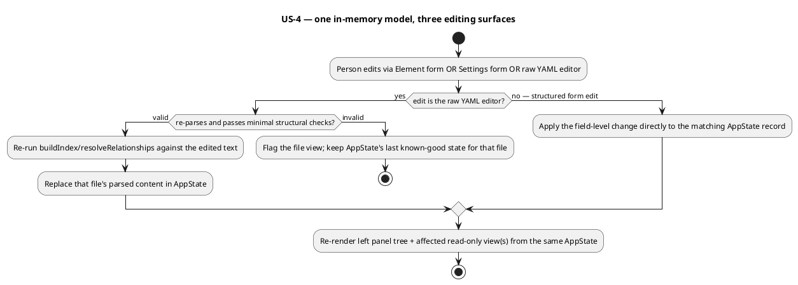

# Standalone Editor — Editing Surfaces

# 1. Context

`src/main/resources/editor-webapp/standalone.html` (shipped by wave 003's
`W-1`/run-0008) is a single, self-contained file opened directly via
`file://` in a Chromium-based browser. It picks a workspace folder,
parses `workspace.yaml` and every manifest under
`settings.manifests.paths` with a hand-written YAML-subset parser
(`parseYaml`) into an in-memory `AppState` mirroring the real Java domain
model (`buildIndex`/`indexElementRecursive`/`resolveRelationships`), and
renders a read-only three-panel shell: a left panel (Settings entry,
a two-branch Elements tree, a Files list) and a center panel that shows,
for the current `AppState.selection`, one of three read-only views —
`renderSettingsViewHtml`, `renderFileViewHtml`, or `renderElementViewHtml`
— via `renderCenterPanelHtml`, with all clicks routed through one
delegated handler (`handleAppClick`, dispatching on `data-action`).

This run is wave 003's phase-P2 run (`W-3`,
`standalone-editor-editing-surfaces`), depending on `W-1` (completed). It
turns each of those three existing read-only center-panel surfaces into
something a person can actually edit, with every edit applied to the
same in-memory `AppState` only — no disk write exists yet (that is `W-4`,
not started, and depends on this run). The real Java element model this
run's forms must mirror: `AbstractElement` (`id`, `name`, `description`,
`qualifiers: Set<String>`, `tags: Map<String,String>`,
`relationships: Set<Relationship>` — egress only) is the base of every
application kind (`person`, `system`, `container`, `component`,
`solution`, and the `group` variants) and every technology kind
(`environment`, `node`); `Relationship` is `{destination, label,
qualifiers, tags}`; `Node` additionally carries `applications:
Set<String>`.

# 2. Problems

- A person browsing a workspace through the standalone editor (post-W-1)
  can see every detail of an element, the workspace's settings, and a
  manifest's raw YAML, but cannot change any of it without leaving the
  tool to hand-edit YAML in a separate text editor and reloading the
  whole page to see the result.
- There is no form-based way to add, change, or remove a detail on an
  element (a qualifier, a tag, a relationship, or `node`'s
  `applications`) — the only existing editing surface anywhere is a
  general-purpose text editor on raw YAML, which demands the person
  already understands the exact manifest shape for that element's kind.
- The workspace's own settings (e.g. the default synthetic relationship
  label used whenever a relationship has no explicit `label` — see
  `indexElementRecursive`'s `defaultSyntheticLabel` fallback) are visible
  but fixed; there is no way to see the effect of a different setting
  without hand-editing `workspace.yaml` and reopening the folder.
- A manifest's raw YAML is shown verbatim but is not an editing surface;
  changing it today means leaving the tool entirely.
- Once editing exists on more than one surface (forms vs. raw YAML) for
  the same underlying content, nothing yet defines what keeps them
  consistent — an edit made through one surface could silently not show
  up in another, or could leave `AppState` representing two different
  realities for the same element.

# 3. Scope / Out of Scope

In scope:

- An edition view for the element view, alongside its existing read-only
  view, with forms covering every element kind's base fields (`id`,
  `name`, `description`, `qualifiers`, `tags`, `relationships`) plus
  `node`'s `applications`, supporting update, add, and remove at the
  field level (e.g. add/remove one qualifier, one tag entry, one
  relationship, one `applications` entry) without replacing the whole
  element.
- Turning the existing read-only settings view into an editable form
  covering the same fields it already displays:
  `settings.manifests.paths`, `settings.relationships.default-synthetic-
  label`, `settings.views.path`/`labels`/`properties`,
  `settings.facets.global-enabled`/`directory-name-template`/`customs`.
- Turning the existing read-only raw-YAML file view into a text editor
  whose content re-parses into the same in-memory model on a schema-valid
  edit, and is flagged (without corrupting `AppState`) on a
  schema-invalid edit.
- Keeping the element edition forms, the settings form, and the raw YAML
  editor consistent with one shared `AppState`, and with the left panel's
  Elements tree and the read-only views, without a page reload, for any
  edit made through any one of the three surfaces.
- Everything above applies to the in-memory model only.

Out of scope (deferred to `W-4` or already delivered/fixed by `W-1`, not
reopened here):

- Creating a brand-new element (into an existing or a new manifest) or
  deleting an existing element — `W-4`.
- Any write back to disk (a "save" action of any kind) — `W-4`.
- Reproducing real diagram/viewpoint rendering in the placeholder diagram
  area — whole-wave non-goal, untouched by this run.
- The folder pick/persist/reopen/close flow — delivered by `W-1`, not
  modified here.
- Any change to `docs/wav/wav-002-manifest-web-editor`'s server-backed
  editor (`editor serve`, `EditorHttpServer`, `index.html`) — independent
  code path, untouched.
- Validating a manifest edit against a full per-kind JSON Schema — no
  such schema exists server-side to borrow from (same constraint `W-1`'s
  TDD recorded as TC-1); this run's validation is limited to what its own
  TDD defines as "schema-valid" for re-parse purposes (deferred to TDD,
  see TC-1).

# 4. Goals / Non-goals

- **GOAL-1**: A person can open any element's edition view and update,
  add, or remove any of its base-field details (and, for a `node`, its
  `applications`), with the change visible immediately in the left
  panel's tree and in that element's own read-only view — no reload.
- **GOAL-2**: A person can change any workspace setting through a form,
  with the change stored and visible immediately (no reload); for
  `settings.relationships.default-synthetic-label` specifically, the
  change's effect on dependent rendering (AC-8) is also immediate — the
  other settings fields round-trip their value only, per AC-8a.
- **GOAL-3**: A person can edit a manifest's raw YAML directly; a valid
  edit updates the same in-memory model everything else reads from, and
  an invalid edit is clearly flagged without silently breaking the tool
  or losing the last good state.
- **GOAL-4**: The three editing surfaces (element forms, settings form,
  raw YAML editor) never disagree about the current in-memory state of
  the same content — an edit on one is visible on the others without a
  reload.
- Non-goal: creating or deleting whole elements or manifests (`W-4`).
- Non-goal: writing anything back to disk (`W-4`).
- Non-goal: rendering real diagrams (whole-wave non-goal).
- Non-goal: changing the folder pick/persist/close/reopen flow (`W-1`,
  already delivered).

# 5. User Stories

- **US-1**: As a person browsing an element, I want to switch to an
  edition view and change its details, so I don't have to hand-edit YAML
  to fix a typo or add a tag.
  - AC-1: From an element's element view, a visible action switches the
    center panel to that element's edition view, and another switches
    back to its read-only view, without losing the current tree
    selection.
  - AC-2: The edition view exposes `id`, `name`, `description`,
    `qualifiers`, `tags`, and `relationships` as editable fields for
    every element kind, plus `applications` for a `node`.
  - AC-3: Changing `name` or `description` and committing the change is
    reflected immediately in the left panel's tree label (where the tree
    shows `name`) and in the element's own read-only view — no reload.
  - AC-4: Adding a new qualifier, tag entry, relationship, or (for a
    `node`) `applications` entry through the edition view is reflected
    immediately in the read-only view's corresponding list/count — no
    reload.
  - AC-5: Removing an existing qualifier, tag entry, relationship, or
    `applications` entry through the edition view is reflected
    immediately in the read-only view's corresponding list/count — no
    reload.
  - AC-6: Editing a relationship's `destination`, `label`, `qualifiers`,
    or `tags` through the edition view is reflected immediately in that
    relationship's rendering in the read-only view (including whether it
    now resolves or is dangling, if `destination` changed).
- **US-2**: As a person reviewing workspace-wide behavior, I want to
  change a setting and see its effect without restarting the tool.
  - AC-7: The Settings entry's center-panel view exposes
    `settings.manifests.paths`, `settings.relationships.default-
    synthetic-label`, `settings.views.path`/`labels`/`properties`, and
    `settings.facets.global-enabled`/`directory-name-template`/`customs`
    as editable fields.
  - AC-8: Changing `settings.relationships.default-synthetic-label` and
    committing the change updates, without reload, the displayed label of
    every relationship that has no explicit `label` of its own (anywhere
    that relationship is shown — its own element's read-only view, and
    any other element's view listing it).
  - AC-8a: Editing `settings.manifests.paths` updates the stored setting
    value in `AppState.workspace.settings` and is visible the next time
    the settings view is opened, but — consistent with FR-17's no-disk-
    access rule — has no re-scan effect on which files are already loaded
    in `AppState.manifestFiles`; re-scanning disk against a changed path
    list is out of this run's scope (disk access generally is `W-4`'s).
    Editing any `settings.views.*` or `settings.facets.*` field likewise
    updates the stored value and is visible on reopening the settings
    view, with no required rendering effect beyond that value round-trip,
    since real diagram/facet rendering is a whole-wave non-goal; AC-8
    remains the one settings field with a required *downstream* rendering
    effect.
- **US-3**: As a person comfortable with raw YAML, I want to edit a
  manifest's text directly and have the tool pick up my change.
  - AC-9: The center panel's file view for a Files item is an editable
    text area seeded with that file's current raw text.
  - AC-10: Committing a schema-valid edit re-parses that file's content
    into the same in-memory model the rest of the tool reads from, and
    the left panel's tree and that file's element(s)' element views
    reflect the change immediately — no reload.
  - AC-11: Committing a schema-invalid edit (the file fails to parse, or
    parses but fails whatever minimal structural check the TDD defines
    for "schema-valid") is flagged to the person directly in the file
    view, and `AppState` keeps the last known-good parsed state for that
    file — the rest of the tool (tree, other elements' views) is not
    corrupted or left in a partial state because of it.
  - AC-12: After a schema-invalid edit is flagged, correcting the text to
    a schema-valid edit and re-committing clears the flag and re-parses
    successfully, exactly as AC-10 describes.
- **US-4**: As a person who might use either editing surface for the same
  element, I want them to never disagree with each other or with what the
  tree shows.
  - AC-13: After editing an element through its edition view (US-1),
    opening that element's manifest file's raw YAML view shows the
    change reflected in the text (the two surfaces describe the same
    underlying content, not two independent copies).
  - AC-14: After editing a manifest's raw YAML directly to change one of
    its elements (US-3, AC-10), opening that element's edition view shows
    the new values pre-filled, not the stale ones.
  - AC-15: No sequence of edits across the three surfaces in this run's
    scope (element forms, settings form, raw YAML editor) leaves the left
    panel's Elements tree showing a different element count, label, or
    nesting than the in-memory model actually holds.

This diagram is the one place a reviewer should check that both edit
paths (structured forms vs. raw YAML) converge on the same re-render
step from the same `AppState`, and that an invalid raw-YAML edit cannot
reach that re-render step with corrupted data. It does not prescribe how
the "apply" or "re-parse" step is implemented — see TC-1/TC-2, deferred
to the TDD.

# 6. Functional requirements

- **FR-1 (P0) - Element edition view toggle**
  - Requirement: The system shall offer, from an element's element view,
    a visible action that switches the center panel to an edition view
    for the same element (and a corresponding action to switch back),
    preserving the current left-panel tree selection and expansion state.
  - Rationale: US-1 needs a discoverable way to reach editing without
    disrupting navigation state already delivered by `W-1`.
  - Linked goals: GOAL-1
  - Linked stories: US-1
  - Notes: Deferred to TDD — whether the two views are a tab/toggle within
    one panel region or two distinct sibling views.

- **FR-2 (P0) - Per-kind edition form fields**
  - Requirement: The system shall render, in an element's edition view,
    editable fields for `id`, `name`, `description`, `qualifiers`,
    `tags`, and `relationships` for every element kind (`person`,
    `system`, `container`, `component`, `solution`, every `group`
    variant, `environment`, `node`), and additionally `applications` for
    a `node`.
  - Requirement: The system shall not render a field path no real kind
    actually has (e.g. no `applications` field on a non-`node` kind).
  - Rationale: Matches the real `AbstractElement`/`Node` field shapes
    (PRD Context); a mismatched or missing field set would silently
    block editing some detail for some kinds.
  - Linked goals: GOAL-1
  - Linked stories: US-1
  - Notes: `id` is editable like every other field — resolved by `Q-1`
    (section 8). See FR-18 for the tree-selection consequence of an `id`
    edit.

- **FR-3 (P0) - Field-level add/update/remove on an element**
  - Requirement: The system shall let a person, through the edition
    view, update `name`/`description`; add or remove one entry at a time
    from `qualifiers`, `tags`, `relationships`, and (for a `node`)
    `applications`; and update one existing relationship's `destination`,
    `label`, `qualifiers`, or `tags` — without requiring the whole
    element to be replaced.
  - Rationale: US-1's AC-4/AC-5/AC-6 require granular, non-destructive
    edits.
  - Linked goals: GOAL-1
  - Linked stories: US-1
  - Notes: None.

- **FR-4 (P0) - Element edit applies to AppState immediately**
  - Requirement: The system shall apply a committed element-edition-view
    edit to the in-memory `AppState` record for that element before
    re-rendering, without any disk read or write.
  - Rationale: GOAL-1/GOAL-4 require edits to land in the single shared
    model the rest of the tool reads from.
  - Linked goals: GOAL-1, GOAL-4
  - Linked stories: US-1
  - Notes: Resolved by `Q-1` (section 8) for the mechanism's shape: the
    edit mutates the canonical parsed `content` node for the owning
    manifest file, then `AppState.index`/tree/relationship resolution are
    re-derived by re-running the existing `buildIndex`/
    `resolveRelationships` over all `manifestFiles` — not a bespoke
    per-field mutation path. Still deferred to TDD: the exact function
    signatures and whether this full re-derive is the single mechanism
    used for every edit surface (see TC-3 for the render-time-vs-cached
    question this does not itself settle).

- **FR-5 (P0) - Element edit reflected in tree and read-only view**
  - Requirement: The system shall, immediately after an element edit is
    applied (FR-4) and without a page reload, re-render the left panel's
    Elements tree (so a changed `name` is visible in the tree label) and
    that element's own read-only view to reflect the new values.
  - Rationale: US-1 AC-3/AC-4/AC-5/AC-6; this is the wave gate's explicit
    P2 criterion for the element edition view.
  - Linked goals: GOAL-1
  - Linked stories: US-1
  - Notes: None.

- **FR-6 (P0) - Relationship destination change updates resolved state**
  - Requirement: When a relationship's `destination` is changed through
    the edition view, the system shall re-evaluate whether that
    relationship now resolves against the current element index (same
    same-layer-only resolution rule `W-1` already implements in
    `resolveRelationships` — application relationships resolve only
    against the application index, technology only against technology;
    see run-0008's PRD/TDD) and update its rendered resolved/dangling
    state accordingly, without a reload.
  - Rationale: US-1 AC-6; a stale resolved/dangling flag after an edit
    would mislead the person about the actual current state.
  - Linked goals: GOAL-1
  - Linked stories: US-1
  - Notes: None.

- **FR-7 (P0) - Settings form fields**
  - Requirement: The system shall render the existing settings view's
    fields — `settings.manifests.paths`, `settings.relationships.default-
    synthetic-label`, `settings.views.path`/`labels`/`properties`,
    `settings.facets.global-enabled`/`directory-name-template`/`customs`
    — as editable form controls instead of read-only text.
  - Rationale: US-2 AC-7; turns the existing read-only display into the
    one editing surface for settings.
  - Linked goals: GOAL-2
  - Linked stories: US-2
  - Notes: None.

- **FR-8 (P0) - Settings edit applies to AppState immediately**
  - Requirement: The system shall apply a committed settings-form edit to
    the in-memory `AppState.workspace.settings` record before
    re-rendering, without any disk read or write.
  - Rationale: GOAL-2/GOAL-4.
  - Linked goals: GOAL-2, GOAL-4
  - Linked stories: US-2
  - Notes: None.

- **FR-9 (P0) - Default synthetic label change propagates live**
  - Requirement: When `settings.relationships.default-synthetic-label` is
    changed and committed, the system shall update, without a reload, the
    displayed label of every relationship that has no explicit `label` of
    its own, everywhere that relationship is rendered.
  - Rationale: US-2 AC-8; this is the wave gate's explicit named example
    for the settings-form criterion.
  - Linked goals: GOAL-2
  - Linked stories: US-2
  - Notes: Deferred to TDD — whether the fallback label is resolved at
    render time (read `AppState.workspace.settings` fresh on every
    render) or baked into each relationship record at parse time and
    must be recomputed on a settings change (see TC-3).

- **FR-10 (P0) - Raw YAML editor**
  - Requirement: The system shall render the existing file view's raw
    YAML `<pre>` as an editable text input seeded with that file's
    current raw text, with a way to commit the edit.
  - Rationale: US-3 AC-9.
  - Linked goals: GOAL-3
  - Linked stories: US-3
  - Notes: None.

- **FR-11 (P0) - Valid raw YAML edit re-parses into the shared model**
  - Requirement: On a committed, schema-valid raw-YAML edit, the system
    shall re-parse that file's text with the same parsing/indexing
    pipeline already used at load time (`parseYaml`/`buildIndex`/
    `resolveRelationships`), replace that file's entry and every element
    it contributes to the index in `AppState`, and re-render the left
    panel's tree and the affected element(s)' read-only/edition views
    without a reload.
  - Rationale: US-3 AC-10; GOAL-3/GOAL-4.
  - Linked goals: GOAL-3, GOAL-4
  - Linked stories: US-3
  - Notes: "Schema-valid" for this purpose is defined by TC-1/the TDD —
    this run does not have a per-kind JSON Schema to validate against.

- **FR-12 (P0) - Invalid raw YAML edit is flagged without corrupting state**
  - Requirement: On a committed edit that fails to parse, or parses but
    fails the minimal structural check the TDD defines, the system shall
    flag the failure directly in that file's view (naming the problem,
    not just a generic error) and shall not replace that file's entry or
    any element it contributes to the index in `AppState` — the
    last-known-good parsed state for that file remains in effect for the
    rest of the tool (tree, other views) until a valid edit is committed.
  - Rationale: US-3 AC-11; this is the wave gate's explicit "without
    corrupting the in-memory model" criterion.
  - Linked goals: GOAL-3
  - Linked stories: US-3
  - Notes: None.

- **FR-13 (P0) - Recovering from an invalid raw YAML edit**
  - Requirement: After FR-12's flagged state, the system shall accept a
    further edit to the same file's text and, if it is now schema-valid,
    clear the flag and proceed exactly as FR-11 describes.
  - Rationale: US-3 AC-12.
  - Linked goals: GOAL-3
  - Linked stories: US-3
  - Notes: None.

- **FR-14 (P0) - Element-form edits visible in that file's raw YAML view**
  - Requirement: After an element edit is applied (FR-4), the system
    shall ensure that element's manifest file's raw-YAML file view (if
    opened) reflects the change.
  - Rationale: US-4 AC-13; the two surfaces must describe the same
    content, not diverge into two copies.
  - Linked goals: GOAL-4
  - Linked stories: US-4
  - Notes: Resolved by `Q-1`/`TC-2` — achieved by regenerating that file's
    YAML text from its edited canonical `content` node (not a targeted
    text patch), consistent with FR-4's resolved mechanism; the TDD still
    owns the serializer's exact output shape (key order, quoting,
    indentation) and must preserve FR-11/FR-12's re-parse guarantees for
    subsequent raw edits.

- **FR-15 (P0) - Raw-YAML edits visible in that element's edition view**
  - Requirement: After a valid raw-YAML edit is applied (FR-11), the
    system shall ensure the affected element's edition view (if opened,
    now or later) is pre-filled from the newly re-parsed values, not the
    values captured before the edit.
  - Rationale: US-4 AC-14.
  - Linked goals: GOAL-4
  - Linked stories: US-4
  - Notes: None.

- **FR-16 (P0) - Tree stays consistent across all edit surfaces**
  - Requirement: The system shall ensure that, after any sequence of
    edits across the element edition view, the settings form, and the
    raw YAML editor, the left panel's Elements tree shows the element
    count, labels, and nesting that the current in-memory model actually
    holds — never a stale snapshot from before the most recent committed
    edit.
  - Rationale: US-4 AC-15; this is the wave gate's general "kept in sync…
    without a page reload" requirement, applied across all three
    surfaces at once rather than one at a time.
  - Linked goals: GOAL-4
  - Linked stories: US-4
  - Notes: None.

- **FR-17 (P1) - No disk access from any editing surface**
  - Requirement: The system shall not read from or write to the picked
    folder as a result of any edit made through any of the three editing
    surfaces in this run's scope.
  - Rationale: Explicit non-goal; disk persistence is `W-4`'s scope, and
    an accidental write here would violate the wave's own phase
    boundary.
  - Linked goals: GOAL-1, GOAL-2, GOAL-3
  - Linked stories: US-1, US-2, US-3
  - Notes: None.

- **FR-18 (P0) - Tree selection follows an `id` rename**
  - Requirement: When an element's `id` is changed and committed, the
    system shall update the left panel's active-selection key and the
    tree's expanded-ancestor state to the element's new reference (so the
    renamed element — not a stale reference, and not an unselected tree)
    remains the active selection and visibly expanded down to it, and the
    center panel shall continue showing that same element's (now
    relabeled) read-only or edition view.
  - Rationale: `Q-1`'s resolution makes `id` editable; without this, a
    person renaming the element they are actively looking at would see
    the selection silently fall off the renamed node (its `reference` —
    and therefore its `AppState.selection.key`/`AppState.expanded`
    entries — changes when `id` changes), which would read as a bug
    rather than FR-5's "reflected immediately" guarantee.
  - Linked goals: GOAL-1
  - Linked stories: US-1
  - Notes: None.

- **FR-19 (P1) - Navigating away from an uncommitted edit discards it**
  - Requirement: The system shall, when the left panel's selection changes
    while an element edition view, the settings form, or the raw YAML
    editor has an uncommitted (not-yet-committed) in-progress edit,
    discard that in-progress edit rather than silently keeping or
    applying it; re-selecting the same item afterward shows it seeded
    from the last *committed* state, not the discarded draft.
  - Rationale: US-1/US-2/US-3 each define a "commit" action but none
    previously stated what happens to a draft that is never committed;
    silent discard matches the no-disk/in-memory-only scope (there is
    nowhere durable to park a draft across a navigation) and matches the
    existing render architecture (`render()` re-generates the whole
    center panel from `AppState` via `innerHTML`, which already has no
    mechanism to preserve unsaved DOM input across a re-render) rather
    than requiring a new one.
  - Linked goals: GOAL-1, GOAL-2, GOAL-3
  - Linked stories: US-1, US-2, US-3
  - Notes: None.

- **FR-20 (P1) - Structured-form input validation is a stated TDD decision, not a silent gap**
  - Requirement: The system shall define, for the element edition view's
    and the settings form's field-level inputs, what happens to an
    obviously-malformed value at commit time (e.g. an empty `qualifiers`/
    `applications` entry, a duplicate `tags` key, an empty relationship
    `destination`) — accept-and-normalize, reject-with-inline-flag (mirroring
    FR-12's raw-YAML treatment), or some other stated rule — rather than
    leaving the behavior unspecified the way it was before this review.
  - Rationale: FR-11/FR-12 gave the raw-YAML surface an explicit valid/
    invalid rule; the two structured-form surfaces had none, which would
    have left an asymmetry for the TDD to guess at rather than decide.
  - Linked goals: GOAL-1, GOAL-2
  - Linked stories: US-1, US-2
  - Notes: Deferred to TDD for the exact per-field rule set (this FR only
    requires that a rule set exists and is stated, not which one).

# 7. Non functional requirements

- **NFR-1 - No reload for any in-scope edit**
  - Requirement: The system shall reflect every edit described by FR-1
    through FR-20 in the relevant panel(s) without a page reload or a
    full-page navigation.
  - Rationale: This is the wave gate's own repeated phrasing ("without a
    page reload") across all three P2 criteria; a reload would also
    discard every other unsaved edit in this no-disk-write phase.
  - Validation: AC-3 through AC-15 are each checked live, in one
    continuous page session, without reloading between edits.

- **NFR-2 - Edits stay in memory only**
  - Requirement: The system shall not persist any edit made through the
    element edition view, the settings form, or the raw YAML editor
    beyond the current page session (no write to disk, IndexedDB, or any
    other storage).
  - Rationale: Matches this run's explicit scope boundary (no save
    action; `W-4`'s job) and the wave's own phase sequencing (P3 is
    "the first point real disk writes happen").
  - Validation: A fresh reload after editing (without using any
    close/reopen-persisted folder state from `W-1`) does not show the
    edit — AppState resets to what a fresh parse of the unmodified files
    produces.

- **NFR-3 - Invalid edit cannot corrupt the model**
  - Requirement: The system shall guarantee that a schema-invalid raw
    YAML edit never partially overwrites `AppState`'s index, tree, or any
    other element's data.
  - Rationale: FR-12's explicit "without corrupting the in-memory model"
    gate criterion; a half-applied bad parse would be worse than
    rejecting the edit outright.
  - Validation: AC-11 — after an invalid edit, every element and the tree
    exactly match their state from immediately before that edit was
    committed.

- **NFR-4 - Form editing stays responsive at .custom's scale**
  - Requirement: Committing an edit on any of the three surfaces and the
    resulting re-render shall complete without a visible freeze (same
    sub-second bar `W-1`'s NFR-2 set for initial load) at `.custom`'s
    real scale (~24 manifest files, under ~120 elements).
  - Rationale: Consistent with the existing performance bar; this run
    adds interaction frequency (every keystroke/commit), not just a
    one-time load.
  - Validation: Manual walkthrough against `.custom`, editing several
    elements and the settings form in sequence, observing no visible
    lag.

# 8. Open Questions

- **Q-1 (resolved)**: Is `id` itself editable through the element edition
  view? **Yes.** The wave plan's own `W-3` scope text is explicit that
  the per-kind forms cover `id` alongside `name`/`description`/
  `qualifiers`/`tags` ("update, add, or remove `id`/`name`/`description`/
  `qualifiers`/`tags`..." — `wav-003-standalone-workspace-editor.md`'s P2
  run row), so treating `id` as read-only would under-deliver against the
  wave's own stated scope, not just this PRD's prior default. Resolved
  design (binding on the TDD, mechanism detail still TDD's to spell out):
  an `id` edit is applied the same way every other element-form edit is
  — by mutating the canonical parsed `content` node for the owning
  manifest file and then re-deriving everything downstream (`reference`,
  the index, the tree, relationship resolution) by re-running the existing
  `buildIndex`/`resolveRelationships` over all `manifestFiles`, exactly
  mirroring `loadWorkspace`'s own pipeline (no new reconciliation engine
  needed — this is now FR-4's resolved mechanism, and TC-2's resolved
  answer: "regenerate from model" over "targeted text patch"). Two
  consequences follow directly from reusing
  that existing machinery rather than hand-rolling a cross-reference
  rewrite, and are accepted as the stated behavior rather than silent
  gaps:
  - Any relationship *elsewhere* whose `destination` still names the old
    `id` is not rewritten automatically; `resolveRelationships` will mark
    it dangling on the next re-render — the same, already-existing,
    already-visible dangling-badge affordance (FR-6), not corruption or a
    crash. The person sees the consequence of the rename immediately and
    can fix the dangling relationship itself through its own edition view.
  - If the renamed element is itself the target of another manifest
    file's `header.parent` (`W-1`'s DEC-5b cross-manifest attachment —
    e.g. `platform` in `.custom`), this run does not propagate the rename
    into that other file's `header.parent` text; that attachment simply
    stops resolving and the formerly-attached root becomes an unattached
    top-level root on the next rebuild, in the same spirit as a dangling
    relationship — a visible, explainable consequence of a rename that
    crosses file boundaries, not this run's job to cascade (this run does
    not write to any file other than the one being directly edited; see
    FR-17/NFR-2 — cascading a rename into a second file's content is a
    write `W-4` territory, not an in-memory read-side effect). Logged as
    DEC-reference material for the TDD rather than re-litigated there.
  - `id` is retained as the one field whose edit may change the element's
    tree identity and selection key — FR-18 (section 6) adds the
    selection-following requirement this implies.
- **Q-2 (resolved)**: What exact minimal structural check defines
  "schema-valid" for a raw YAML edit (FR-11/FR-12), given there is no
  per-kind JSON Schema to validate against (same gap `W-1`'s TDD recorded
  as TC-1)? **Resolved: reuse the existing per-file structural check
  verbatim, add nothing new.** `loadWorkspace`'s existing per-file load
  path (and `buildIndex`'s per-file check for the index-building pass)
  already define exactly this check for every manifest file at initial
  load: the text must (a) parse without throwing via the existing
  `parseYaml`; (b) parse to a non-null object with a `header` object
  whose `header.kind` (after stripping the `archicode.morin.io/` prefix)
  is a key of the existing `ARCHICODE_KIND_MAP`; (c) have a `content`
  object with `content.id !== undefined`. A raw-YAML edit is
  schema-valid iff it passes this same three-part check — the identical
  check already gating every file at folder-open time, not a new or
  stricter one invented for this run. This was the prior attempt's own
  leaning and is confirmed correct: it is simpler (`DRY` — one structural
  check, not two) and consistent with `TC-1`'s explicit non-goal of
  per-kind field-shape validation. No kind-appropriate-field-type check is
  added; a syntactically-valid document with, say, a `node`'s
  `applications` field holding a string instead of a sequence is
  "schema-valid" by this definition and is the TDD's/this run's accepted
  scope boundary (matches `W-1`'s own TC-1, which never attempted
  per-kind shape validation either).

# 9. Technical Concerns

- **TC-1**: No per-kind JSON Schema exists server-side to validate a raw
  YAML edit against (same constraint `W-1`'s TDD recorded as TC-1 for
  initial parsing); this run's "schema-valid"/"schema-invalid" judgment
  (FR-11/FR-12) must be defined by the TDD using only what the existing
  hand-written parser and indexer can check structurally. Deferred to
  TDD.
- **TC-2 (resolved by Q-1)**: Keeping the raw YAML text and the structured
  element-form edits mutually consistent (FR-14/FR-15, US-4) requires
  either (a) regenerating YAML text from the edited in-memory model,
  which risks losing hand-authored formatting/comments (a concern `W-1`'s
  wave-level non-goals already flagged as out of scope to guarantee), or
  (b) targeted text patching, or (c) some other reconciliation the TDD
  defines. **Resolved: (a), regenerate from the model.** An `id` rename
  (now in scope per `Q-1`) changes a line's key content in a way a
  targeted text patch would have to special-case anyway (the patch target
  itself moves), so regenerating the whole file's YAML text from its
  current canonical `content` node on every commit — reusing the same
  "single source of truth, re-derive everything else" shape FR-4/FR-11
  already use — is simpler than maintaining two mechanisms (patch for
  ordinary fields, regenerate for renames). The accepted cost (losing
  hand-authored formatting/comments on any edited file) was already
  flagged as out of scope by `W-1`'s wave-level non-goals, so this is not
  a new concession. The TDD still owns the serializer's exact output
  shape (key order, quoting, indentation, how it handles a `header` block
  the parser never needed to round-trip before).
- **TC-3**: Whether relationship-label fallback (FR-9) and relationship
  resolved/dangling state (FR-6) are recomputed at render time from live
  `AppState` reads, or cached on each record and invalidated/recomputed
  on the specific edits that could change them, is an implementation
  decision with real correctness consequences (a caching approach that
  misses an invalidation path would silently show stale data). Deferred
  to TDD.
- **TC-4**: `W-1`'s existing `AppState`/`ElementRecord`/rendering
  functions (`renderElementViewHtml`, `renderSettingsViewHtml`,
  `renderFileViewHtml`, `handleAppClick`'s `data-action` dispatch) are
  real, working code this run extends in place, not a blank slate —
  the TDD must show exactly how new edit-handling functions compose with
  the existing ones (e.g. new `data-action` values added to the same
  `switch`, not a parallel event-handling mechanism) rather than
  duplicating logic `W-1` already wrote correctly.
