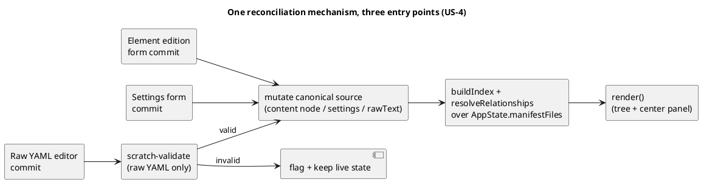
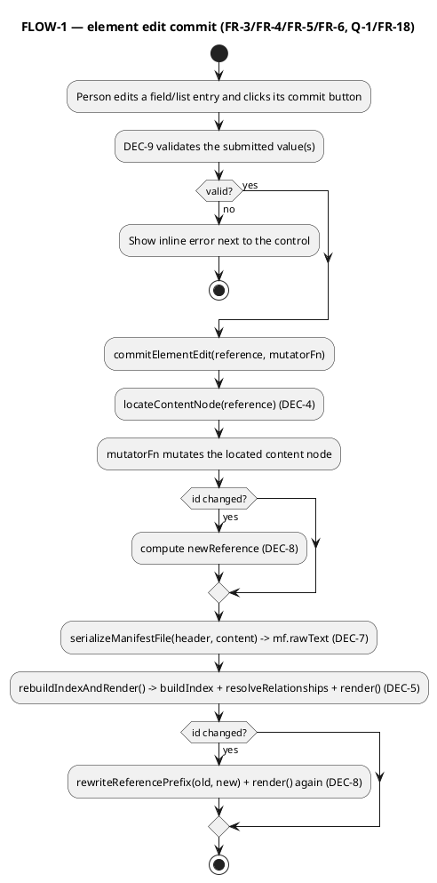

# Standalone Editor — Editing Surfaces

# Summary

Extend the existing, single-file `src/main/resources/editor-webapp/standalone.html`
(shipped read-only by `W-1`/run-0008) with three in-memory editing
surfaces — an element edition view, an editable settings form, and an
editable raw-YAML file view — all three reconciled through one mechanism:
every committed edit mutates the one canonical source of truth
(`AppState.manifestFiles[i].content` for an element edit, `AppState.workspace
.settings` for a settings edit, or a file's raw text for a YAML edit), then
the whole index/tree/relationship state is re-derived by re-running the
existing `buildIndex`/`resolveRelationships` over `AppState.manifestFiles`
— exactly mirroring `loadWorkspace`'s own pipeline, never a bespoke
per-field patch. No new file is added; this run only modifies
`src/main/resources/editor-webapp/standalone.html`.

# Scope

In scope: PRD FR-1 through FR-20 — the element edition view and its
per-kind forms; the settings form; the raw-YAML editor; the shared
mutate-then-rebuild reconciliation mechanism; a new YAML serializer (to
regenerate a file's raw text from its edited `content` node); `id`-rename
handling (including selection/expansion follow, FR-18); structured-form
validation rules (FR-20); uncommitted-edit discard on navigation (FR-19).

Out of scope: creating/deleting elements or manifests, any disk write
(`W-4`); real diagram/viewpoint rendering (whole-wave non-goal); the
folder pick/persist/reopen/close flow (`W-1`, unmodified); `wav-002`'s
server-backed editor (independent code path, untouched); a per-kind JSON
Schema for raw-YAML validation (PRD TC-1, same gap `W-1` already
recorded).

# PRD Traceability

This table is a derived index for quick lookup; each `DEC-`/`CON-`/`CTR-`
item's own **Linked PRD IDs** footer (in Proposed Design/Constraints/Data
Model and Contracts below) is the authoritative source if the two ever
disagree — e.g. a PRD ID added to a `DEC` later without this table being
re-synced should be resolved in the `DEC`'s favor, not this table's.

| PRD ID | TDD item |
|---|---|
| GOAL-1/US-1/AC-1–6 | DEC-1 (edit-mode toggle), DEC-2/DEC-2a (per-kind form via one shared template + the `applications` field gap-fix it depends on), DEC-4 (content-node locator), DEC-5 (commit-and-rebuild pipeline), DEC-8 (id rename + FR-18) |
| FR-1 | DEC-1 |
| FR-2 | DEC-2, DEC-2a (the `applications` field does not exist in `ElementRecord` today — DEC-2a adds it) |
| FR-3 | DEC-2, DEC-2a, DEC-9 (field-level add/remove/update actions) |
| FR-4 | DEC-4, DEC-5 |
| FR-5 | DEC-5 (re-render step) |
| FR-6 | DEC-5 (resolveRelationships re-run) |
| FR-7, FR-8 | DEC-3 (settings form), DEC-5 |
| FR-9 | DEC-5 (defaultSyntheticLabel baked in by indexElementRecursive on every rebuild) |
| FR-10, FR-11, FR-12, FR-13 | DEC-6 (raw-YAML commit: scratch-validate-then-swap) |
| FR-14 | DEC-7 (YAML serializer) |
| FR-15 | DEC-5 (rebuild always reads current `manifestFiles`) |
| FR-16 | DEC-5 |
| FR-17 | CON-1 |
| FR-18 | DEC-8 |
| FR-19 | DEC-10 (confirmed free from the existing full-innerHTML re-render) |
| FR-20 | DEC-9 |
| NFR-1 | DEC-5/DEC-6/DEC-10 (every surface re-renders synchronously, no reload) |
| NFR-2 | Security and Privacy section (no new persistence mechanism — IndexedDB/disk are never touched by any new function, same scope as CON-1) |
| NFR-3 | DEC-6 (scratch-validate-then-swap) |
| NFR-4 | CON-2, Reliability/Performance/Scalability section |
| Q-1 (resolved) | DEC-4, DEC-7, DEC-8 |
| Q-2 (resolved) | DEC-6 |
| TC-1 | Non-Goals |
| TC-2 (resolved) | DEC-7 |
| TC-3 (resolved) | DEC-5 |
| TC-4 | Current State, every DEC composes with existing functions |

All PRD requirements are addressed; none are left unresolved by this TDD.

# Technical Goals

- **TG-1**: Every edit, on any of the three surfaces, lands in `AppState`
  through exactly one reconciliation mechanism (mutate canonical source →
  rebuild index/tree/relationships → render), so the three surfaces cannot
  drift into independent realities (US-4).
- **TG-2**: Reuse `W-1`'s existing `parseYaml`/`buildIndex`/
  `indexElementRecursive`/`resolveRelationships`/`render*Html`/
  `handleAppClick` functions as-is for reading; add new functions that
  compose with them (new `data-action` cases in the same `switch`, new
  render functions called from the same `renderCenterPanelHtml` dispatch)
  rather than parallel mechanisms (PRD TC-4).
- **TG-3**: A small, auditable YAML serializer (the inverse of the
  existing hand-written parser) that round-trips every scalar/mapping/
  sequence shape the parser already supports, so a form-driven edit is
  visible, verbatim-equivalent, in that file's raw-YAML view (FR-14).
- **TG-4**: A schema-valid/invalid judgment for raw-YAML edits that adds
  zero new validation logic beyond what `loadWorkspace`/`buildIndex`
  already run at initial load (Q-2).

# Non-Goals

- A per-kind JSON Schema or any kind-specific field-shape validation
  beyond FR-20's stated rule set (PRD TC-1) — e.g. a `node`'s
  `applications` entry being a string instead of intended usage is not
  rejected.
- Preserving a file's original formatting/comments once any part of its
  `content` is edited through a structured form — the whole file is
  regenerated from its parsed `content` node (DEC-7); a raw-YAML edit that
  is never followed by a structured-form edit keeps its own hand-authored
  text verbatim (only `rawText` is replaced by the *new* text the person
  typed, not re-serialized).
- Undo/redo, multi-step edit history, or any persistence of a draft beyond
  the current selection (FR-19 — discard, not stash).
- Any new interaction mechanism beyond `handleAppClick`'s existing
  delegated-click dispatch — no new global listeners, no per-keystroke
  AppState mutation (commits happen on an explicit button click only).

# Assumptions

- **ASM-1**: Every element `id` is a string with no literal `.` character
  — the same assumption `indexElementRecursive`/`buildIndex` already make
  when concatenating `parentReference + '.' + childNode.id` to form a
  reference; this run's reference-prefix rewriting (DEC-8) and
  content-node locator (DEC-4) both split/rejoin on `.` and would
  mis-locate a node whose own `id` contained a dot. Pre-existing fragility,
  not introduced by this run; verifiable by grep for a literal `.` inside
  any `id:` value under `.custom/manifests/*.yaml` (none found).
- **ASM-2**: JS object key insertion order is preserved for plain objects
  with string keys (a language guarantee, not a V8-specific quirk), so
  the hand-written parser's `{}`-building (`parseYamlMapping`) already
  yields objects whose `Object.keys()` order matches the source file's
  key order — the new serializer (DEC-7) relies on this to keep an
  untouched field's position stable across a regenerate-and-reparse
  round-trip.
- **ASM-3**: `.custom`'s real manifests use no string value that is both
  (a) intended as a literal string and (b) would be mis-coerced by
  `parseYamlScalar` if left unquoted (e.g. a tag value `"yes"` meant as
  text, not boolean) — confirmed by `W-1`'s own Stage 11 parse-diff
  pass (run-0008 TDD RISK-1); the new serializer (DEC-7) must quote any
  *newly introduced* string value that collides with `parseYamlScalar`'s
  coercion rules, but does not need to re-quote values that were already
  unambiguous in the original file.

# Constraints

- **CON-1 (= PRD FR-17)**: No function added by this run reads from or
  writes to the picked folder (`dirHandle`/`FileSystemFileHandle`/
  `FileSystemDirectoryHandle`); every new function operates on
  `AppState` only. Verified by grep for `getFileHandle`/
  `getDirectoryHandle`/`.getFile(`/`showDirectoryPicker` outside the
  existing `W-1` functions.
- **CON-2 (= PRD NFR-4, run-0008 ASM-5)**: `.custom`'s real scale (~24
  manifest files, under ~120 elements) is the performance bar; the
  commit-and-rebuild pipeline (DEC-5) re-runs `buildIndex`/
  `resolveRelationships` synchronously on every commit, same cost class as
  `W-1`'s one-time load, so no chunking/debouncing is designed for.
- **CON-3**: No new `data-action` value collides with an existing one in
  `handleAppClick`'s `switch` (`open-folder`, `reopen-folder`,
  `close-folder`, `select-settings`, `select-file`, `select-element`,
  `goto-element`, `toggle-branch`, `toggle-element`) — every new case name
  is listed explicitly in DEC-1/DEC-2/DEC-3/DEC-6/DEC-9 and checked
  against this list.

# Current State

`src/main/resources/editor-webapp/standalone.html` (1228 lines, unchanged
since `W-1`/run-0008) is organized into: a YAML-subset parser
(`parseYaml`/`parseYamlBlock`/`parseYamlMapping`/`parseYamlSequence`/
`parseYamlScalar`, lines ~141-355); IndexedDB handle persistence
(lines ~365-415, untouched by this run); `AppState`
(`createInitialAppState`, lines ~421-433) and `parseSettings`
(lines ~450-483, reused as-is for the settings form's read side);
`header.kind` prefix mapping + recursive indexing + relationship
resolution (`ARCHICODE_KIND_MAP`, `indexElementRecursive`, `buildIndex`,
`resolveRelationships`, lines ~490-641 — note: `indexElementRecursive`'s
built `record` (lines ~536-547) currently has no `applications` field at
all, for any kind, even a `node`; `Node.applications` is mirrored nowhere
in the JS model yet, confirmed directly against the real code — DEC-2a
below is a prerequisite gap-fix this run must make, not an existing
behavior to reuse); workspace/manifest loading
(`loadWorkspace`, lines ~657-736, the pipeline this run's rebuild step
mirrors); folder pick/persist/reopen/close (lines ~743-827, untouched);
the read-only three-panel UI (`renderTopPanelHtml`, `renderLeftPanelHtml`/
`renderTreeBranchHtml`/`renderTreeNodeHtml`, `renderSettingsViewHtml`/
`renderFileViewHtml`/`renderElementViewHtml`/`renderCenterPanelHtml`,
`renderShellHtml`, `handleAppClick`, `render`, lines ~835-1213);
bootstrap (lines ~1219-1225). `AppState.selection` is
`{kind:'none'|'settings'|'file'|'element', key}`; there is no `mode` field
and no edit-related state yet. Every render happens via one `app.innerHTML
= renderShellHtml()` call (full subtree replace) plus one delegated
`click` listener re-attached each render — confirmed directly in the file,
not assumed.

# Proposed Design



A reviewer should check that all three surfaces funnel into the same `M
→ R → X` chain (DEC-5), and that only the raw-YAML path has a validation
gate (`V`) before `M` — the two structured-form paths commit directly
because their inputs are already structurally well-typed JS values by
construction (DEC-9 still rejects bad *values*, e.g. an empty `id`, but
never a malformed *shape*).

**DEC-1 — Element view gains an explicit view/edit mode (resolves
FR-1).** Add `mode: 'view'|'edit'` to `AppState.selection` (default
`'view'`; `createInitialAppState` and every `selection = {...}` assignment
in `select-element`/`goto-element`/`select-file`/`select-settings` set it
explicitly to `'view'`, so switching the *selected item* always lands back
in view mode — only an explicit toggle enters edit mode for the
currently-selected element). Two new `data-action` values:
`toggle-element-edit` (sets `mode` to whichever of `'view'`/`'edit'` it
currently isn't) rendered as a single button in the element view's header
in both modes ("Edit" / "Back to view"). `renderCenterPanelHtml`'s
`sel.kind === 'element'` branch dispatches on `sel.mode`:
`renderElementViewHtml` (existing, unchanged) for `'view'`,
`renderElementEditionFormHtml` (new, DEC-2) for `'edit'`.
**Alternatives considered:** two sibling tree entries (a "read" and an
"edit" node per element) — rejected, doubles the tree's size and
disagrees with the PRD's own framing ("alongside its existing read-only
view", not a second navigable item). **Tradeoffs:** one extra `AppState`
field; no migration concern since `W-1` shipped no persisted `selection`
state (`DEC-9` in run-0008's TDD — navigation state is never persisted).
**Linked PRD IDs:** FR-1, AC-1.

**DEC-2 — One shared per-kind form template, not eight (resolves
FR-2/FR-3).** `renderElementEditionFormHtml(record)` renders, for every
kind, the same block structure as the read-only view's qualitative
section (id/name/description/qualifiers/tags/relationships) but with
input controls instead of static text, plus one conditional block
(`record.kind === 'node'`) for `applications` — mirroring `AbstractElement`
being the real base type for every kind and `Node` being the only kind
with `applications`. **Rationale:** the PRD's "per-kind forms" requirement
(FR-2) is about *field coverage* (no kind exposes a field it doesn't have,
no kind is missing a field it does have), not about needing eight
hand-written templates; one shared template with a single conditional
satisfies that exactly and is far less code to keep correct (KISS/DRY).
**Alternatives considered:** eight separate template functions, one per
kind — rejected, pure duplication of six identical fields eight times for
a one-field difference. **Tradeoffs:** none identified; if a future kind
diverges further, the conditional-block pattern still scales linearly.
**Linked PRD IDs:** FR-2, FR-3, AC-2.

Fields and their controls:
- `id`, `name`, `description`: three `<input type="text">` (or the
  description as a `<textarea>`), seeded from the record's current
  values (`name`/`description` seeded `''` when `null`), plus one
  `data-action="save-element-basics"` button that reads all three inputs'
  current `.value` and calls `commitElementEdit` (DEC-5) with a mutator
  that sets `node.id`/`node.name`/`node.description` (DEC-9's validation
  rules apply first).
- `qualifiers`: existing pills each with their own small `×`
  `data-action="remove-qualifier" data-index="N"` button, plus one text
  input + `data-action="add-qualifier"` button.
- `tags`: existing key/value rows each with their own `×
  data-action="remove-tag" data-key="K"` button, plus one key input + one
  value input + `data-action="add-tag"` button.
- `relationships`: each existing relationship rendered as its own small
  sub-form (destination/label/qualifiers(comma-joined text input)/
  tags(comma-joined `k=v` text input)) with its own
  `data-action="save-relationship" data-index="N"` button, plus its own
  `data-action="remove-relationship" data-index="N"` button, plus one
  blank new-relationship sub-form + `data-action="add-relationship"`
  button at the end.
- `applications` (node only): same pattern as `qualifiers`
  (`add-application`/`remove-application`).

**DEC-2a — Prerequisite gap-fix: mirror `Node.applications` into
`ElementRecord` (resolves FR-2 for `node`'s `applications` field, which
the real code does not carry at all today).** Confirmed directly against
`indexElementRecursive` (standalone.html lines ~536-547): the `record` it
builds has `reference/kind/id/name/description/qualifiers/tags/
relationships/children/sourceFile` — no `applications` key, for any kind,
including `node`. Without this fix, DEC-2's `applications` block would
read/seed from `record.applications`, which is always `undefined`, and no
existing `applications` entry a real `.custom` `node` manifest already
has (if any) would render or be editable at all — silently defeating
FR-2/FR-3 for that one field rather than merely leaving it unimplemented.
This run therefore adds one line to `indexElementRecursive`: `applications:
Array.isArray(node.applications) ? node.applications : []` alongside the
existing `qualifiers`/`tags` lines, unconditionally (every kind gets the
field in the record for consistency with how `qualifiers`/`tags` are
already unconditional; DEC-2's own per-kind conditional rendering, not
`ElementRecord`'s shape, is what keeps a non-`node` kind from ever showing
an `applications` control). **Alternatives considered:** read
`node.applications` directly from the located content node at render time
instead of the indexed `record` — rejected: every other field the
edition view displays (`qualifiers`/`tags`/`relationships`) reads from
`record`, not from a freshly-located content node, and `applications`
should not be the one exception (CONSISTENT). **Tradeoffs:** none — this
is a strict, backward-compatible addition to `ElementRecord`'s shape (no
existing reader of `record` is affected by one more always-present array
field). **Linked PRD IDs:** FR-2, FR-3, AC-2.

**DEC-3 — Settings view becomes directly editable, no view/edit toggle
(resolves FR-7/FR-8).** Unlike the element view, the PRD's AC-7 does not
ask for a parallel read-only settings view to keep — `renderSettingsViewHtml`
is replaced in place by a form (same function name, same call site in
`renderCenterPanelHtml`) whose controls are seeded from
`AppState.workspace.settings`:
`manifests.paths` (`<textarea>`, one path per line — join with `\n` to
seed, split on `\n`/trim/filter-empty to read), `relationships.default-
synthetic-label` (`<input type="text">`), `views.path` (`<input
type="text">`), `views.labels`/`views.properties`/`facets.customs`
(`<textarea>` seeded with `JSON.stringify(value, null, 2)`, read back via
`JSON.parse` — reusing the existing display convention rather than
building a structured map/array editor the PRD never asked for, KISS),
`facets.globalEnabled` (`<input type="checkbox">`),
`facets.directoryNameTemplate` (`<input type="text">`). One
`data-action="save-settings"` button commits every field together via
`commitSettingsEdit` (DEC-5) in one call (simpler than per-field commits
for a form this size; no PRD requirement for per-field settings commits).
**Alternatives considered:** a structured per-key editor for
`labels`/`properties`/`customs` — rejected as speculative; these three
fields have no required downstream rendering effect (AC-8a), so textual
JSON parity with the existing display is sufficient. **Tradeoffs:** a
person must write valid JSON for those three fields; FR-20/DEC-9 define
what happens if they don't. **Linked PRD IDs:** FR-7, FR-8, AC-7, AC-8a.

**DEC-4 — Content-node locator (resolves Q-1's mechanism requirement
(a)).** New function `locateContentNode(reference)`:
1. `record = findElementRecord(reference)` (existing helper) → gives
   `record.sourceFile` (a `relPath`) and confirms the reference exists.
2. `mf = AppState.manifestFiles.find(f => f.relPath === record.sourceFile)`.
3. `rootRef = mf.header.parent ? mf.header.parent + '.' + mf.content.id :
   String(mf.content.id)` (exactly `buildIndex`'s own `rootReference`
   computation, DEC-5b in run-0008's TDD).
4. If `reference === rootRef`: the node is `mf.content` itself; return
   `{ mf, node: mf.content, parentArray: null, indexInParent: null }` (a
   manifest root has no in-file parent array to splice from/into — adding
   a *sibling* root is `W-4`'s create-element scope, not this run's).
5. Else, `reference` must start with `rootRef + '.'` (anything else is
   this function's own contract violation, since `findElementRecord`
   only returns references `buildIndex` actually produced from this same
   `mf.content` tree or a cross-file-attached child's — and a
   cross-file-attached child's own `sourceFile` is *its own* file, not the
   attaching parent's, so this case is unreachable for a correctly-built
   index). Split the suffix after `rootRef + '.'` on `.` (ASM-1) and walk
   `mf.content.elements` (array), matching each segment against
   successive nodes' own `id`, recursing into each matched node's own
   `.elements` for the next segment, tracking the *last* matched node's
   containing array and index so an add/remove/rename mutation can splice
   it. Returns `{ mf, node, parentArray, indexInParent }`.
**Rationale:** the `index`'s `ElementRecord`s are fresh copies built by
`indexElementRecursive` (confirmed in the real code — a new `record`
object every `buildIndex` call), never live references back into
`mf.content`'s nested objects; a commit must locate and mutate the real
parsed node, not a disposable copy that the next rebuild discards anyway.
**Alternatives considered:** have `indexElementRecursive` additionally
stash a back-reference (`record.contentNode = node`) on every
`ElementRecord` at index-build time — rejected: it would keep every
rendered element view implicitly coupled to a specific `content` object
identity across rebuilds, inviting a stale-reference bug the explicit
re-locate-by-reference approach cannot have (locating fresh, every
commit, from the current `manifestFiles`, is simpler to reason about).
**Tradeoffs:** an O(depth) walk per commit — negligible at `.custom`'s
scale (CON-2). **Linked PRD IDs:** Q-1, FR-4, TC-4.

**DEC-5 — Commit-and-rebuild pipeline (resolves FR-4/FR-5/FR-6/FR-9/
FR-15/FR-16, TC-3).** Two new functions, both ending in the same tail:

```
function rebuildIndexAndRender() {
  const { index, rootsByCategory } = buildIndex(AppState.manifestFiles, AppState.workspace.settings);
  AppState.index = index;
  AppState.workspace.application.elements = rootsByCategory.application;
  AppState.workspace.technology.elements = rootsByCategory.technology;
  AppState.relationshipStats = resolveRelationships(index);
  render();
}

function commitElementEdit(reference, mutatorFn) {
  const { mf, node, parentArray, indexInParent } = locateContentNode(reference);
  const result = mutatorFn(node, parentArray, indexInParent); // may return { renamedTo: newReference } — see DEC-8
  mf.rawText = serializeManifestFile(mf.header, mf.content); // DEC-7
  rebuildIndexAndRender();
  return result;
}

function commitSettingsEdit(mutatorFn) {
  mutatorFn(AppState.workspace.settings);
  rebuildIndexAndRender();
}
```

Every element-form action (DEC-2/DEC-9) calls `commitElementEdit` with a
small mutator closure specific to that action (set id/name/description;
push/splice a qualifier/tag/application entry; update/push/splice a
relationship). Every settings-form action (DEC-3) calls
`commitSettingsEdit`. Because `rebuildIndexAndRender` always re-derives
`index`/`relationshipStats`/the tree arrays from the live
`manifestFiles`/`settings`, FR-6 (resolved/dangling re-evaluation), FR-9
(default-synthetic-label relabeling — baked in by
`indexElementRecursive`'s existing fallback line, which reads
`settings.relationships.defaultSyntheticLabel` fresh on every
`buildIndex` call), FR-15 (a raw-YAML edit's new values appear in the
edition view, since the edition view always renders from the freshly
rebuilt `index`), and FR-16 (tree always matches the current model) all
fall out of the one pipeline with no separate invalidation logic — this
is TC-3's resolution: render-time-fresh-read via full re-derive, not
cache-and-invalidate, accepted as simplest given `.custom`'s scale
(CON-2). **Alternatives considered:** mutate the live `index`
`ElementRecord` directly (skip the rebuild) for simple field changes
(`name`/`description`) and only rebuild for structural changes
(`id`/relationships/children) — rejected: two mechanisms to keep
correct instead of one (DRY/KISS), and the performance saved is
unmeasurable at this scale. **Tradeoffs:** every commit, however small,
pays the cost of a full index rebuild — acceptable per CON-2.
**Linked PRD IDs:** FR-4, FR-5, FR-6, FR-9, FR-15, FR-16, TC-3.

**DEC-6 — Raw-YAML commit: scratch-validate, never mutate-then-rollback
(resolves FR-10/FR-11/FR-12/FR-13, Q-2, NFR-3).** New function
`commitFileEdit(relPath, newText)`:
1. Parse: `let header=null, content=null, error=null; try { const parsed
   = parseYaml(newText) || {}; header = (parsed.header && typeof
   parsed.header === 'object') ? parsed.header : null; content =
   (parsed.content && typeof parsed.content === 'object') ?
   parsed.content : null; if (!header || !header.kind) error = 'Missing
   header.kind'; else if (!content || content.id === undefined) error =
   'Missing content.id'; } catch (e) { error = e.message || String(e); }`
   — this is `loadWorkspace`'s own per-file inline logic (lines ~701-711),
   copied verbatim rather than re-derived, so the "parses, has
   `header.kind`, has `content.id`" two-thirds of Q-2's check is
   definitionally identical to the load-time check.
2. If `error` is already set, stop here: this is the invalid path (step
   4 below) — `ARCHICODE_KIND_MAP` recognition (Q-2's third part) is
   checked next only if parsing itself succeeded.
3. Otherwise, build a scratch copy: `const scratchFiles =
   AppState.manifestFiles.map(f => f.relPath === relPath ? { ...f,
   rawText: newText, header, content, error: null } : f);` and run
   `buildIndex(scratchFiles, AppState.workspace.settings)` — this is the
   same call `rebuildIndexAndRender` makes, applied to a *scratch* array,
   not `AppState.manifestFiles` itself. `buildIndex`'s own per-file
   checks — the generic "missing `header.kind`/`content.id`" re-check
   (lines ~587-590) and, separately, the `ARCHICODE_KIND_MAP` recognition
   lookup (lines ~591-596) — will set `scratchFiles[i].error` if either
   fails, completing Q-2's third part with zero new validation code
   (literally the existing function, run once more).
4. **Invalid** (`error` set, from step 1 or 3): do not touch
   `AppState.manifestFiles`/`AppState.index` at all. Set module-level
   `rawYamlEditDraft = { relPath, text: newText, error }` (DEC-10) and
   call `render()` — the file view re-renders showing the typed text
   (from the draft, not reverted) with `error` displayed inline (FR-12),
   and every other file/element/the tree is untouched because nothing
   about `AppState` itself changed (NFR-3 — this is not a rollback, it is
   simply never having mutated the live state in the first place).
5. **Valid**: `AppState.manifestFiles = scratchFiles` (the one file's
   entry swapped, rest unchanged by reference — `Array.prototype.map`'s
   untouched entries are the same object references); `rawYamlEditDraft =
   null`; call `rebuildIndexAndRender()` (DEC-5) — note this computes
   `buildIndex` a *second* time, against the now-live `manifestFiles`;
   accepted minor redundancy (CON-2's scale makes it free) in exchange for
   `rebuildIndexAndRender` remaining the single rebuild entry point every
   commit path uses, rather than having the raw-YAML path special-case
   itself to reuse step 3's scratch result directly.
**Alternatives considered:** mutate `AppState.manifestFiles[i]` directly,
rebuild, and revert on failure — rejected per NFR-3's explicit
"never corrupt" framing: a revert-after-mutate design is one bug away
from a left-behind partial state if the rebuild itself throws
unexpectedly; validate-before-touching has no such window.
**Linked PRD IDs:** FR-10, FR-11, FR-12, FR-13, Q-2, NFR-3.

**DEC-7 — YAML serializer (resolves FR-14, Q-1/TC-2's resolved "regenerate
from model" mechanism).** New function `serializeManifestFile(header,
content)` returning the full file text, and its recursive helper
`serializeYamlValue(value, indent)`:
- A plain object → one `key: <value>` line per `Object.keys(obj)` entry
  (ASM-2 — preserves existing key order for untouched keys; any key added
  by a form action appends at the end of its object), at the given
  indent; a nested object/non-empty-array value's lines follow on
  subsequent lines indented by 2 more spaces (object) — matching
  `parseYamlMapping`'s own indent-delta expectation — or as a block
  sequence (array).
- An array → one `- <item>` line per entry; a scalar item serializes
  inline after the dash; an object item serializes its first key inline
  after `- ` and every further key as a continuation line at `indent +
  2` (matching `parseYamlSequence`'s `restCol` alignment, i.e. the real
  parser's expectation that a sequence-of-maps item's own first key sits
  on the dash line and later keys align one level deeper); an empty array
  serializes as `key: []`-equivalent — actually as `key:` with no block
  following (the parser's `parseYamlMappingEntry` already treats a
  `rawValue === ''` key with no deeper-indented next line as `null`, not
  `[]`; since every list field this run edits (`qualifiers`, `tags`,
  `relationships`, `applications`, `elements`) is read back by
  `indexElementRecursive`/`buildIndex` via `Array.isArray(x) ? x : []`
  defaulting, an empty array round-tripping as `null` is behaviorally
  identical after the next parse — verified against that exact fallback,
  not asserted blindly).
- A scalar → `null`/`undefined` → literal `null`; boolean → literal
  `true`/`false`; number → `String(value)`; string → emitted **unquoted**
  only if it is non-empty, has no leading/trailing whitespace, contains
  no `:`+space/`#`+space/newline, and does not case-insensitively equal
  any of `parseYamlScalar`'s special tokens (`true`/`false`/`yes`/`no`/
  `on`/`off`/`null`/`~`) nor match its integer/decimal regexes — any
  string failing that test is emitted double-quoted with `"`/`\`
  backslash-escaped (the exact inverse of `unescapeYamlDoubleQuoted`).
  This is ASM-3's enforcement point: a value that was already unambiguous
  stays unquoted (minimal diff from a person's own hand-authored style);
  anything that would be mis-coerced on re-parse is quoted, guaranteeing
  the round-trip `serializeManifestFile` → `parseYaml` is lossless for
  every value this run's forms can produce.
**Alternatives considered:** targeted text patching (replace just the
changed line(s) in the existing `rawText` via string search/splice) —
rejected per `TC-2`'s own resolution (PRD): an `id` rename changes the
very string a patch would search for, and a structural add/remove
(e.g. inserting a new `tags` entry into a file with no `tags:` key yet)
has no existing line to patch — regenerating the whole file from its
canonical `content` is one mechanism covering every edit shape, patching
would need two. **Tradeoffs:** any edit to a file strips that file's own
original formatting/comments going forward (Non-Goals) — PRD-accepted.
**Linked PRD IDs:** FR-14, TC-2.

**DEC-8 — `id` rename: reference-prefix rewrite for selection/expansion
(resolves Q-1, FR-18).** The `save-element-basics` mutator (DEC-2), when
the submitted `id` differs from `node.id`, computes
`oldReference` (the reference passed into `commitElementEdit`) and
`newReference = oldReference.includes('.') ? oldReference.slice(0,
oldReference.lastIndexOf('.') + 1) + newId : newId` *before* mutating
`node.id = newId`, then returns `{ renamedTo: { from: oldReference, to:
newReference } }` from the mutator. `commitElementEdit` (DEC-5), after
`rebuildIndexAndRender()`, checks that return value and — if present —
calls `rewriteReferencePrefix(from, to)`:
```
function rewriteReferencePrefix(oldPrefix, newPrefix) {
  if (AppState.selection.kind === 'element') {
    if (AppState.selection.key === oldPrefix) AppState.selection.key = newPrefix;
    else if (AppState.selection.key && AppState.selection.key.indexOf(oldPrefix + '.') === 0)
      AppState.selection.key = newPrefix + AppState.selection.key.slice(oldPrefix.length);
  }
  const rewritten = new Set();
  for (const key of AppState.expanded) {
    if (key === oldPrefix) rewritten.add(newPrefix);
    else if (key.indexOf(oldPrefix + '.') === 0) rewritten.add(newPrefix + key.slice(oldPrefix.length));
    else rewritten.add(key);
  }
  AppState.expanded = rewritten;
  render(); // re-render once more so the now-corrected selection/expanded state is reflected
}
```
This covers the renamed element itself and every descendant (a
descendant's reference is `oldPrefix + '.' + rest`, unaffected by the
rename except for the shared prefix) without touching any *other*
element's `selection`/`expanded` entries, which never shared that prefix.
A relationship elsewhere whose `destination` still names the old `id` is
deliberately **not** rewritten (PRD `Q-1`'s accepted consequence —
surfaces as dangling via `resolveRelationships`, same as any other
unresolved reference); likewise a cross-file `header.parent` attachment
naming the old `id` as its parent is **not** rewritten in that other
file (PRD `Q-1`'s accepted consequence — that file's root becomes an
unattached top-level root on the next rebuild). **Linked PRD IDs:** Q-1,
FR-18.

**DEC-9 — Structured-form validation rules (resolves FR-20).** Applied
inline, before calling `commitElementEdit`/`commitSettingsEdit` (a
rejected action never calls the commit function at all — `AppState` is
never touched, matching DEC-6's "never mutate-then-rollback" philosophy
for the structured surfaces too); a rejection sets a small, action-scoped
inline error shown next to the offending control (not a full-page error)
and otherwise leaves the form's current draft inputs untouched (FR-19
still discards the whole draft on navigation, but a rejected single
action does not itself navigate away).
- `id`: required after trim; the resulting `newReference` (DEC-8) must
  not already exist in the same category's `AppState.index` under a
  *different* current reference (prevents a silent `Map` key collision in
  the next `buildIndex` call — `index[category].set(reference, record)`
  would otherwise let the later-indexed element silently shadow the
  earlier one).
- `name`/`description`: no required format; an empty-after-trim
  submission is normalized to `null` (matches `indexElementRecursive`'s
  own `null`-means-absent convention and the read-only view's "none"
  display).
- `qualifiers`/`applications` add: the new entry must be non-empty after
  trim; rejected otherwise (no silent append of an empty string).
- `tags` add: the key must be non-empty after trim and must not already
  exist in the element's current `tags` (reject with "key already exists
  — edit it instead" rather than silently overwriting); the value has no
  format requirement.
- `relationships` add/save: `destination` must be non-empty after trim;
  `label` empty-after-trim is normalized to `undefined` (so
  `indexElementRecursive`'s existing fallback-to-`defaultSyntheticLabel`
  logic applies exactly as it does for a relationship with no explicit
  label in a manifest file — not a literal empty string); `qualifiers`
  (comma-separated input) and `tags` (comma-separated `k=v` input) have no
  further format requirement beyond being parseable by a simple
  split-on-comma (malformed `k=v` pairs, i.e. missing `=`, are dropped
  rather than rejecting the whole save — consistent with "flag the
  specific problem, don't block the rest" rather than an all-or-nothing
  commit for a convenience text-shorthand field).
- Settings `manifests.paths`: at least one non-empty path required after
  splitting/trimming; reject (keep previous value) if the result would be
  empty.
- Settings `views.path`: non-empty after trim required; falls back to
  the documented default `'views'` is **not** applied here (that default
  is `parseSettings`' behavior for an *absent* key at load time, not a
  rule for an explicit, empty form submission) — an empty submission is
  rejected, not silently defaulted, so the person sees why nothing
  changed.
- Settings `views.labels`/`views.properties`/`facets.customs` (JSON
  textarea): `JSON.parse` failure is rejected inline ("invalid JSON"),
  keeping the previous value; this mirrors FR-12's "flag without
  corrupting" treatment, applied to the settings form per FR-20's own
  instruction to pick a rule set.
- Settings `facets.directoryNameTemplate`: non-empty after trim required
  (same reasoning as `views.path`).
**Alternatives considered:** silently normalizing every bad input
(dropping empties, auto-deduplicating tag keys) with no inline feedback —
rejected: FR-20 explicitly asks for a *stated* rule, and silent
normalization of an id collision in particular would corrupt the index
(a real correctness bug, not just a UX nicety). **Linked PRD IDs:** FR-20.

**DEC-10 — Uncommitted-edit discard on navigation (resolves FR-19 — no
new mechanism needed).** Confirmed, not re-derived: every
`select-settings`/`select-file`/`select-element`/`goto-element`
`data-action` handler already ends in `render()`, which replaces
`#app`'s entire subtree via `innerHTML` (DEC-1 in run-0008's TDD) — the
previous center panel's DOM (including any uncommitted `<input>`/
`<textarea>` values the person had typed but never committed) is
discarded as an ordinary consequence of that existing architecture, with
no new code required. The one case needing an explicit variable is the
raw-YAML draft (DEC-6's `rawYamlEditDraft`), because *that* surface's own
invalid-commit path must re-render (to show the error) *without*
navigating away and *without* losing the typed text — so
`rawYamlEditDraft` is explicitly cleared by the same
`select-settings`/`select-file`/`select-element`/`goto-element` handlers
(one new line in each, `rawYamlEditDraft = null;`, guarded to only matter
when navigating away from the file it belongs to) so a stale draft error
never resurfaces against a different file later. **Linked PRD IDs:**
FR-19.

# Repository Impact

- **IMP-1** — `src/main/resources/editor-webapp/standalone.html`
  - Path(s): `src/main/resources/editor-webapp/standalone.html`
  - Change type: modify (additive within the file — no existing function
    is removed; `renderSettingsViewHtml`'s body is replaced per DEC-3,
    `AppState`'s shape gains fields per CTR-1 below, `handleAppClick`'s
    `switch` gains new `case`s)
  - Why impacted: sole file in scope (wave manifest `likely_paths`, PRD
    scope) — every DEC above lands here.
  - Linked PRD IDs: all.
  - Risks / notes: this is the only file any run in this wave touches
    (wave `Risks` — "every run edits the same single file"); no merge
    conflict risk since this wave is strictly serial (one run per batch).

# Canonical Impact

No `arc`/`dom` canonical register is declared under `docs/` in this
repository (confirmed: no `docs/CLAUDE.md` exists, and this repo's root
`CLAUDE.md` names no such register) — the same finding run-0008's TDD
recorded. Following that run's own precedent rather than inventing a new
section:
- **CI-arc-1**: None. This run extends a browser-side artifact that
  mirrors existing Java domain concepts for display/editing purposes; it
  does not change, extend, or reinterpret the architecture those concepts
  describe (no Java source, `pom.xml`, or CLI behavior changes).
- **CI-dom-1**: None. No enforced invariant is added, changed, or
  ratified — every validation rule this run adds (DEC-9) is a client-side,
  in-memory-only UI guard, not a rule enforced anywhere in the Java CLI or
  its schemas.

# Data Model and Contracts

- **CTR-1 (modifies run-0008 TDD's CTR-1)**: `AppState.selection` gains a
  `mode` field: `{ kind: 'none'|'settings'|'file'|'element', key: string|
  null, mode: 'view'|'edit' }` (DEC-1); `mode` is only meaningful when
  `kind === 'element'` and is reset to `'view'` by every selection-changing
  action. `ElementRecord` (produced by `indexElementRecursive`) gains one
  more always-present field: `applications: string[]` (DEC-2a) — empty
  for every kind except `node`, where it mirrors `Node.applications`; this
  closes a real gap in `W-1`'s shipped `ElementRecord` shape, not a
  reinterpretation of it. No other `AppState`/`ElementRecord` field
  changes shape.
- **CTR-2 (new, module-level, not part of `AppState`)**: `let
  rawYamlEditDraft = { relPath: string, text: string, error: string } |
  null;` (DEC-6/DEC-10) — mirrors the existing module-level
  `treeExpandedApplications`/`treeExpandedEnvironments` pattern (transient
  UI state deliberately kept outside `AppState`'s documented shape).
- **CTR-3 — Manifest file text contract (new, resolves FR-14/TC-2)**: a
  manifest file's `rawText` is no longer guaranteed to equal the bytes
  last read from disk once any structured-form edit has touched its
  `content` — it becomes `serializeManifestFile(header, content)`'s
  output (DEC-7). `parseYaml(serializeManifestFile(header, content))`
  must reproduce a `{header, content}` structurally equal to the input
  for every value shape `indexElementRecursive`/`buildIndex` read
  (verified in Stage 11 against every real `.custom` manifest, not just
  asserted).
- **CTR-4 — No change to `AppState.workspace.settings`'s shape**
  (`parseSettings`'s existing output contract, reused read-only for the
  settings form's seed values and read-write for its commit).

# Interfaces and Behavior

- **IF-1 (extends run-0008 IF-3)** — Center panel, element selection:
  `sel.mode === 'view'` → unchanged `renderElementViewHtml`, now with one
  added `data-action="toggle-element-edit"` button in its header;
  `sel.mode === 'edit'` → `renderElementEditionFormHtml` (DEC-2), with the
  same toggle button now reading "Back to view".
- **IF-2 (replaces run-0008 DEC-7's settings view)** — Center panel,
  settings selection: always the editable form (DEC-3); one
  `data-action="save-settings"` button; per-field inline error spans
  (hidden unless DEC-9 rejected that field's last submission).
- **IF-3 (replaces run-0008 DEC-7's file view)** — Center panel, file
  selection: the raw-YAML `<pre>` becomes a `<textarea
  data-relpath="...">` seeded from `rawYamlEditDraft` (if present and
  matching this `relPath`) or `mf.rawText` otherwise; one
  `data-action="commit-file-edit" data-relpath="..."` button; an error
  banner shown when `rawYamlEditDraft.error` is set for this `relPath`
  (FR-12).
- **IF-4 (new)** — every new `data-action` value added to
  `handleAppClick`'s `switch` (CON-3 lists the existing ones this must not
  collide with): `toggle-element-edit`, `save-element-basics`,
  `add-qualifier`/`remove-qualifier`, `add-tag`/`remove-tag`,
  `add-relationship`/`save-relationship`/`remove-relationship`,
  `add-application`/`remove-application`, `save-settings`,
  `commit-file-edit`.

# Flows and Processing Logic



A reviewer should check that the "id changed?" branch is the only path
with a second `render()` call, and that every other field-level commit
(qualifier/tag/relationship/application add-remove-save, name/description)
goes through the exact same `commitElementEdit` → `rebuildIndexAndRender`
chain with no special-casing.

- **FLOW-1 (element edit commit)**: see diagram above. Linked: FR-3, FR-4,
  FR-5, FR-6, FR-18, Q-1.
- **FLOW-2 (settings edit commit)**: click `save-settings` → DEC-9
  validates every field → if any field invalid, show that field's inline
  error and do not commit any field (all-or-nothing for the one form
  submission, simpler than partial-apply) → else `commitSettingsEdit`
  mutates `AppState.workspace.settings` → `rebuildIndexAndRender()`.
  Linked: FR-7, FR-8, FR-9, FR-20.
- **FLOW-3 (raw-YAML edit commit)**: click `commit-file-edit` → read the
  `<textarea>`'s current value → `commitFileEdit(relPath, newText)` (DEC-6)
  → parse + structural check into a scratch copy → invalid: set
  `rawYamlEditDraft`, `render()` (no rebuild, no mutation of live state);
  valid: swap `AppState.manifestFiles[i]`, clear `rawYamlEditDraft`,
  `rebuildIndexAndRender()`. Linked: FR-10, FR-11, FR-12, FR-13, Q-2,
  NFR-3.
- **FLOW-4 (navigate away mid-edit)**: any `select-*`/`goto-element`
  handler → (new) clear `rawYamlEditDraft` if set → `selection = {...,
  mode: 'view'}` → `render()` — the previous center panel's uncommitted
  DOM state is discarded as a side effect of the full `innerHTML`
  replace (DEC-10), no explicit per-field discard logic needed. Linked:
  FR-19.

# Reliability, Performance, and Scalability

Every commit path (DEC-5/DEC-6) is synchronous and re-runs the same
`buildIndex`/`resolveRelationships` cost `W-1`'s one-time load already
pays once; at `.custom`'s real scale (CON-2, ~24 files/~120 elements) this
stays well under NFR-4's sub-second bar — no debouncing, chunking, or web
worker is designed for this run, consistent with run-0008's own
Reliability section for the same reason. `locateContentNode`'s walk
(DEC-4) is `O(depth)` per commit, negligible against the rebuild's own
cost. The raw-YAML path's scratch-copy-then-`buildIndex` (DEC-6) doubles
that one commit's rebuild cost (scratch pass + live pass) — still
negligible at this scale (CON-2); not optimized away because doing so
would mean the raw-YAML path reusing a cached scratch result instead of
calling the same `rebuildIndexAndRender` every other path calls, which
would reintroduce exactly the two-mechanisms risk DEC-5/DEC-6 were
designed to avoid.

# Security and Privacy

No change from run-0008's posture: everything stays local to the browser
tab (CON-1/FR-17), no network calls added, no new persistence (NFR-2 — a
fresh reload loses every edit this run makes, including a successful
commit, since only the IndexedDB-stored folder *handle* persists, never
`AppState`'s content). The new `JSON.parse` call (DEC-3, settings
`labels`/`properties`/`customs` fields) parses only text the person
themselves typed into their own browser tab — no external or
cross-origin input reaches it.

# Observability and Verification

No logging/telemetry added (same reasoning as run-0008 — a local static
file has nowhere to send it; existing `console.log`/`console.warn`/
`console.error` call sites are unchanged). Verification is a manual
`file://` walkthrough against `.custom`, driven directly by the PRD's
AC list and this wave's P2 gate text, run in Stage 11:
- Edit one element of each kind (`person`, `system`, `container`,
  `component`, `solution`, a `group` variant, `environment`, `node`)
  through its edition view — rename, add/remove a qualifier/tag/
  relationship, and (for the `node`) an `applications` entry — observing
  the tree label, the read-only view, and that file's raw-YAML view all
  update live (AC-3–6, AC-13).
- Change `settings.relationships.default-synthetic-label` and confirm
  every label-less relationship's displayed label updates everywhere it
  renders, live (AC-8).
- Edit `.custom`'s `app.platform.authx.yaml` raw YAML directly to a
  schema-valid change, confirm the tree/element view update live (AC-10,
  AC-14); then to a schema-invalid change (e.g. delete `header.kind`),
  confirm the flag appears and nothing else in the tree/other views
  changes (AC-11); then correct it back, confirm recovery (AC-12).
- Rename `platform.authx`'s own element `id` specifically (the DEC-5b
  cross-manifest-attachment case) and confirm the accepted Q-1
  consequence: `authx`'s manifest (attached via `header.parent:
  "platform"`, pointing at `platform`'s own id, not `authx`'s — so this
  specific rename does not itself trigger the orphaning case; renaming
  `platform` itself would) is unaffected, while any relationship
  elsewhere naming the old `authx` id goes dangling as expected.
- Serializer round-trip check: for every real file under
  `.custom/manifests/*.yaml`, after one trivial edit (e.g. add then remove
  a throwaway qualifier) confirm `parseYaml(mf.rawText)` after the
  regenerate reproduces the same `{header, content}` shape the file had
  before, aside from the deliberate edit itself (CTR-3).
- Navigate away from an uncommitted edit on each surface and confirm it
  is discarded (FR-19), and that a fresh page reload (new tab, not using
  `W-1`'s reopen-persisted folder) shows none of this session's edits
  (NFR-2).

# Deployment and Rollout

Same as run-0008: no deployment, no migration, no new Maven dependency —
a change to one static classpath resource, reviewed and merged like any
other source change. Rollback is a plain revert of this run's commit;
nothing external depends on the new `AppState.selection.mode` field or
`rawYamlEditDraft` variable (both are in-memory, per-tab, never
persisted).

# Risks and Tradeoffs

- **RISK-1**: The new YAML serializer (DEC-7) is hand-written, like the
  parser it inverts, and could silently produce text that re-parses to a
  *different* structure than intended for a value shape not covered by
  `.custom`'s real fixtures. Mitigation: Stage 11's explicit round-trip
  check (Observability and Verification) against every real `.custom`
  manifest file, not just the files this run's manual walkthrough happens
  to edit.
- **RISK-2**: `id`-rename's accepted consequences (Q-1 — dangling
  relationships elsewhere, orphaned cross-file attachment) could read as
  a bug to a person who doesn't expect them. Mitigation: this is a stated
  PRD decision, not a silent gap, and the dangling-badge/unattached-root
  outcomes are both already-existing, already-visible UI states from
  `W-1` — no new failure mode is introduced, only a new way to reach an
  existing one.
- **RISK-3 (carried from run-0008's RISK-2)**: full-`innerHTML`
  re-render on every commit (DEC-5/DEC-10) is the same granularity `W-1`
  chose for a read-only UI; this run leans on it further (every
  keystroke-triggering-a-commit, not just every navigation click) and
  explicitly turns its "no incremental DOM patch" property into a
  feature for FR-19 (DEC-10) rather than fighting it — accepted, not
  re-litigated.
- **RISK-4**: Settings' `labels`/`properties`/`customs` JSON-textarea
  controls (DEC-3) ask a person to hand-edit JSON for fields with no
  required rendering effect (AC-8a) — a usability rough edge, not a
  correctness risk (DEC-9's `JSON.parse`-failure rejection prevents
  corruption). Accepted per AC-8a's own narrowed scope; a future run could
  replace this with a structured editor if these fields ever gain a real
  rendering effect.

# Open Questions

None outstanding — PRD Q-1/Q-2 were resolved before this TDD was drafted
(see PRD section 8 and this TDD's DEC-4/DEC-6/DEC-7/DEC-8).

# Deferred Work

- **DEF-1**: A structured (non-JSON-textarea) editor for
  `settings.views.labels`/`properties`/`facets.customs`, if a future run
  gives those fields a real rendering effect that makes hand-edited JSON
  too error-prone (RISK-4).
- **DEF-2**: Reusing DEC-6's scratch-validation result directly instead of
  calling `rebuildIndexAndRender` a second time on the valid path
  (Reliability section) — not worth the mechanism split at `.custom`'s
  scale today.
- **DEF-3 (carried from run-0008's DEF-1)**: YAML anchors/aliases,
  multi-document streams, flow collections, block scalars — still not
  needed by any real fixture; the new serializer (DEC-7) does not produce
  them either, consistent with the parser's own scope.

# File Placement and Frontmatter

This TDD is saved at
`docs/wav/wav-003-standalone-workspace-editor/run/run-0009-standalone-editor-editing-surfaces/tdd-0009-standalone-editor-editing-surfaces.md`,
matching this wave's existing run-0008 TDD's path pattern. No new source
file is created; the sole modified file is
`src/main/resources/editor-webapp/standalone.html`, exactly where the wave
manifest's `likely_paths` names it for `W-3`.
