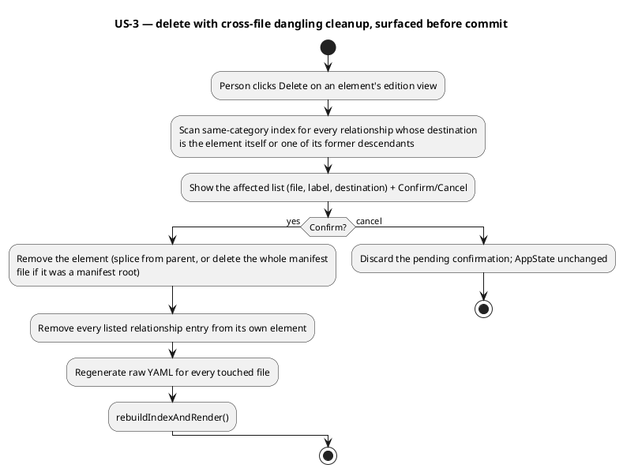

# Standalone Editor — Create, Delete & Save

# 1. Context

`src/main/resources/editor-webapp/standalone.html` (shipped read-only by
`W-1`/run-0008, made editable in-memory by `W-3`/run-0009) is a single,
self-contained file opened via `file://`. It picks a workspace folder,
parses `workspace.yaml` and every manifest under `settings.manifests.paths`
into an in-memory `AppState`, and lets a person edit any element's base
fields (`id`/`name`/`description`/`qualifiers`/`tags`/`relationships`, plus
a `node`'s `applications`), the workspace's own settings, and a manifest's
raw YAML — all three surfaces funneling through one reconciliation
mechanism (`commitElementEdit`/`commitSettingsEdit`/`commitFileEdit`, each
ending in `rebuildIndexAndRender()`) that mutates the canonical parsed
source and re-derives `AppState.index`/the tree/relationship resolution by
re-running `buildIndex`/`resolveRelationships`. No edit survives a reload
today — `W-3`'s scope stopped at the in-memory model, by design (wave
Non-Goal, deferred to this run).

This run is wave 003's phase-P3 run (`W-4`,
`standalone-editor-create-delete-and-save`), depending on `W-3`
(completed), and the **last run in the wave**. It adds the three
capabilities the wave's Completion Criteria names as what closes the wave
out: creating a new element (into an existing manifest, as a nested child,
or into a brand-new manifest file), deleting an element without leaving a
dangling relationship anywhere in the saved model, and a save action that
writes every changed manifest file (and `workspace.yaml`, if its settings
changed) back to the real granted directory via the File System Access
API. This is the first point in the whole wave a real file on disk is
modified — every prior run's "no disk write" boundary (`W-3`'s `FR-17`,
`W-1`'s read-only scope) ends here.

The real Java model this run's create/delete logic must stay consistent
with (same as `W-1`/`W-3`'s own grounding): `AbstractElement`
(`id`/`name`/`description`/`qualifiers`/`tags`/`relationships`, egress
only) is the base of every application kind (`person`, `system`,
`container`, `component`, `solution`, and the `group` variants) and every
technology kind (`environment`, `node`); a manifest file's `header.kind`
is a prefixed `ManifestKind` id (e.g. `"archicode.morin.io/system"`) that
maps to a `{category, rootKind}` pair (`ARCHICODE_KIND_MAP`, already in
the file); a manifest's root element can be cross-file-attached under an
existing element via `header.parent` (`DEC-5b`) — this is how most of
`.custom`'s real nesting works (`platform.authx` is a wholly separate file
from `platform`, attached by `header.parent: "platform"`).

# 2. Problems

- A person who has corrected or extended a workspace through the editor's
  existing edition views (`W-3`) has no way to add a genuinely new element
  — every edit so far can only change a field on something that already
  exists in a manifest file loaded at open time.
- There is no way to remove an element at all. A person who decides an
  element is wrong, duplicated, or obsolete must still hand-edit YAML in a
  separate text editor, and even then has no help finding every other
  manifest file whose `relationships[].destination` still names the
  removed id — exactly the kind of cross-file reference the tool's own
  dangling-relationship badge (`W-1`) was built to surface, but never to
  fix.
- Every edit made through the tool today — however correct — disappears
  on the next reload. The tool has picked and remembered a real folder
  (`W-1`) and can edit a real in-memory mirror of it (`W-3`), but has no
  way to put a single byte of that work back on the disk the person
  actually granted access to.
- Two risks the wave's own plan explicitly left open for this run to
  decide, not guess at the wave level: what "save" does if a file changed
  on disk since it was loaded (e.g. hand-edited externally during the same
  session), and whether a save preserves a manifest's hand-authored YAML
  comments/formatting (the wave's Non-Goals already flag that `W-3`'s
  in-memory serializer does not guarantee this, and defers the real-world
  consequence — now that saves actually happen — to this run).

# 3. Scope / Out of Scope

In scope:

- Creating a new element as a nested child of an existing element (same
  manifest file as the parent, appended to the parent's own
  `content.elements`) — covers "into an existing manifest."
- Creating a new element as a brand-new manifest file's root element,
  either as a genuine top-level root (no `header.parent`) or cross-file
  attached under an existing element (`header.parent` set) — covers "into
  a brand-new manifest."
- Deleting any element (a manifest root — which removes that whole
  manifest file — or a nested child — which splices it out of its
  parent's `content.elements`), scanning the whole same-category model for
  any relationship whose `destination` names the deleted element or one of
  its former descendants (including a cross-file-attached former
  descendant) and removing those relationship entries before the delete is
  considered complete, with the affected relationships surfaced to the
  person before the delete is committed (not a silent removal).
- A save action that writes every file this session actually changed
  (and only those) back to the granted directory via the File System
  Access API: a modified existing manifest file (`createWritable`), a
  brand-new manifest file (`getFileHandle(name, {create: true})`), a
  manifest file whose root element was deleted (`removeEntry`), and
  `workspace.yaml` itself if any setting changed.
- Detecting, at save time, whether a file this session is about to write
  has changed on disk since it was loaded (or since this session's own
  last successful save of it), and refusing the save (naming every
  conflicting file, making no partial write) rather than silently
  overwriting an external change.
- Stating plainly, as an accepted and already-TDD-decided consequence
  inherited from `W-3` (not re-litigated here): saving a file that
  received at least one structured-form edit this session (an element
  edition-view field, an id rename, or this run's own cross-file
  relationship pruning) writes that file with its original hand-authored
  comments/formatting stripped (regenerated from the parsed model); a file
  touched only through the raw-YAML editor, or never touched at all,
  writes back exactly the text already in memory.

Out of scope (deferred, or already delivered/fixed by `W-1`/`W-3`, not
reopened here):

- Any new comment/formatting-preserving YAML writer — `W-3`'s existing
  regenerate-from-model serializer (`serializeManifestFile`) is reused
  as-is; building a format-preserving one is a substantial undertaking
  this run's scope does not ask for (see Open Questions).
- Cascading a delete into a cross-file-attached child's own manifest file
  — deleting a parent whose children are attached from other manifest
  files via `header.parent` does not delete those other files; they
  simply fail to resolve their attachment on the next rebuild and become
  unattached top-level roots, the same accepted consequence `W-3`'s `Q-1`
  already established for an `id` rename crossing a file boundary.
- Scanning or cleaning up a `node`'s `applications` entries that name a
  deleted application element — `applications` is not a `Relationship`
  and has never had a resolved/dangling concept in this tool (confirmed
  directly: `resolveRelationships` only ever reads `record.relationships`,
  never `record.applications`); the wave's own scope text names
  "relationship," not this field. Logged as a known, accepted gap, not a
  silent one (see Open Questions).
- Any element-form field not already covered by `W-3` (qualifiers, tags,
  relationships, `node.applications`) — this run's create form seeds only
  `id`/`name`/`description` plus the chosen placement; a person adds
  qualifiers/tags/relationships/applications afterward through the
  already-existing edition view (reuse, not duplication).
- Undo/redo for a save, or any "are you sure" confirmation beyond the one
  this PRD explicitly requires for delete (`AC-9`) — a create or a save
  has no destructive consequence of its own to confirm.
- Any change to `docs/wav/wav-002-manifest-web-editor`'s server-backed
  editor — independent code path, untouched.
- Real diagram/viewpoint rendering — whole-wave non-goal, untouched.

# 4. Goals / Non-goals

- **GOAL-1**: A person can create a new element — as a child of an
  existing one, or as a brand-new manifest's root, optionally attached
  under an existing element — and immediately see it in the left panel's
  Elements tree, sourced from the correct file.
- **GOAL-2**: A person can delete any element and be shown, before
  committing, every relationship elsewhere that would otherwise be left
  dangling by the deletion; confirming removes the element and those
  relationship entries together, so no dangling reference is ever
  silently saved.
- **GOAL-3**: A person can save every change made this session back to
  the real folder on disk with one explicit action, and reloading that
  folder afterward shows exactly what was saved — nothing more, nothing
  silently lost, and no corrupted file.
- **GOAL-4**: A save never silently clobbers a change made to a file
  outside this session since it was loaded; it refuses instead, naming
  the conflict, rather than guessing which version should win.
- Non-goal: preserving every manifest's original YAML formatting/comments
  through an edit-then-save round trip (inherited, restated, not solved).
- Non-goal: deleting or modifying any file outside `settings.manifests.
  paths` and `workspace.yaml` — a save never reaches beyond that scope.
- Non-goal: multi-user conflict resolution beyond the single-session
  stale-check in `GOAL-4` — this remains a local, single-person tool
  (whole-wave Non-Goal).

# 5. User Stories

- **US-1**: As a person building out a workspace, I want to add a new
  child element to something that already exists, so I don't have to
  hand-edit YAML to extend a manifest.
  - AC-1: From an existing element's edition view, a visible action opens
    a create form for a new child element, offering only the kinds that
    element's own kind can actually contain (mirroring `W-1`'s tree
    nesting rules — e.g. a `system` offers `container`/`group`, a
    `container` offers `component`/`group`).
  - AC-2: Submitting the form with a valid, non-colliding `id` appends the
    new element to the parent's own manifest file's `content.elements`,
    and the left panel's tree, the parent's own read-only view (child
    count), and that file's raw-YAML view all reflect it immediately — no
    reload.
  - AC-3: The new element opens directly in its own edition view after
    creation, so the person can continue adding qualifiers/tags/
    relationships through the existing `W-3` form without a separate
    navigation step.
- **US-2**: As a person building out a workspace, I want to add a
  brand-new top-level element — attached under something that exists, or
  fully standalone — so I'm not limited to extending what's already in one
  file.
  - AC-4: From the left panel's Applications or Environments branch
    header, a visible action opens a create form for a new top-level
    element, offering every kind valid for that category
    (`person`/`system`/`solution`/`container`/`component`/
    `container-group`/`solution-group`/`system-group` for Applications,
    `environment`/`node` for Environments), an optional "attach under an
    existing element" field, and the same `id`/`name`/`description` fields
    as `AC-1`.
  - AC-5: Leaving "attach under" blank creates a genuinely top-level
    element (no `header.parent`) only when the chosen kind is one the
    real domain model actually allows as unparented — `solution`/
    `system`/`person`/`container-group`/`solution-group`/`system-group`
    for Applications, `environment` for Environments (`W-1`'s TDD
    `DEC-8`); choosing `container`/`component` with "attach under" left
    blank is rejected (`FR-6`), since neither kind is ever genuinely
    top-level in the real model. Otherwise, the tree shows the new
    element as a new top-level branch entry.
  - AC-6: Filling "attach under" with an existing element's reference
    whose own kind can contain the chosen new kind creates the new
    manifest file with that `header.parent` set; the tree shows the new
    element nested under the chosen parent, exactly as a cross-file
    attachment already renders (`DEC-5b`) — matching, from the tree's own
    perspective, the same nesting a same-file child would show.
  - AC-7: Submitting either form creates a brand-new entry in
    `AppState.manifestFiles` (not yet written to disk) whose relative path
    follows the existing `.custom` naming convention (category prefix +
    the new element's full reference, dot-joined, `.yaml`), appears
    immediately in the left panel's Files list, and shows the synthesized
    YAML in that file's raw-YAML view — no reload.
  - AC-8: Submitting a create form with an `id` that would collide with an
    existing reference in the same category (same rule `W-3`'s `DEC-9`
    already applies to a rename) is rejected inline, naming the collision;
    nothing is created.
- **US-3**: As a person cleaning up a workspace, I want to delete an
  element and trust that nothing elsewhere is left silently pointing at
  it.
  - AC-9: A delete action on any element (from its edition view) first
    shows, inline, every relationship elsewhere in the same category that
    targets the element or one of its former descendants (file + label +
    destination for each), and requires an explicit second confirmation
    click before anything is actually removed — never a one-click
    irreversible delete.
  - AC-10: Confirming the delete removes the element (its whole manifest
    file if it was a manifest root; just its own entry from its parent's
    `content.elements` if it was a nested child) and every relationship
    entry `AC-9` listed, regenerates the raw YAML of every file touched by
    either removal, and updates the left panel's tree, Files list, and
    every affected element's read-only/edition view immediately — no
    reload, and no relationship anywhere still names the removed
    reference or a former descendant's reference.
  - AC-11: Canceling the confirmation (rather than confirming) leaves
    `AppState` completely unchanged — the element, every relationship
    `AC-9` listed, and every file's content are exactly as they were
    before the delete action was started.
  - AC-12: Deleting a manifest root that other manifest files attach to
    via `header.parent` does not delete those other files; on the next
    rebuild (immediate, same commit), they become unattached top-level
    roots in the tree — a visible, explainable consequence, not a crash
    or a silently vanished element.
- **US-4**: As a person who has made real changes, I want to put them back
  on disk, in the folder I actually picked.
  - AC-13: Before writing anything, a save action ensures the granted
    folder handle carries `readwrite` permission — checking via
    `queryPermission({mode: 'readwrite'})` and, if not already granted,
    requesting it via `requestPermission({mode: 'readwrite'})` from
    inside the save button's own click handler (a user gesture, matching
    `W-1`'s `CON-3`); if the person denies that request, the save stops
    immediately, writes nothing, and says so plainly. Every handle this
    tool has ever granted so far (`showDirectoryPicker()`/
    `requestPermission`/`queryPermission` in `W-1`) is `read`-only, so
    this elevation is required before `AC-14` can do anything at all.
  - AC-14: A visible save action, available whenever at least one change
    this session has not yet been saved, writes every created or modified
    manifest file, removes every manifest file whose root element was
    deleted, and writes `workspace.yaml` if any setting changed — all
    scoped to the granted directory, under `settings.manifests.paths` or
    `workspace.yaml` itself, and nowhere else.
  - AC-15: After a successful save, reopening the same folder (a fresh
    `loadWorkspace` — e.g. via a full page reload and the existing
    auto-reopen flow) shows exactly the saved state: every created
    element present, sourced from the correct file; every deleted
    element and its cleaned-up relationships absent; no parse error on any
    file.
  - AC-16: If a file this save would write has changed on disk since it
    was loaded (or since this session's own last successful save of it),
    the save is refused entirely (no file is written, including ones that
    have no conflict) and the person is shown exactly which file(s)
    conflict, with guidance to reopen the folder before retrying.
  - AC-17: A save failure for a reason other than a conflict (e.g. the
    browser denies write permission mid-save) leaves every already-written
    file in this save attempt written, names which file failed and why,
    and leaves every file after the failure point unattempted — not
    silently retried, not silently skipped without being named.

# 6. Functional requirements

- **FR-1 (P0) - Add-child-element entry point**
  - Requirement: The system shall offer, from an element's edition view, a
    visible action that opens a create form for a new child element of
    that element, restricted to the kinds that element's own kind can
    actually contain.
  - Rationale: US-1, AC-1.
  - Linked goals: GOAL-1
  - Linked stories: US-1
  - Notes: The allowed-child-kind table mirrors `W-1`'s TDD `DEC-8` tree
    nesting rules exactly — this run does not invent a new rule set.

- **FR-2 (P0) - Add-child-element commit**
  - Requirement: The system shall, on a valid submission, append the new
    element as an entry in the parent's own `content.elements` array (same
    manifest file as the parent), regenerate that file's raw YAML from the
    now-mutated content, and reflect the change in the tree, the parent's
    read-only view, and that file's raw-YAML view without a reload.
  - Rationale: US-1, AC-2.
  - Linked goals: GOAL-1
  - Linked stories: US-1
  - Notes: Reuses `W-3`'s existing `commitElementEdit`/
    `rebuildIndexAndRender` pipeline — a creation is a mutator that pushes
    into an array rather than one that changes a scalar field.

- **FR-3 (P0) - New element opens in its own edition view**
  - Requirement: The system shall, immediately after a successful create
    (child or top-level), set `AppState.selection` to the new element in
    edit mode.
  - Rationale: US-1, AC-3 — avoids a separate navigation step to add the
    qualifiers/tags/relationships the create form itself does not collect.
  - Linked goals: GOAL-1
  - Linked stories: US-1
  - Notes: None.

- **FR-4 (P0) - Add-top-level-element entry point**
  - Requirement: The system shall offer, from each of the left panel's
    Applications and Environments branch headers, a visible action that
    opens a create form for a new top-level element in that category,
    offering every manifest kind valid for that category, an optional
    "attach under an existing element" field, and the same `id`/`name`/
    `description` fields as the child-create form.
  - Rationale: US-2, AC-4.
  - Linked goals: GOAL-1
  - Linked stories: US-2
  - Notes: None.

- **FR-5 (P0) - Add-top-level-element commit synthesizes a new manifest file**
  - Requirement: The system shall, on a valid submission, synthesize a new
    manifest file (`header.kind` from the chosen kind, `header.version:
    "1"`, `header.parent` set only when "attach under" was filled;
    `content.id`/`name`/`description` from the form) and add it as a new
    entry in `AppState.manifestFiles`, with a relative path following the
    existing convention (category prefix + the new element's full
    reference, dot-joined + `.yaml`), marked as not yet existing on disk.
  - Rationale: US-2, AC-7.
  - Linked goals: GOAL-1
  - Linked stories: US-2
  - Notes: The naming pattern itself (category prefix + dot-joined
    reference + `.yaml`) is already confirmed against every real
    `.custom` manifest file name (see `TC-2`) — only *which* of several
    configured `settings.manifests.paths` entries a new file lands under
    (when more than one is configured; `.custom` itself configures only
    one) is deferred to the TDD.

- **FR-6 (P0) - Attach-under validation, and top-level-kind gating when left blank**
  - Requirement: The system shall reject a top-level create submission,
    naming the problem and creating nothing, if: (a) "attach under" is
    filled and that element does not exist in the same category's index,
    or its own kind cannot contain the chosen new kind per the same
    nesting rule `FR-1` uses; or (b) "attach under" is left blank and the
    chosen kind is not one the real domain model allows as a genuinely
    unparented root — `solution`/`system`/`person`/`container-group`/
    `solution-group`/`system-group` for the Applications category,
    `environment` for the Environments category (`W-1`'s TDD `DEC-8`);
    `container`/`component`/`node` are never valid with "attach under"
    left blank.
  - Rationale: US-2, AC-5/AC-6 — case (a) is an attachment that cannot
    ever resolve, or resolves to a kind-incompatible nesting; case (b),
    found during this run's own Stage 2 KDMLLC review against the real
    domain model's `DEC-8` nesting rules, is a `container`/`component`
    (application) or a bare `node` with no parent and no containing
    system/environment — architecturally nonsensical relative to the
    model this tool mirrors, and nothing before this review caught it.
  - Linked goals: GOAL-1
  - Linked stories: US-2
  - Notes: None.

- **FR-7 (P0) - Create id-collision validation**
  - Requirement: The system shall reject a create submission (child or
    top-level) whose resulting full reference already exists in the same
    category's current index, naming the collision, without creating
    anything.
  - Rationale: US-1/US-2, AC-8 — the same `Map` key-collision risk `W-3`'s
    `DEC-9` already guards against for an `id` rename.
  - Linked goals: GOAL-1
  - Linked stories: US-1, US-2
  - Notes: None.

- **FR-8 (P0) - Delete impact scan**
  - Requirement: The system shall, when a delete action is started on an
    element, compute that element's own reference plus every reference in
    the same category's current index that is a former descendant of it
    (including a cross-file-attached one), then scan every relationship on
    every element in that same category for a `destination` matching any
    reference in that set, and present the matching relationships (their
    owning file, label, and destination) to the person before any removal
    happens.
  - Rationale: US-3, AC-9 — this is the wave's own explicit "scan the
    whole model" requirement; the surfaced list is what makes the
    following confirm/cancel step meaningful rather than a blind
    "are you sure?".
  - Linked goals: GOAL-2
  - Linked stories: US-3
  - Notes: Scanning is scoped to the deleted element's own category
    (application or technology) — a relationship never resolves
    cross-category (`W-1`'s `DEC-5`), so a cross-category scan would only
    ever find nothing.

- **FR-9 (P0) - Delete requires explicit confirmation**
  - Requirement: The system shall not remove anything as a result of a
    delete action until the person takes a second, explicit confirming
    action after `FR-8`'s impact list is shown; canceling shall leave
    `AppState` completely unchanged.
  - Rationale: US-3, AC-9/AC-11 — matches this PRD's own framing
    ("surfaced... not a silent removal") and the wave's "no dangling
    reference may be silently saved" requirement's implicit corollary that
    the removal itself must not be silent either.
  - Linked goals: GOAL-2
  - Linked stories: US-3
  - Notes: None.

- **FR-10 (P0) - Delete commit removes the element and every scanned relationship together**
  - Requirement: The system shall, on confirmation, remove the element
    (splicing it from its parent's `content.elements` if it was a nested
    child, or removing its whole manifest file's entry from
    `AppState.manifestFiles` if it was a manifest root) and every
    relationship entry `FR-8` found, in the same commit, regenerate the
    raw YAML of every file either removal touched, and re-render the tree
    and every affected view without a reload.
  - Rationale: US-3, AC-10.
  - Linked goals: GOAL-2
  - Linked stories: US-3
  - Notes: A manifest-root delete marks that file for removal from disk at
    the next save (`FR-14`); it is removed from `AppState.manifestFiles`
    immediately so the tree/Files list stop showing it right away.

- **FR-11 (P0) - Cross-file attachment orphaning on parent delete is not cascaded**
  - Requirement: The system shall not delete, modify, or otherwise cascade
    into a manifest file that is cross-file-attached (via `header.parent`)
    under a deleted element; on the next rebuild, that file's root becomes
    an unattached top-level root in the tree.
  - Rationale: US-3, AC-12 — same accepted-consequence shape `W-3`'s `Q-1`
    already established for an `id` rename, applied here to a delete.
  - Linked goals: GOAL-2
  - Linked stories: US-3
  - Notes: This falls out of the existing `buildIndex`/`DEC-5b` "parent not
    found → top-level root" rule with no new code — the attaching file's
    `header.parent` string no longer resolves once the deleted element is
    gone from the index.

- **FR-12 (P0) - `node.applications` is not scanned or cleaned on delete**
  - Requirement: The system shall not alter, scan, or flag any `node`'s
    `applications` entries as part of a delete action, even one naming the
    deleted application element.
  - Rationale: Scope boundary — `applications` is not a `Relationship` and
    has no resolved/dangling concept anywhere in this tool today; adding
    one is a larger change than this run's wave-assigned scope ("any
    relationship elsewhere") asks for. Stated explicitly so a stale
    `applications` entry after a delete is a known, accepted gap, not a
    silently-missed one.
  - Linked goals: GOAL-2
  - Linked stories: US-3
  - Notes: A future run could extend the impact scan to this field; not
    this run's job.

- **FR-13 (P0) - Save acquires `readwrite` permission before writing**
  - Requirement: The system shall, before attempting any write or remove
    in a save action, ensure the granted folder handle carries
    `readwrite` permission — checking via `queryPermission({mode:
    'readwrite'})` and, if not already granted, requesting it via
    `requestPermission({mode: 'readwrite'})` from inside the save
    button's own click handler (a user gesture); if permission is denied,
    the save shall stop immediately, write nothing, and tell the person
    plainly.
  - Rationale: US-4, AC-13 — found during this run's own Stage 2 KDMLLC
    review against the real file: every handle this tool has ever
    granted so far (`W-1`'s `showDirectoryPicker()`/`requestPermission`/
    `queryPermission`) is `read`-only; the File System Access API rejects
    a write call on a handle never elevated to `readwrite`, so without
    this requirement every save as otherwise specified would fail
    outright against a real granted handle. This is the single
    highest-leverage fix this review produced.
  - Linked goals: GOAL-3
  - Linked stories: US-4
  - Notes: `requestPermission({mode: 'readwrite'})` must only be called
    from inside a user-gesture handler (the save button's click),
    mirroring `W-1`'s `CON-3`/`DEC-4` for the existing read-permission
    flow — this run reuses that same discipline, not a new one.

- **FR-14 (P0) - Save writes only this session's actual changes**
  - Requirement: The system shall, on a save action, write to disk exactly
    the manifest files created or modified this session (via
    `createWritable`/`write`/`close` for an existing file, or
    `getFileHandle(name, {create: true})` then the same write sequence for
    a new one), remove from disk exactly the manifest files whose root
    element was deleted this session (via `removeEntry`), and write
    `workspace.yaml` only if a setting changed this session — and shall
    not write or remove any file this session did not actually change.
  - Rationale: US-4, AC-14 — "exactly what changed" is both correctness
    (AC-15) and the minimal-blast-radius mitigation for a tool writing
    directly to a person's real files.
  - Linked goals: GOAL-3
  - Linked stories: US-4
  - Notes: Deferred to TDD — the exact per-file "changed this session"
    tracking mechanism.

- **FR-15 (P0) - Save scope is limited to the granted directory's manifest paths and workspace.yaml**
  - Requirement: The system shall never attempt to write or remove any
    path outside `settings.manifests.paths` (resolved under the granted
    `FileSystemDirectoryHandle`) or `workspace.yaml` itself.
  - Rationale: Wave Phase P3 scope's own explicit boundary; the File System
    Access API's own permission model additionally enforces this at the
    platform level (the granted handle itself cannot reach outside the
    picked folder), but this run's own code must not even attempt to.
  - Linked goals: GOAL-3
  - Linked stories: US-4
  - Notes: None.

- **FR-16 (P0) - Save detects a stale file and refuses rather than overwrites**
  - Requirement: The system shall, immediately before writing any file in
    a save attempt, re-check that every file this save would write or
    remove has not changed on disk since it was loaded (or since this
    session's own last successful save of it); if any has, the system
    shall write or remove nothing in this save attempt and shall name
    every conflicting file to the person.
  - Rationale: US-4, AC-16 — this is this run's own resolution of the
    wave's open "what does save do if a file changed on disk since it was
    loaded" question (see Open Questions for the reasoning).
  - Linked goals: GOAL-4
  - Linked stories: US-4
  - Notes: All-or-nothing per save attempt — a partial write (some files
    written, others blocked) would leave the folder in a state this
    session's own `AppState` no longer accurately describes.

- **FR-17 (P1) - Save failure reporting**
  - Requirement: The system shall, if an individual file write/remove
    fails for a reason other than a staleness conflict (e.g. a denied
    permission), stop the save attempt at that file, name which file
    failed and why, and leave every file already written in this attempt
    as written (not rolled back) and every file after the failure point
    unattempted.
  - Rationale: US-4, AC-17 — the File System Access API gives no
    multi-file transaction primitive; a named partial-failure state is
    more honest than a silent full-rollback claim this tool cannot
    actually make.
  - Linked goals: GOAL-3
  - Linked stories: US-4
  - Notes: Distinguished from `FR-16`'s conflict case, which is checked
    for every file *before* any write starts in that attempt, precisely so
    a conflict never produces this partial-failure state.

- **FR-18 (P1) - Comment/formatting loss on save is stated, not silent**
  - Requirement: The system shall make no attempt to preserve a manifest
    file's original comments/formatting beyond what `W-3`'s existing
    `serializeManifestFile` already does (regenerate the whole file from
    the parsed `content` node) for any file that received at least one
    structured-form edit (an element edition-view field, an id rename, or
    this run's own cross-file relationship pruning); a file touched only
    through the raw-YAML editor, or never touched, writes back exactly the
    text already in `rawText`.
  - Rationale: Wave Non-Goal, explicitly deferred to this run's PRD/TDD to
    state its real-world consequence now that saves actually happen (see
    Open Questions).
  - Linked goals: none (explicit non-goal, stated as a requirement so the
    behavior is testable rather than merely asserted)
  - Linked stories: none
  - Notes: None.

- **FR-19 (P1) - Successful save updates each file's on-disk baseline**
  - Requirement: The system shall, after a file is successfully written or
    removed, update that file's recorded "last known disk state" (used by
    `FR-15`'s next staleness check) to reflect the just-completed write,
    and mark it as no longer having an unsaved change.
  - Rationale: Without this, every file written in a successful save would
    immediately appear stale to the very next save attempt (its on-disk
    timestamp changed — by this session's own write), which would make
    `FR-16` unusable after the first successful save.
  - Linked goals: GOAL-3, GOAL-4
  - Linked stories: US-4
  - Notes: None.

# 7. Non functional requirements

- **NFR-1 - No reload for any create/delete edit**
  - Requirement: The system shall reflect every create and delete edit
    (`FR-1` through `FR-12`) in the relevant panel(s) without a page reload,
    consistent with `W-3`'s own existing guarantee for every other edit
    surface.
  - Rationale: Consistency with the established architecture; a reload
    would also discard every other unsaved change in the same session.
  - Validation: `AC-2`, `AC-7`, `AC-10` are each checked live, in one
    continuous page session.

- **NFR-2 - Save is the only path to disk**
  - Requirement: The system shall never read from or write to the granted
    directory as a side effect of create, delete, or any other in-memory
    edit — only an explicit save action performs disk I/O (beyond the
    initial `loadWorkspace`/the existing auto-reopen flow, both unchanged).
  - Rationale: Matches the wave's own Risk framing ("save is always an
    explicit action, never automatic"); an accidental write during an
    in-memory edit would violate the explicit-action guarantee entirely.
  - Validation: Grep for `createWritable`/`getFileHandle(`/`removeEntry(`
    outside the new save-specific functions this run adds — none found in
    any create/delete/commit function.

- **NFR-3 - A refused save never partially writes**
  - Requirement: The system shall guarantee that `FR-16`'s staleness check
    either blocks an entire save attempt or allows the entire attempt to
    proceed — never a save where some files are written and the
    conflicting ones are silently skipped.
  - Rationale: `AC-16`'s explicit "no file is written, including ones that
    have no conflict" requirement; a partial write here would leave the
    folder in a state no single `AppState` snapshot describes.
  - Validation: A deliberately-staled single file among several dirty
    ones, confirming zero files are written for that save attempt.

- **NFR-4 - Create/delete/save stay responsive at `.custom`'s scale**
  - Requirement: Committing a create or delete and its resulting re-render,
    and completing a save of every dirty file, shall complete without a
    visible freeze at `.custom`'s real scale (~24-25 manifest files, under
    ~120 elements) — the same bar `W-1`/`W-3` already set.
  - Rationale: Consistency with the established performance bar.
  - Validation: Manual/harness walkthrough creating, deleting, and saving
    against a real-scale fixture, observing no visible lag.

# 8. Open Questions

- **Q-1 (resolved)**: What should "save" do if a file it is about to write
  has changed on disk since this session loaded it (e.g. hand-edited
  externally)? **Resolved: detect and refuse, never blind-overwrite.**
  Reasoning: this tool writes directly to a person's real files with no
  undo and no version history of its own; the File System Access API
  exposes a file's `lastModified` timestamp cheaply (via
  `FileSystemFileHandle.getFile()`), so detecting a change is nearly free,
  while blind-overwriting an external edit is an unrecoverable data-loss
  mode this tool would have caused, not merely failed to prevent. The
  alternative considered — last-write-wins with a warning but no block —
  was rejected because a warning after the fact does not undo the
  overwrite; refusing first is the only option that actually prevents the
  loss. The accepted cost is that the person must redo their in-memory
  edits against the freshly reopened folder — acceptable because those
  edits were never persisted in the first place (`W-3`'s `NFR-2`), so
  nothing durable is lost by refusing, only session effort.
- **Q-2 (resolved)**: Does this run add any mechanism to preserve a
  manifest's hand-authored YAML comments/formatting through an edit-then-
  save round trip? **Resolved: no — inherits `W-3`'s existing
  regenerate-from-model serializer unchanged, and states the real
  consequence explicitly now that it has one (`FR-17`).** Reasoning:
  `W-3`'s TDD (`DEC-7`/`CTR-3`) already built and shipped
  `serializeManifestFile` specifically accepting this tradeoff for the
  in-memory phase, on the grounds that patching text in place cannot
  handle every edit shape (an `id` rename moves its own patch target) as
  simply as regenerating from the parsed model can; building a
  comment-preserving writer now would mean either a second serializer
  mechanism (contradicting `W-3`'s own `DRY`/`KISS` reasoning for choosing
  one mechanism over two) or reworking the hand-written parser to retain
  comment/formatting metadata through every parse — both substantial
  undertakings disproportionate to a `standard`-tier run whose main new
  risk is already the disk-write mechanics themselves, not the
  serializer. Logged as `DEF-1` for a future run if this tradeoff is ever
  rejected.
- **Q-3 (resolved)**: Should the whole-model dangling scan for delete
  (`FR-8`) also cover a `node`'s `applications` field, since it can also
  name a since-deleted application element? **Resolved: no, scan
  `relationships[].destination` only.** Reasoning: the wave's own Phase P3
  scope text names "relationship" specifically, not every field that can
  hold a cross-element reference; `applications` has never had a
  resolved/dangling concept anywhere in this tool (`resolveRelationships`
  never reads it), so giving it one here would be scope creep into a
  genuinely separate feature (deciding what "dangling" even means for a
  field that isn't a `Relationship` — does it get its own badge? its own
  UI?) rather than this run's assigned job. Stated as `FR-12`, an accepted
  gap, not silently dropped.

# 9. Technical Concerns

- **TC-1**: The exact per-file "changed this session, needs to be written
  on next save" tracking mechanism (`FR-13`) is deferred to the TDD —
  candidates include a `dirty` boolean set by every mutation path, versus
  comparing current `rawText` against a captured "as-loaded" snapshot at
  save time. Both are workable; the TDD should pick one and justify it
  against the existing `commitElementEdit`/`commitFileEdit` mutation
  points rather than this PRD prescribing the mechanism.
- **TC-2**: The exact new-manifest-file path/filename synthesis
  convention (`FR-5`) is deferred to the TDD, though this PRD states the
  observed existing convention (category prefix + dot-joined reference +
  `.yaml`, confirmed against every real `.custom` file name) as the
  pattern to match; the TDD must also decide which of
  `settings.manifests.paths` entries a new file lands under when more
  than one is configured (`.custom` itself only configures one, by
  default, so this is a forward-looking decision more than an
  immediately-testable one).
- **TC-3**: `workspace.yaml`'s own raw structure carries `styles`/
  `formatters` alongside `settings` (confirmed against the real
  `.custom/workspace.yaml`); a save that rewrites `workspace.yaml` must
  preserve `styles`/`formatters` byte-for-byte-equivalent (structurally,
  not necessarily literally, given `Q-2`'s accepted serializer tradeoff)
  and must serialize `settings` back into the same kebab-case key
  convention the real files already use (e.g. `default-synthetic-label`,
  not `defaultSyntheticLabel`) rather than the camelCase shape
  `AppState.workspace.settings` holds internally — deferred to TDD for the
  exact inverse-of-`parseSettings` mapping. This inverse must also cover
  the one *nested* alias `parseSettings` applies below the top level,
  found during this run's own Stage 2 KDMLLC review: `readAliased` maps
  each `facets.customs[]` entry's `jsonPath`/`json-path` the same way it
  maps the top-level fields — a `customs` entry edited through `W-3`'s
  existing JSON-textarea (which reads/writes the camelCase `jsonPath`
  shape) must serialize back to `json-path` on save, or every `.custom`
  entry would round-trip to a key convention the rest of the file does
  not use, the same fidelity bug `TC-3` exists to prevent, just for a
  field not named by its first draft.
- **TC-4**: `W-1`/`W-3`'s existing `AppState`/pipeline functions
  (`buildIndex`, `resolveRelationships`, `commitElementEdit`,
  `rebuildIndexAndRender`, `locateContentNode`, `serializeManifestFile`,
  the folder-handle/IndexedDB machinery) are real, working code this run
  extends in place — the TDD must show exactly how create/delete/save
  compose with them (e.g. a create is a `commitElementEdit`-style mutator
  that pushes into an array; a delete's cross-file relationship pruning
  touches multiple files in one commit, which no existing mutator does
  today) rather than duplicating logic already correct.
- **TC-5**: The File System Access API's write surface
  (`FileSystemFileHandle.createWritable()`/`FileSystemDirectoryHandle.
  removeEntry()`/`getFileHandle(name, {create: true})`) and its
  `getFile().lastModified` staleness-check primitive are new to this
  codebase (every prior run only ever read via `getFile()`/`entries()`);
  the TDD should confirm their exact behavior (e.g. whether
  `createWritable()` truncates-then-writes or requires an explicit
  truncate call) against real browser documentation before relying on it,
  the same research discipline `W-1`'s own `Q-1`/`Q-2` already modeled for
  this API's read/permission surface.

# Deferred Work

- **DEF-1**: A comment/formatting-preserving YAML writer, if `Q-2`'s
  accepted tradeoff is ever rejected by a future wave.
- **DEF-2**: Extending the delete impact scan to `node.applications`
  (`FR-12`'s accepted gap), if a future run gives that field its own
  resolved/dangling concept.
