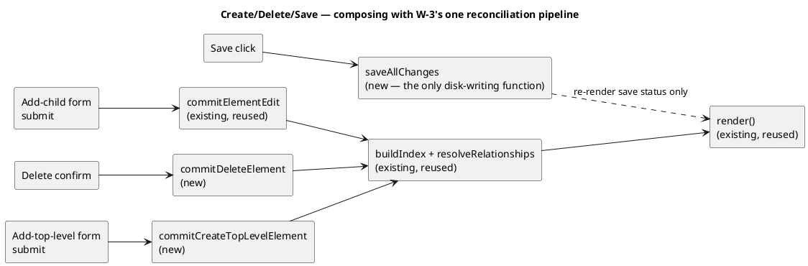
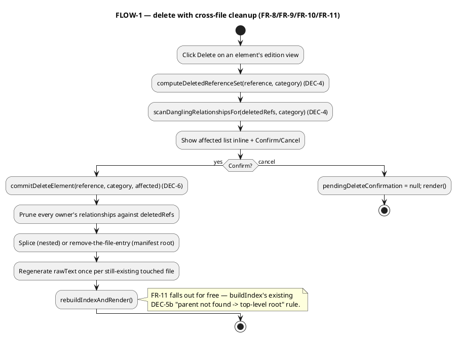

# Standalone Editor — Create, Delete & Save

# Summary

Extend `src/main/resources/editor-webapp/standalone.html` (read-only via
`W-1`, in-memory-editable via `W-3`) with the wave's three closing
capabilities: creating a new element (as a same-file nested child, or as a
brand-new manifest file's root, optionally cross-file-attached), deleting
an element with a whole-model scan that removes every relationship
elsewhere left dangling by the deletion (surfaced for an explicit confirm
before anything is removed), and a save action that writes every actually
changed file back to the real granted directory via the File System
Access API — including, for the first time in this wave, requesting
`readwrite` permission on a handle every prior run only ever granted
`read`. Every new mutation funnels through the same `mutate canonical
source → rebuild index/tree/relationships → render` pipeline `W-3`
already built (`commitElementEdit`/`rebuildIndexAndRender`), extended with
two new commit functions (`commitCreateTopLevelElement`,
`commitDeleteElement`) for the two cases that don't fit the existing
single-file-mutation shape. A per-file `dirty` flag (set at every mutation
chokepoint) and a `pendingFileRemovals` list drive the save action, which
checks every dirty/removed file's on-disk `lastModified` immediately
before writing anything and refuses the whole attempt — writing nothing —
if any has changed externally since it was loaded.

# Scope

In scope: PRD FR-1 through FR-19 — the two create entry points and their
shared form, the child-kind nesting-rule helper, the delete impact scan
and confirm/cancel flow, the two new commit functions, the save action
(permission acquisition, dirty-file writes, file removal, stale-check,
partial-failure reporting, on-disk-baseline update), and `workspace.yaml`'s
own settings-serialization inverse (kebab-case round trip, including the
nested `facets.customs[].json-path` alias).

Out of scope: a comment/formatting-preserving YAML writer (PRD `Q-2`); a
`node.applications` dangling concept (PRD `Q-3`/`FR-12`); cascading a
delete into a cross-file-attached child's own file (PRD `FR-11`); any
change to `wav-002`'s server-backed editor; real diagram/viewpoint
rendering (whole-wave non-goal).

# PRD Traceability

Each `DEC`/`CTR`/`CON` item's own **Linked PRD IDs** footer is the
authoritative source if it ever disagrees with this table (same rule
`TDD-0009` stated, kept here for the same reason — F2/F3 in that run's own
review found exactly this kind of drift).

| PRD ID | TDD item |
|---|---|
| GOAL-1/US-1/AC-1–3 | DEC-1 (create entry points + shared form), DEC-3 (child-kind/level helper), DEC-5 (create commit functions) |
| GOAL-1/US-2/AC-4–8 | DEC-1, DEC-2 (new-manifest synthesis), DEC-3, DEC-5 |
| FR-1, FR-2, FR-3 | DEC-1, DEC-5 |
| FR-4, FR-5, FR-6, FR-7 | DEC-1, DEC-2, DEC-3, DEC-5 |
| FR-8, FR-9, FR-10, FR-11, FR-12 | DEC-4 (delete impact scan + confirm), DEC-6 (delete commit) |
| FR-13 | DEC-7 (readwrite permission acquisition) |
| FR-14, FR-19 | DEC-8 (dirty tracking), DEC-9 (save pipeline) |
| FR-15 | CON-1, DEC-9 |
| FR-16 | DEC-9 (stale-check step) |
| FR-17 | DEC-9 (partial-failure step) |
| FR-18 | DEC-10 (settings serializer), Non-Goals (restates `W-3`'s accepted tradeoff) |
| NFR-1 | DEC-1, DEC-4, DEC-5, DEC-6 (full-render, no reload, same as `W-3`) |
| NFR-2 | CON-1 |
| NFR-3 | DEC-9's stale-check-before-any-write ordering |
| NFR-4 | Reliability/Performance/Scalability section |
| Q-1 (resolved) | DEC-9 |
| Q-2 (resolved) | Non-Goals |
| Q-3 (resolved) | DEC-4's scan scope |
| TC-1 (resolved) | DEC-8 |
| TC-2 (resolved) | DEC-2 |
| TC-3 | DEC-10 |
| TC-4 | Current State, every DEC composes with existing functions |
| TC-5 | DEC-7, DEC-9, Assumptions |

All PRD requirements are addressed; none are left unresolved by this TDD.

# Technical Goals

- **TG-1**: Create and delete reuse the exact same commit-and-rebuild
  shape `W-3` established (`mutate canonical source → buildIndex +
  resolveRelationships → render()`) wherever the existing single-file
  mutation functions already fit; two new commit functions are added only
  for the two cases that genuinely don't (a brand-new file with no
  existing content node to locate; a removal that can touch more than one
  file in one commit).
- **TG-2**: Every disk write goes through one small set of functions
  (`saveAllChanges` and the handle-navigation helpers it calls) — no
  create/delete/commit function performs disk I/O itself (mirrors `W-3`'s
  `CON-1`, extended rather than relaxed).
- **TG-3**: A save is all-or-nothing per attempt with respect to
  conflicts (`FR-16`/`NFR-3`) and transparent about a non-conflict failure
  (`FR-17`) — never a silent partial state the person has to reverse-
  engineer from the folder afterward.
- **TG-4**: The child-kind/nesting-level helper (`DEC-3`,
  `childKindOptionsForLevel`) is one table-driven rule, shared by both
  create entry points' kind-containment checks and `FR-6`'s
  attach-under-filled validation — not reimplemented three times.
  `FR-6`'s separate blank-attach-under gate (which kinds may be
  genuinely unparented at all) answers a different question — "is this
  kind ever root-like" rather than "can this specific parent contain
  it" — and is intentionally a second, small, hardcoded rule, not folded
  into the same table (narrowed during this run's own Stage 5 review,
  which flagged the original wording as overstating a single unified
  mechanism).

# Non-Goals

- A comment/formatting-preserving YAML writer (PRD `Q-2`/`DEF-1`).
- A resolved/dangling concept for `node.applications` (PRD `Q-3`/`FR-12`/
  `DEF-2`).
- Cascading a delete or a rename into a cross-file-attached child's own
  file (PRD `FR-11`, inherited from `W-3`'s `Q-1`).
- A multi-file atomic transaction primitive — the File System Access API
  has none; `FR-17`'s partial-failure reporting is this run's accepted,
  stated substitute, not a workaround that hides the gap.
- Any UI affordance to choose which of several configured
  `settings.manifests.paths` entries a new file lands under — always the
  first configured entry (`DEC-2`), since `.custom` itself configures only
  one and the PRD (`FR-5` Notes) defers the multi-path case.

# Assumptions

- **ASM-1 (carried from `W-3`'s `ASM-1`)**: No real element `id` contains
  a literal `.` — this run's reference construction
  (`parentReference + '.' + newId`, `attachUnderReference + '.' + newId`)
  relies on the same assumption `locateContentNode`/`rewriteReferencePrefix`
  already do.
- **ASM-2**: `requestPermission({mode: 'readwrite'})`, called from inside
  the save button's own synchronous click-handler invocation (before any
  `await` inside that handler's call chain yields control back to the
  browser), is treated by Chromium as within the triggering user gesture
  — the same discipline `W-1`'s `CON-3`/`DEC-4` already established for
  `requestPermission({mode: 'read'})` in `reopenFolder`, confirmed via the
  same MDN/spec research this run re-checked (the File System Access
  API's permission prompt has no distinct gesture rule for `readwrite`
  versus `read`).
- **ASM-3**: `FileSystemFileHandle.createWritable()` (no options) creates
  a writable stream that, on `write()` followed by `close()`, replaces the
  file's entire contents — it does not require a separate explicit
  truncate call first (confirmed against the File System Access API spec
  and MDN: the default `keepExistingData` is `false`, i.e. the file is
  truncated to zero length when the writable stream is created, before
  any `write()` call takes effect). This is `PRD TC-5`'s research item,
  resolved here rather than assumed.
- **ASM-4**: `FileSystemDirectoryHandle.getFileHandle(name, {create:
  true})` creates the file (empty) if it does not already exist, and
  `getFileHandle(name)` (no options, used for an existing file) behaves
  exactly as every existing read-path call in `loadWorkspace` already
  relies on — both confirmed against the spec, matching `W-1`'s own prior
  research discipline for this API's read surface.
- **ASM-5 (carried from `W-3`'s `ASM-5`)**: a conflicting file's
  `getFile().lastModified` is a reliable enough per-file change signal at
  this tool's scale and usage pattern (single local person, no
  sub-second concurrent external edits expected) — a content hash would
  be more precise but is not needed to satisfy `FR-16`'s intent, and
  `lastModified` is what every browser already exposes without an extra
  read of the file's full content just to check staleness.

# Constraints

- **CON-1 (= PRD FR-14/NFR-2, extends `W-3`'s `CON-1`)**: No function
  added by this run reads from or writes to any path outside
  `settings.manifests.paths` (resolved under the granted
  `dirHandle`) or `workspace.yaml` itself; every disk-touching call lives
  inside `saveAllChanges` or its own small navigation helpers, never
  inside a create/delete/commit function. Verified by grep for
  `createWritable`/`removeEntry(`/`getFileHandle(` outside those
  functions.
- **CON-2 (= PRD NFR-4, carried from `W-3`'s `CON-2`)**: `.custom`'s real
  scale (~24-25 manifest files, under ~120 elements) remains the
  performance bar; a save writes only dirty files (`DEC-8`), so its cost
  scales with how much actually changed, not with workspace size.
- **CON-3 (carried from `W-3`'s `CON-3`)**: No new `data-action` value
  collides with any existing one. New values this run adds:
  `open-create-child-form`, `open-create-top-level-form`,
  `cancel-create`, `submit-create-child`, `submit-create-top-level`,
  `request-delete-element`, `confirm-delete-element`,
  `cancel-delete-element`, `save-all-changes` — checked against the real
  file's full existing list (21 unique values, confirmed by direct
  inspection) with zero collisions.
- **CON-4**: A save attempt is only ever triggered by an explicit click on
  the save action — no automatic/periodic/on-blur save exists anywhere
  (PRD `NFR-2`'s "save is the only path to disk" restated as an
  implementation constraint, not just a requirement).

# Current State

`src/main/resources/editor-webapp/standalone.html` (2216 lines, unchanged
since `W-3`/run-0009) already provides every mechanism this run builds on:
`AppState` (`CTR-1`, `createInitialAppState`, lines ~565-577);
`buildIndex`/`indexElementRecursive`/`resolveRelationships` (lines
~667-786, same-category same-layer resolution, `DEC-5b`'s cross-manifest
`header.parent` attachment); `loadWorkspace` (lines ~802-881, the pipeline
this run's new file-creation/removal must stay consistent with);
`locateContentNode` (lines ~1032-1065, walks a reference to its real
parsed node); `commitElementEdit`/`commitSettingsEdit`/
`rebuildIndexAndRender` (lines ~1084-1121); `commitFileEdit` (lines
~1135-1181, scratch-validate-then-swap); `serializeManifestFile`/
`serializeYamlValue` (lines ~430-499, the parser's inverse,
`.custom`-round-trip-verified by `W-3`'s own Stage 10/11); the folder-pick/
persist/reopen/close flow (lines ~888-972, every permission call there is
`mode: 'read'` only — confirmed directly, no `readwrite` request exists
anywhere in the file today); the three-panel UI and `handleAppClick`'s
21-case `switch` (lines ~1365-2145). `AppState.manifestFiles[i]` currently
has no `dirty`/`existedOnDisk`/`lastKnownDiskModified` fields — every entry
is implicitly "as loaded," since no save has ever existed before this run.

# Proposed Design



A reviewer should check that `saveAllChanges` is the *only* new function
with a disk-touching API call in it, and that every create/delete path
still ends in the same `buildIndex`/`resolveRelationships`/`render()`
chain `W-3` already uses — `rebuildIndexAndRender` is called by
`commitCreateTopLevelElement`/`commitDeleteElement` exactly as it already
is by `commitElementEdit`/`commitSettingsEdit`.

**DEC-1 — Create entry points + one shared create form (resolves
FR-1/FR-4, AC-1/AC-4).** `AppState.selection.kind` gains a new value
`'create'`, with shape `{ kind: 'create', createMode: 'child'|'top-level',
category: 'application'|'technology', parentReference: string|null }`.
Two triggers:
- An `open-create-child-form` button, rendered in an element's edition
  view (`renderElementEditionFormHtml`) *only* when `DEC-3`'s
  `childKindOptionsFor(record)` returns a non-empty list for that element
  (a `person`/`component` never gets this button — they are always
  leaves). Sets `selection = { kind: 'create', createMode: 'child',
  category: <record's own category>, parentReference: reference }`.
- An `open-create-top-level-form` button, rendered next to each of the
  left panel's "Applications"/"Environments" branch headers (always
  visible — a brand-new top-level element is always a valid thing to
  attempt, validation happens at submit per `DEC-3`/`FR-6`). Sets
  `selection = { kind: 'create', createMode: 'top-level', category:
  'application'|'technology', parentReference: null }`.
`renderCenterPanelHtml` gains one more branch: `sel.kind === 'create'` →
`renderCreateElementFormHtml(sel)` (new, `DEC-2`). A `cancel-create`
button inside that form sets `selection` back to `{ kind: 'element', key:
parentReference, mode: 'edit' }` for child mode, or `{ kind: 'none', key:
null, mode: 'view' }` for top-level mode, then `render()` — no `AppState`
mutation either way (mirrors `W-3`'s `DEC-10` "discard a draft on
navigation" philosophy: a create form the person backs out of leaves
nothing behind). **Alternatives considered:** a transient module-level
flag (like `W-3`'s `rawYamlEditDraft`) instead of a `selection.kind` value
— rejected: unlike a raw-YAML draft or a delete confirmation (`DEC-4`),
create has no existing element to render *alongside*; it is a genuinely
new, blank view, which is exactly what `selection.kind` already exists to
discriminate between (`'settings'`/`'file'`/`'element'`/now `'create'`) —
using the mechanism built for that distinction is more consistent
(`CONSISTENT`) than reaching for the transient-flag pattern reserved for
state layered on top of an otherwise-normal render. **Linked PRD IDs:**
FR-1, FR-3, FR-4, AC-1, AC-3, AC-4.

**DEC-2 — Shared create form + new-manifest synthesis (resolves
FR-2/FR-5/FR-7, AC-2/AC-7/AC-8).** `renderCreateElementFormHtml(sel)`
renders: a `<select>` of kind options (`DEC-3`'s
`childKindOptionsFor(parentRecord)` for `createMode === 'child'`; the
fixed per-category list from PRD `FR-4` for `createMode === 'top-level'`),
`id`/`name`/`description` inputs (same controls `W-3`'s edition form
already uses), and — `top-level` mode only — an "attach under" text input
(a reference string, optional). One `submit-create-child`/
`submit-create-top-level` button per mode.

- **Child submit**: reads the form, validates (`DEC-3`'s kind-membership
  check + `FR-7`'s id-collision check against `computeChildReference =
  parentReference + '.' + id`), and on success calls
  `commitElementEdit(parentReference, mutatorFn)` (existing function,
  reused as-is) with a mutator that pushes `{ kind: chosenKind, id, name,
  description }` (each key included only when non-empty — matching a
  typical hand-authored file's own shape rather than writing an explicit
  `null`) onto the parent node's own `elements` array (creating it if
  absent), and returns `{ createdReference: computeChildReference }`.
- **Top-level submit**: reads the form, validates (`FR-6`'s attach-under/
  blank-kind gating via `DEC-3`, plus `FR-7`'s id-collision check against
  `computeTopLevelReference = attachUnder ? attachUnder + '.' + id : id`),
  and on success calls the new `commitCreateTopLevelElement` (`DEC-5`).

The new manifest file's relative path (`FR-5`) is synthesized as
`(category === 'application' ? 'app.' : 'env.') + computeTopLevelReference
+ '.yaml'`, placed under `AppState.workspace.settings.manifests.paths[0]`
(the first configured path — `Non-Goals`; `.custom` itself configures
exactly one). Verified against every real `.custom` manifest file name:
all 25 follow this exact pattern (`app.platform.authx.yaml` for reference
`platform.authx`, `env.ref.swisscom.esc.k8s.authx.yaml` for reference
`ref.swisscom.esc.k8s.authx`, `app.primarysys.yaml` for a bare top-level
reference `primarysys` — zero exceptions, exhaustively checked, not
sampled). **Linked PRD IDs:** FR-2, FR-3, FR-5, FR-7, AC-2, AC-7, AC-8.

**DEC-3 — Child-kind/nesting-level helper (resolves FR-1/FR-6, TC-1's
resolution).** Mirrors `W-1`'s TDD `DEC-8` nesting rules as one small,
shared, table-driven helper rather than three ad-hoc checks (`TG-4`).
`indexElementRecursive`'s signature gains one more parameter, `level`
(threaded through the recursion the same way `category`/`sourceFile`/
`settings` already are — found, during this run's own Stage 5 review,
to be a real gap in the first draft: the function's real signature,
`indexElementRecursive(node, kind, reference, sourceFile, category,
index, settings)`, has no way to recover a group-flavored manifest kind's
base level from `kind` alone, since `buildIndex` already reduces
`header.kind` to the generic `rootKind` — e.g. `'group'` for
`container-group`/`solution-group`/`system-group` alike — via
`ARCHICODE_KIND_MAP` *before* calling `indexElementRecursive` at all, so
that distinction is gone by the time the function would need it unless
it is passed in explicitly). `buildIndex`'s own `bareKind` local (the
*un*-generalized string, e.g. `'system-group'`) computes the manifest
root's `level` once, *before* generalizing to `rootKind`: strip a
trailing `-group` if present and map the base (`'container'`→
`'container'`, `'solution'`→`'solution'`, `'system'`→`'system'`), else use
`rootKind` itself (`'person'`/`'component'`/`'environment'`/`'node'` are
already valid level names). That `rootLevel` is passed as
`indexElementRecursive`'s new `level` argument for the root call; the
function stores it as `record.level` and, recursing into each child,
passes `childKind === 'group' ? level : childKind` as the child's own
`level` argument — so a `group` always inherits its caller's `level`
(never computes one of its own), while every other kind's `level` is
simply its own bare `kind` string, matching
`'solution'|'system'|'container'|'component'|'person'|'environment'|
'node'`. `childKindOptionsForLevel(level)`:
`'solution'` → `['system', 'group']`; `'system'` → `['container',
'group']`; `'container'` → `['component', 'group']`; `'environment'` →
`['node']`; `'node'` → `['node']`; anything else (`'component'`/
`'person'`) → `[]` (leaf). `childKindOptionsFor(record)` returns
`childKindOptionsForLevel(record.level)` directly. `FR-6`'s attach-under
validation additionally computes the *candidate* element's own `level`
the same way a manifest root's is computed (from the chosen top-level
kind, reducing a `-group` flavor to its base) and requires: if the
candidate's bare rootKind is `'group'`, that its reduced level equals the
parent's `level` (so a `system-group` can attach under a `system` or
another `system`-level `group`, never under a `solution`); otherwise, that
the candidate's bare rootKind is literally in
`childKindOptionsForLevel(parentRecord.level)`. **Alternatives
considered:** (a) computing `level` lazily at validation/render time by
looking up `record.sourceFile`'s `mf.header.kind` directly instead of
threading a `level` parameter through `indexElementRecursive`'s own
recursion — rejected: a nested `group`'s level is still its *position*
in the tree, not something `mf.header.kind` alone gives for anything but
the file's own root, so this would still need its own ancestor-walk for
a nested record, without avoiding the one cheap recursion-threading step
`indexElementRecursive` already performs regardless. (b) Deriving
`level` as a static function of `record.kind` alone, with no threading —
rejected, and caught as under-specified during this run's own Stage 5
review: `record.kind` for any nested `group` is always the generic
string `'group'`, carrying no information about which level that
particular group sits at, and `indexElementRecursive`'s real signature
has no other parameter that could recover it without the explicit
threading this `DEC-3` now specifies. **Tradeoffs:** none identified for
`.custom`'s real elements beyond the one mechanical signature-parameter
addition every recursive call site must now pass. `.custom` itself has
no `group`/`person` usage to exercise this rule against — flagged in
Risks, same class of fixture gap `W-1`'s own `ASM-2`/`Q-2` already logged
for dangling detection. **Linked PRD IDs:** FR-1, FR-6, TC-1.

**DEC-4 — Delete impact scan + confirm/cancel (resolves FR-8/FR-9/FR-11,
AC-9/AC-11/AC-12).** A `request-delete-element` button in the element
edition view (always present — even a leaf can be the destination of a
relationship) computes, on click:
```
function computeDeletedReferenceSet(reference, category) {
  const set = new Set([reference]);
  for (const ref of AppState.index[category].keys()) {
    if (ref === reference || ref.indexOf(reference + '.') === 0) set.add(ref);
  }
  return set;
}

function scanDanglingRelationshipsFor(deletedRefs, category) {
  const affected = [];
  for (const record of AppState.index[category].values()) {
    if (deletedRefs.has(record.reference)) continue; // DEC-4: "elsewhere" excludes the deleted subtree itself
    for (const rel of record.relationships) {
      if (deletedRefs.has(rel.destination)) {
        affected.push({ ownerReference: record.reference, ownerSourceFile: record.sourceFile, label: rel.label, destination: rel.destination });
      }
    }
  }
  return affected;
}
```
and sets module-level `pendingDeleteConfirmation = { reference, category,
affected }` (transient, not part of `AppState` — same pattern as `W-3`'s
`rawYamlEditDraft`: state layered *on top of* the already-rendering
element edition view, not a new view). `render()` then shows, inline
within that same edition view, the `affected` list (file + label +
destination per entry, or "No other relationship is affected" when
empty) plus `confirm-delete-element`/`cancel-delete-element` buttons.
`cancel-delete-element` sets `pendingDeleteConfirmation = null` and
re-renders — `AppState` itself was never touched (`AC-11`).
`confirm-delete-element` calls `commitDeleteElement` (`DEC-6`).
`FR-11`'s cross-file-attachment orphaning needs no code here: it falls
out of `buildIndex`'s existing `DEC-5b` "parent not found → top-level
root" rule once the deleted element leaves the index on the next rebuild.
**Alternatives considered:** a transient `AppState.selection.kind ===
'delete-confirm'` view (mirroring `DEC-1`'s choice for create) — rejected
for the reason `DEC-1` itself gives in reverse: unlike create, a delete
confirmation has a fully-renderable existing element to show *underneath*
it, which is exactly the shape `W-3`'s transient-module-state pattern was
built for. **Linked PRD IDs:** FR-8, FR-9, FR-11, AC-9, AC-11, AC-12.

**DEC-5 — Create commit functions (resolves FR-2/FR-5, extends `DEC-1`/
`DEC-2`).** The child-create path reuses `commitElementEdit` verbatim
(`DEC-2`'s mutator pushes into `node.elements`); only the top-level path
needs a new function, since there is no existing content node to locate:
```
function commitCreateTopLevelElement({ category, headerKind, attachUnderReference, id, name, description }) {
  const reference = attachUnderReference ? (attachUnderReference + '.' + id) : id;
  const header = { kind: ARCHICODE_KIND_PREFIX + headerKind, version: '1' };
  if (attachUnderReference) header.parent = attachUnderReference;
  const content = { id };
  if (name) content.name = name;
  if (description) content.description = description;
  const manifestsDir = (AppState.workspace.settings.manifests.paths[0] || 'manifests').replace(/\/$/, '');
  const relPath = manifestsDir + '/' + (category === 'application' ? 'app.' : 'env.') + reference + '.yaml'; // matches loadWorkspace's own relDirPath + '/' + name join (line ~838) — found missing in Stage 5 review
  const mf = {
    relPath, header, content, error: null,
    rawText: serializeManifestFile(header, content), // DEC-7's W-3 serializer, reused as-is
    dirty: true, existedOnDisk: false, lastKnownDiskModified: null
  };
  AppState.manifestFiles.push(mf);
  AppState.manifestFiles.sort((a, b) => a.relPath.localeCompare(b.relPath)); // matches loadWorkspace's own ordering
  rebuildIndexAndRender();
  return { createdReference: reference };
}
```
A caller (the `submit-create-top-level` handler) runs `DEC-2`'s/`DEC-3`'s
validation *before* calling this — a rejected submission never reaches
it, matching `W-3`'s own "validate before commit, never commit-then-
rollback" discipline (`DEC-9` there). After either create path returns,
the handler sets `AppState.selection = { kind: 'element', key:
result.createdReference, mode: 'edit' }` and calls `render()` once more
(`FR-3` — the same "one extra render after the rebuild's own render"
shape `W-3`'s `DEC-8`/`rewriteReferencePrefix` already uses for an
id-rename). **Linked PRD IDs:** FR-2, FR-3, FR-5.

**DEC-6 — Delete commit function (resolves FR-10, extends `DEC-4`).**
```
function commitDeleteElement(reference, category, affected) {
  const located = locateContentNode(reference);
  const touchedRelPaths = new Set();

  // Prune every "elsewhere" relationship this TDD's own DEC-4 (the delete
  // impact scan) found, by re-deriving the removal condition directly
  // against each owner's *live* raw node (never by index/object identity
  // against the disposable ElementRecord copies DEC-4's scan read from —
  // same reasoning TDD-0009's DEC-4 (locateContentNode) already
  // established: an index record is a fresh copy every rebuild).
  const deletedRefs = computeDeletedReferenceSet(reference, category);
  const ownerRefs = new Set(affected.map((a) => a.ownerReference));
  for (const ownerRef of ownerRefs) {
    const ownerLocated = locateContentNode(ownerRef);
    const relationships = Array.isArray(ownerLocated.node.relationships) ? ownerLocated.node.relationships : [];
    ownerLocated.node.relationships = relationships.filter((r) => !deletedRefs.has(r && r.destination));
    touchedRelPaths.add(ownerLocated.mf.relPath);
  }

  // Remove the element itself: splice from its parent array (nested), or
  // remove the whole manifest file's entry (a manifest root).
  if (located.parentArray === null) {
    if (located.mf.existedOnDisk) {
      AppState.pendingFileRemovals.push(located.mf.relPath);
      AppState.removedFileBaselines.set(located.mf.relPath, located.mf.lastKnownDiskModified); // DEC-9's stale-check needs this baseline — found missing in Stage 5 review
    }
    AppState.manifestFiles = AppState.manifestFiles.filter((f) => f !== located.mf);
    touchedRelPaths.delete(located.mf.relPath); // that file no longer exists; nothing to regenerate for it
  } else {
    located.parentArray.splice(located.indexInParent, 1);
    touchedRelPaths.add(located.mf.relPath);
  }

  // Regenerate raw YAML exactly once per still-existing touched file.
  for (const mf of AppState.manifestFiles) {
    if (touchedRelPaths.has(mf.relPath)) {
      mf.rawText = serializeManifestFile(mf.header, mf.content);
      mf.dirty = true;
    }
  }

  // If the deleted element (or one of its former descendants) was the
  // active selection, fall back to the workspace-wide default view —
  // it no longer exists.
  if (AppState.selection.kind === 'element' &&
      (AppState.selection.key === reference || (AppState.selection.key && AppState.selection.key.indexOf(reference + '.') === 0))) {
    AppState.selection = { kind: 'none', key: null, mode: 'view' };
  }

  pendingDeleteConfirmation = null;
  rebuildIndexAndRender();
}
```
`touchedRelPaths` is deliberately a plain `Set` of `relPath` strings, not
of `mf` object references — `AppState.manifestFiles` is reassigned by
`.filter()` in the manifest-root-removal branch, which would silently
invalidate a stale `mf` object reference held from before that
reassignment if this function touched the same file for both reasons
(impossible in practice, since a file either *is* the deleted root or
*isn't*, but kept as strings regardless for exactly this kind of
reassignment-safety, matching `CONSISTENT` with `commitFileEdit`'s own
`relPath`-keyed, not object-keyed, scratch-swap pattern). **Linked PRD
IDs:** FR-10.

**DEC-7 — `readwrite` permission acquisition (resolves FR-13, the Stage
2 review's own top finding).**
```
async function ensureWritePermission() {
  if (!AppState.folder || !AppState.folder.handle) return false;
  try {
    let permission = await AppState.folder.handle.queryPermission({ mode: 'readwrite' });
    if (permission !== 'granted') {
      permission = await AppState.folder.handle.requestPermission({ mode: 'readwrite' }); // ASM-2: must be called from the save button's own click handler
    }
    return permission === 'granted';
  } catch (e) {
    console.error('ArchiCode: ensureWritePermission failed', e);
    return false;
  }
}
```
Called as the very first step of `saveAllChanges` (`DEC-9`) — before any
stale-check or write. If it returns `false`, `saveAllChanges` sets
`saveStatus = { state: 'denied', message: 'Write permission was not
granted; nothing was saved.' }`, renders, and returns, writing nothing.
**Linked PRD IDs:** FR-13.

**DEC-8 — Per-file dirty tracking (resolves TC-1, feeds FR-14).**
`AppState.manifestFiles[i]` gains three fields (`CTR-1` extension):
`dirty: boolean` (starts `false` on load, set `true` at every mutation
chokepoint below), `existedOnDisk: boolean` (`true` for every file
`loadWorkspace` loads; `false` for a brand-new file until its first
successful save), `lastKnownDiskModified: number | null` (captured from
`getFile().lastModified` at load time, and updated after every successful
write — `DEC-9`'s `FR-19`). `AppState.workspace` gains `settingsDirty:
boolean` and `settingsLastKnownDiskModified: number | null` (same shape,
for `workspace.yaml`). `AppState` itself gains `pendingFileRemovals:
string[]` (relPaths pending a `removeEntry` at next save — `DEC-6`).
Chosen over the alternative (comparing current `rawText` against a
captured "as-loaded" snapshot at save time): the dirty-flag approach needs
no second copy of every file's text kept around just for comparison, and
every mutation already funnels through a small, enumerable set of
chokepoints where one assignment is trivial to add (`DRY`/`KISS` — the
alternative would double this tool's in-memory footprint for a comparison
this run's own mutation functions already know the answer to directly).
Set at: `commitElementEdit` (after regenerating `mf.rawText` — one line
added to the existing function), `commitFileEdit`'s valid branch (the
swapped-in scratch entry carries `dirty: true`, since the person
explicitly committed new text for it), `commitCreateTopLevelElement`
(`dirty: true` from creation), `commitDeleteElement` (every file in
`touchedRelPaths`), `commitSettingsEdit` (sets
`AppState.workspace.settingsDirty = true`). **Linked PRD IDs:** FR-14,
TC-1.

**DEC-9 — Save pipeline (resolves FR-13 through FR-17, Q-1).**
```
async function saveAllChanges() {
  if (!(await ensureWritePermission())) { // DEC-7
    saveStatus = { state: 'denied', message: 'Write permission was not granted; nothing was saved.' };
    render();
    return;
  }

  const dirtyFiles = AppState.manifestFiles.filter((f) => f.dirty);
  const removals = AppState.pendingFileRemovals.slice();
  const settingsDirty = AppState.workspace.settingsDirty;
  if (dirtyFiles.length === 0 && removals.length === 0 && !settingsDirty) {
    saveStatus = { state: 'success', message: 'Nothing to save.' };
    render();
    return;
  }

  // FR-16/Q-1: stale-check every file this attempt would touch, BEFORE any write.
  const conflicts = [];
  for (const f of dirtyFiles) {
    if (!f.existedOnDisk) continue; // brand-new file: nothing on disk to conflict with
    const current = await statManifestFile(f.relPath); // getFile().lastModified, or null if missing
    if (current === null || current !== f.lastKnownDiskModified) conflicts.push(f.relPath);
  }
  for (const relPath of removals) {
    const current = await statManifestFile(relPath);
    const mf = /* the removed file's last known state is no longer in AppState.manifestFiles — tracked separately */ removedFileBaseline(relPath);
    if (current !== null && current !== mf) conflicts.push(relPath);
  }
  if (settingsDirty) {
    const current = await statWorkspaceYaml();
    if (current !== AppState.workspace.settingsLastKnownDiskModified) conflicts.push('workspace.yaml');
  }
  if (conflicts.length > 0) {
    saveStatus = { state: 'conflict', conflicts }; // FR-16/AC-16: nothing written
    render();
    return;
  }

  // Write phase (FR-14/FR-17): stop at the first failure, name it, leave
  // everything already written as written.
  for (const f of dirtyFiles) {
    try {
      await writeManifestFile(f); // getDirectoryHandleByRelativePath + getFileHandle(create: !f.existedOnDisk) + createWritable + write + close
      f.dirty = false;
      f.existedOnDisk = true;
      f.lastKnownDiskModified = await statManifestFile(f.relPath); // FR-19
    } catch (e) {
      saveStatus = { state: 'error', failedFile: f.relPath, message: e && e.message ? e.message : String(e) };
      render();
      return;
    }
  }
  for (const relPath of removals) {
    try {
      await removeManifestFile(relPath); // getDirectoryHandleByRelativePath + removeEntry
      AppState.pendingFileRemovals = AppState.pendingFileRemovals.filter((p) => p !== relPath);
    } catch (e) {
      saveStatus = { state: 'error', failedFile: relPath, message: e && e.message ? e.message : String(e) };
      render();
      return;
    }
  }
  if (settingsDirty) {
    try {
      await writeWorkspaceYaml(); // DEC-10's serializer + the same write sequence
      AppState.workspace.settingsDirty = false;
      AppState.workspace.settingsLastKnownDiskModified = await statWorkspaceYaml();
    } catch (e) {
      saveStatus = { state: 'error', failedFile: 'workspace.yaml', message: e && e.message ? e.message : String(e) };
      render();
      return;
    }
  }

  saveStatus = { state: 'success', message: 'Saved.' };
  render();
}
```
`removedFileBaseline(relPath)` reads from a small parallel map
(`AppState.removedFileBaselines: Map<relPath, lastKnownDiskModified>`)
populated by `commitDeleteElement` at the moment it pushes to
`pendingFileRemovals` (since the removed `mf` object itself is gone from
`AppState.manifestFiles` by the time `saveAllChanges` runs, its own
`lastKnownDiskModified` would otherwise be unreachable for the
stale-check). **Alternatives considered:** last-write-wins with a
post-hoc warning (`Q-1`'s rejected alternative, restated here at the
mechanism level) — rejected for the same reason the PRD already gives: a
warning after an overwrite does not undo it. **Linked PRD IDs:** FR-13,
FR-14, FR-15, FR-16, FR-17, Q-1.

**DEC-10 — `workspace.yaml` settings serializer (resolves FR-18's `TC-3`
extension).**
```
function serializeSettingsToRaw(settings) {
  return {
    manifests: { paths: settings.manifests.paths },
    relationships: { 'default-synthetic-label': settings.relationships.defaultSyntheticLabel },
    views: { path: settings.views.path, labels: settings.views.labels, properties: settings.views.properties },
    facets: {
      'global-enabled': settings.facets.globalEnabled,
      'directory-name-template': settings.facets.directoryNameTemplate,
      customs: settings.facets.customs.map((c) => {
        const rest = Object.assign({}, c);
        if (Object.prototype.hasOwnProperty.call(rest, 'jsonPath')) {
          const jsonPath = rest.jsonPath;
          delete rest.jsonPath;
          rest['json-path'] = jsonPath; // TC-3's nested alias, found in Stage 2 review
        }
        return rest;
      })
    }
  };
}

async function writeWorkspaceYaml() {
  const raw = {
    styles: AppState.workspace.styles,
    formatters: AppState.workspace.formatters,
    settings: serializeSettingsToRaw(AppState.workspace.settings)
  };
  const text = serializeYamlValue(raw, 0); // W-3's existing serializer, reused as-is
  // ... writeManifestFile-equivalent write sequence against 'workspace.yaml' at the folder root
}
```
`styles`/`formatters` are carried through verbatim from
`AppState.workspace.styles`/`.formatters` (captured, unmodified, at load
time by `loadWorkspace` — no editing surface in this wave ever touches
them), so they round-trip exactly as `ASM-2`/`ASM-3` (`W-3`'s TDD)
already guarantee for any untouched object/array shape. The key order
(`styles`, `formatters`, `settings`) matches the real
`.custom/workspace.yaml`'s own top-to-bottom order. **Stated consequence
(found during this run's own Stage 5 review, not silently accepted):**
`serializeSettingsToRaw` always emits every settings key, including any
`parseSettings` only ever *defaulted* because the real, hand-authored
file never set it (confirmed: the real `.custom/workspace.yaml` sets
only `styles`, `formatters`, and `settings.views.properties.deep` — no
`manifests`/`relationships`/`views.path`/`views.labels`/`facets` keys at
all). A single settings save therefore visibly expands a sparse
`workspace.yaml` to a fully-enumerated one, the same "regenerate the
whole thing from the model, lose what was implicit" tradeoff `FR-18`
already accepts for a manifest file's comments/formatting — restated
here because it also applies to keys, not just formatting, for this one
file. **Alternatives considered:** scoping the serializer to emit only
the keys present in the raw object captured at load time — rejected as a
materially different, non-trivial design (it would need to track, per
key, whether the in-memory value is still the loaded default or was
actually edited) that no PRD requirement asks for; `FR-14`'s "exactly
what changed" framing is about *which files* a save touches, not about
preserving *which keys of one already-dirty file* stay absent. **Linked
PRD IDs:** FR-18, TC-3.

**DEC-11 — Save UI (resolves AC-13/AC-14/AC-16/AC-17's visibility
requirements).** A `save-all-changes` button in the top panel (next to
the existing `close-folder` button), rendered only when
`hasUnsavedChanges()` (`true` if any `manifestFiles[i].dirty`,
`pendingFileRemovals.length > 0`, or `workspace.settingsDirty`) —
otherwise omitted, not merely disabled, so there is nothing to click when
there is nothing to save. A small status line beside it renders the
module-level `saveStatus` (`{state: 'idle'|'denied'|'conflict'|'error'|
'success', ...}`, initialized to `{state: 'idle'}` and reset to `'idle'`
whenever a new edit is made after a prior save attempt's status was
shown — avoiding a stale conflict/error message lingering past the edit
that would resolve it). **Linked PRD IDs:** AC-13, AC-14, AC-16, AC-17.

# Repository Impact

- **IMP-1** — `src/main/resources/editor-webapp/standalone.html`
  - Path(s): `src/main/resources/editor-webapp/standalone.html`
  - Change type: modify (additive — every existing function stays;
    `indexElementRecursive`/`AppState`/`handleAppClick`'s `switch` gain
    new fields/cases; `renderElementEditionFormHtml`/
    `renderLeftPanelHtml`/`renderTopPanelHtml` gain new buttons)
  - Why impacted: sole file in scope (wave `likely_paths`, PRD scope).
  - Linked PRD IDs: all.
  - Risks / notes: last run in the wave touching this file — no further
    run follows to catch a seam this run's own Stage 10/11 misses.

# Canonical Impact

No `arc`/`dom` canonical register exists under `docs/` in this repository
(same finding `W-1`/`W-3`'s TDDs already recorded).
- **CI-arc-1**: None. This run extends a browser-side artifact; it adds a
  real disk-write capability to that artifact, but writes only files the
  artifact's own mirrored domain already describes (manifest YAML,
  `workspace.yaml`) in the same shape the real Java `ManifestParser`
  reads — it does not change, extend, or reinterpret the Java-side
  architecture itself (no Java source, `pom.xml`, or CLI behavior
  changes).
- **CI-dom-1**: None. No enforced invariant is added, changed, or
  ratified anywhere the real Java CLI or its schemas run — every
  validation this run adds (`FR-6`/`FR-7`'s create-time checks, `DEC-9`'s
  stale-check) is a client-side, browser-only guard over what this tool
  itself writes, not a rule enforced by `ManifestParser`/the CLI.

# Data Model and Contracts

- **CTR-1 (extends run-0008/run-0009's CTR-1)**: `AppState.manifestFiles[i]`
  gains `dirty: boolean`, `existedOnDisk: boolean`,
  `lastKnownDiskModified: number | null` (`DEC-8`). `AppState.selection`'s
  `kind` enum gains `'create'`, with shape `{ kind: 'create', createMode:
  'child'|'top-level', category, parentReference: string | null }`
  (`DEC-1`). `AppState.workspace` gains `settingsDirty: boolean`,
  `settingsLastKnownDiskModified: number | null` (`DEC-8`). `AppState`
  itself gains `pendingFileRemovals: string[]` and
  `removedFileBaselines: Map<string, number | null>` (`DEC-6`/`DEC-9`).
  `ElementRecord` (produced by `indexElementRecursive`) gains one more
  always-present field: `level: 'solution'|'system'|'container'|
  'component'|'person'|'environment'|'node'` (`DEC-3`).
- **CTR-2 (new, module-level, not part of `AppState`)**: `let
  pendingDeleteConfirmation = { reference: string, category: string,
  affected: Array<{ownerReference, ownerSourceFile, label, destination}>
  } | null;` (`DEC-4`) and `let saveStatus = { state: 'idle'|'denied'|
  'conflict'|'error'|'success', message?, conflicts?, failedFile? } =
  { state: 'idle' };` (`DEC-11`) — same deliberately-outside-`AppState`
  pattern as `W-3`'s `rawYamlEditDraft`/`W-1`'s
  `treeExpandedApplications`.
- **CTR-3 — New-manifest-file contract (resolves FR-5)**: a manifest file
  created this run's way (`commitCreateTopLevelElement`) has exactly the
  same `{relPath, rawText, header, content, error}` shape every
  `loadWorkspace`-loaded file has, plus `DEC-8`'s three new fields; its
  `rawText` is always `serializeManifestFile`'s output (never hand-typed),
  so `parseYaml(mf.rawText)` reproducing `{header, content}` is guaranteed
  by the same round-trip property `W-3`'s `CTR-3` already established for
  `serializeManifestFile`'s output in general.
- **CTR-4 — No change to `AppState.workspace.settings`'s in-memory shape**
  — `DEC-10`'s serializer is a one-way save-time projection to the raw
  on-disk shape; `parseSettings`'s own camelCase/aliased in-memory shape
  (`CTR-4` in `W-3`'s TDD) is unchanged by this run.

# Interfaces and Behavior

- **IF-1 (new)** — Element edition view gains two buttons:
  `open-create-child-form` (only when `childKindOptionsFor(record)` is
  non-empty) and `request-delete-element` (always present). A
  `pendingDeleteConfirmation` matching the current element inserts an
  inline confirmation block (affected-relationships list +
  confirm/cancel) directly below the element's own fields, without
  changing `selection`.
- **IF-2 (new)** — Each of the left panel's "Applications"/"Environments"
  branch headers gains an `open-create-top-level-form` button (data-
  category set to that branch's category).
- **IF-3 (new)** — Center panel, `sel.kind === 'create'`:
  `renderCreateElementFormHtml(sel)` (`DEC-2`) — kind select, id/name/
  description inputs, attach-under input (top-level mode only),
  submit/cancel buttons.
- **IF-4 (new)** — Top panel gains a `save-all-changes` button (visible
  only when `hasUnsavedChanges()`) and a status line reflecting
  `saveStatus`.
- **IF-5 (new)** — every new `data-action` value, listed exhaustively in
  `CON-3`.

# Flows and Processing Logic



- **FLOW-1 (delete)**: see diagram. Linked: FR-8, FR-9, FR-10, FR-11,
  AC-9, AC-10, AC-11, AC-12.
- **FLOW-2 (create, child)**: click `open-create-child-form` →
  `selection = {kind:'create', createMode:'child', ...}` → submit →
  `DEC-3` kind check + `FR-7` id-collision check → valid:
  `commitElementEdit(parentReference, mutator)` → `selection =
  {kind:'element', key: createdReference, mode:'edit'}` → `render()`.
  Linked: FR-1, FR-2, FR-3, FR-7, AC-1, AC-2, AC-3, AC-8.
- **FLOW-3 (create, top-level)**: click `open-create-top-level-form` →
  `selection = {kind:'create', createMode:'top-level', ...}` → submit →
  `FR-6`'s attach-under/blank-kind gating (`DEC-3`) + `FR-7`'s
  id-collision check → valid: `commitCreateTopLevelElement(...)` (`DEC-5`)
  → `selection = {kind:'element', key: createdReference, mode:'edit'}` →
  `render()`. Linked: FR-4, FR-5, FR-6, FR-7, AC-4, AC-5, AC-6, AC-7, AC-8.
- **FLOW-4 (save)**: click `save-all-changes` →
  `ensureWritePermission()` (`DEC-7`) → denied: `saveStatus = {state:
  'denied', ...}`, stop → granted: stale-check every dirty/removed/
  settings-changed target (`DEC-9`) → any conflict: `saveStatus =
  {state:'conflict', conflicts}`, stop, nothing written → no conflict:
  write dirty files, remove pending removals, write `workspace.yaml` if
  settings changed, each step able to stop-and-report on its own failure
  (`FR-17`) → `saveStatus = {state:'success', ...}`. Linked: FR-13 through
  FR-19, AC-13 through AC-17.

# Reliability, Performance, and Scalability

Create/delete commits pay the same `buildIndex`/`resolveRelationships`
full-rebuild cost every `W-3` commit already pays (`CON-2`) — negligible
at `.custom`'s scale. A save's own cost scales with how many files are
actually dirty (`DEC-8`), not with the whole workspace's size, since only
dirty/removed files are touched; the stale-check adds one `getFile()` call
per dirty/removed/settings-changed target (cheap — metadata only, not a
full read) immediately before the write phase. No debouncing/chunking is
designed for, consistent with `W-1`/`W-3`'s own reasoning at this scale.

# Security and Privacy

Extends `W-3`'s posture (everything local to the browser tab, no network
calls) with the one capability this whole wave has been building toward:
a real write to the person's own granted directory, performed only on an
explicit click, scoped by the File System Access API's own
per-origin/per-handle permission model (which this run elevates from
`read` to `readwrite`, but only for the already-granted handle — never a
new, broader grant) and by `CON-1`'s own self-imposed path scoping. No
data leaves the browser tab at any point.

# Observability and Verification

No logging/telemetry added (same reasoning as every prior run — a local
static file has nowhere to send it). Verification, run in Stage 11, uses
a Node `vm` harness (per this wave's established Browser-pane limitation —
see Lessons Learnt) loading the real `<script>` body and driving it
against a `fs`-backed `FileSystemDirectoryHandle`/`FileSystemFileHandle`/
writable-stream shim over a **temporary copy** of `.custom` (never the
real tracked directory):
- Create a child element under a real `.custom` system (e.g. a new
  `container` under `platform.authx`), confirm it lands in
  `app.platform.authx.yaml`'s `content.elements`, the tree, and that
  file's raw-YAML view.
- Create a brand-new top-level element with no parent, and one attached
  under an existing element, confirm the new file's relative path, name,
  and content.
- Delete `platform.authx.backend` specifically (the wave's own named
  fixture) and confirm the scan finds exactly its four cross/same-file
  relationship entries (`app.platform.authx.yaml`'s `frontend`,
  `app.platform.scp.yaml`, `app.platform.iam.yaml`,
  `app.platform.portal.yaml`), that canceling leaves everything
  byte-for-byte unchanged, and that confirming removes all four and
  regenerates exactly those files' raw YAML.
- Delete a manifest-root element that another file attaches under via
  `header.parent` (e.g. `platform` itself, with `authx`/`iam`/etc.
  attached), confirm those other files are untouched on disk/in
  `AppState.manifestFiles` and become unattached top-level roots on
  rebuild.
- Save, then reopen the temp copy fresh (a new `loadWorkspace` call, not
  reusing in-memory state) and confirm every created element is present,
  the deleted element and its four pruned relationships are absent
  everywhere, and no file fails to parse.
- Deliberately modify one dirty file's bytes on disk (via plain `fs`,
  simulating an external edit) between load and save, confirm the whole
  save attempt is refused and zero files (including unrelated ones) are
  written.
- Confirm `ensureWritePermission` is only ever reachable from
  `save-all-changes`'s own handler chain, and grep for `createWritable`/
  `removeEntry(`/`getFileHandle(.*create:\s*true` outside `saveAllChanges`
  and its direct helpers.
- Confirm, after the run, the **real** `.custom/` directory (not the temp
  copy) is byte-for-byte unchanged (`git status`/`git diff` against it).

# Deployment and Rollout

Same as every prior run in this wave: no deployment, no migration, no new
Maven dependency — a change to one static classpath resource. Rollback is
a plain revert of this run's commit; nothing external depends on the new
`AppState` fields or module-level variables (all in-memory, per-tab, never
persisted beyond the files this run explicitly writes on an explicit
save).

# Risks and Tradeoffs

- **RISK-1**: `DEC-3`'s `level`/child-kind-options rule has no real
  `.custom` fixture to verify against (no `group`/`person` usage exists
  today). Mitigation: the rule is derived directly from the real Java
  type hierarchy's own marker interfaces (same source `W-1`'s `ASM-4`
  already cites), not invented; Stage 11 verification exercises it
  against a deliberately-constructed synthetic fixture, the same
  mitigation shape `W-1` used for dangling-relationship detection.
- **RISK-2**: The File System Access API's write surface
  (`createWritable`/`removeEntry`/`getFileHandle(..., {create: true})`)
  and the `readwrite` permission elevation are new to this codebase and
  cannot be exercised by the Browser pane in this environment (confirmed
  by both prior runs for the read-only surface; this run's own Stage 10/
  11 re-confirms the same gap for the write surface). Mitigation: the
  Node `vm` harness's `fs`-backed shim implements the same write/remove/
  permission semantics the spec defines (`ASM-2`/`ASM-3`/`ASM-4`),
  exercising the real, unmodified `standalone.html` code — not a
  from-scratch simulation of it — against a real temporary filesystem
  copy, the same verification shape every prior run in this wave used.
- **RISK-3 (carried from `W-3`'s `RISK-2`)**: `id`-rename's and now
  delete's accepted consequences (a dangling relationship or an orphaned
  cross-file attachment left for the person to notice/fix, rather than
  cascaded) could read as a bug to a person who doesn't expect them.
  Mitigation: stated PRD decisions (`FR-11`/`W-3`'s `Q-1`), not silent
  gaps, and the dangling-badge/unattached-root outcomes are already-
  existing, already-visible UI states.
- **RISK-4**: `DEC-9`'s stale-check uses `lastModified` only (`ASM-5`), not
  a content hash — a file could theoretically be "touched" (rewritten
  with identical bytes) externally and still trip a conflict, or
  (astronomically unlikely at this tool's usage pattern) have its
  timestamp coincidentally unchanged despite a real edit. Accepted per
  `ASM-5`'s own reasoning — the cost of a false-positive conflict (redo an
  edit) is far smaller than the cost either a false negative or a content-
  hash read of every file on every save would add.

# Open Questions

None outstanding — PRD `Q-1`/`Q-2`/`Q-3` were resolved before this TDD was
drafted (see PRD section 8 and this TDD's `DEC-9`/Non-Goals/`DEC-4`).

# Deferred Work

- **DEF-1 (= PRD DEF-1)**: A comment/formatting-preserving YAML writer.
- **DEF-2 (= PRD DEF-2)**: Extending the delete impact scan to
  `node.applications`.
- **DEF-3**: A content-hash-based (rather than `lastModified`-based)
  staleness check, if `RISK-4`'s accepted tradeoff is ever rejected.
- **DEF-4**: UI to choose which of several configured
  `settings.manifests.paths` entries a new file lands under, if a future
  workspace configures more than one (`Non-Goals`).

# File Placement and Frontmatter

This TDD is saved at
`docs/wav/wav-003-standalone-workspace-editor/run/run-0010-standalone-editor-create-delete-and-save/tdd-0010-standalone-editor-create-delete-and-save.md`,
matching this wave's existing run-0008/run-0009 TDD path pattern. No new
source file is created; the sole modified file is
`src/main/resources/editor-webapp/standalone.html`, exactly where the wave
manifest's `likely_paths` names it for `W-4`.
